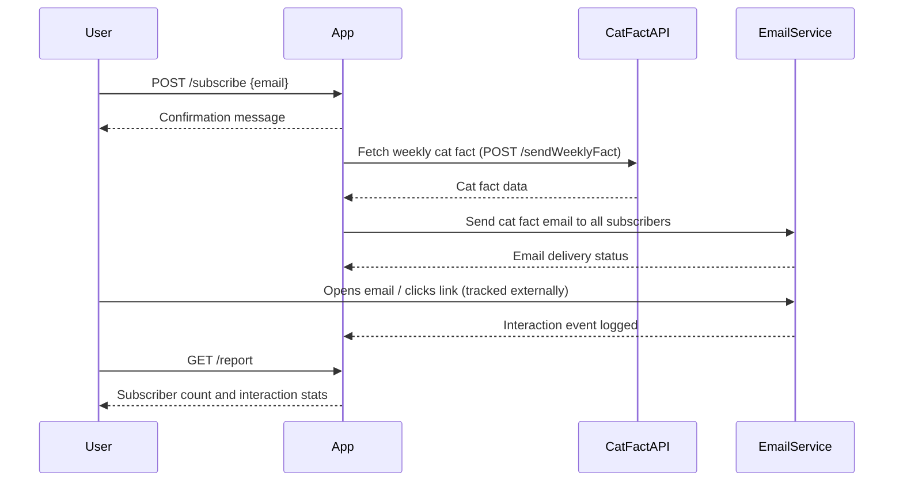
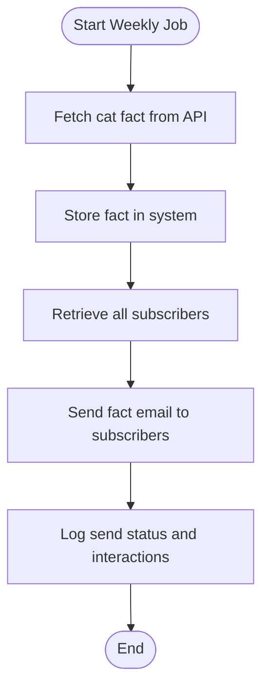

```markdown
# Functional Requirements for Weekly Cat Fact Subscription Application

## API Endpoints

### 1. User Subscription

- **Endpoint:** `POST /subscribe`
- **Description:** Allows a user to sign up for weekly cat fact emails.
- **Request:**
  ```json
  {
    "email": "user@example.com"
  }
  ```
- **Response:**
  ```json
  {
    "message": "Subscription successful",
    "subscriberId": "uuid-string"
  }
  ```

### 2. Retrieve Subscribers Count and Interaction Stats

- **Endpoint:** `GET /report`
- **Description:** Returns the number of subscribers and interaction statistics.
- **Response:**
  ```json
  {
    "subscribersCount": 123,
    "emailOpens": 456,
    "clicks": 78
  }
  ```

### 3. Trigger Weekly Cat Fact Fetch and Email Send

- **Endpoint:** `POST /sendWeeklyFact`
- **Description:** Triggers data ingestion from Cat Fact API, sends emails to all subscribers.
- **Request:** Empty JSON `{}` or no body
- **Response:**
  ```json
  {
    "message": "Weekly cat fact sent to all subscribers",
    "fact": "Cats have five toes on their front paws, but only four toes on their back paws."
  }
  ```

---

## Business Logic Notes

- The `POST /sendWeeklyFact` endpoint handles:
  - Fetching a cat fact from `https://catfact.ninja/fact` API.
  - Storing or caching the fact for the week.
  - Sending emails to all subscribers.
  - Logging interaction events (opens, clicks) asynchronously.

- GET endpoints are read-only and do not invoke external calls.

---

## User-App Interaction Sequence Diagram


```mermaid
sequenceDiagram
    participant User
    participant App
    participant CatFactAPI
    participant EmailService

    User->>App: POST /subscribe {email}
    App-->>User: Confirmation message

    App->>CatFactAPI: Fetch weekly cat fact (POST /sendWeeklyFact)
    CatFactAPI-->>App: Cat fact data

    App->>EmailService: Send cat fact email to all subscribers
    EmailService-->>App: Email delivery status

    User->>EmailService: Opens email / clicks link (tracked externally)
    EmailService-->>App: Interaction event logged

    User->>App: GET /report
    App-->>User: Subscriber count and interaction stats
```

---

## Weekly Cat Fact Send-Out Flow


```mermaid
flowchart TD
    Start([Start Weekly Job])
    FetchFact[Fetch cat fact from API]
    StoreFact[Store fact in system]
    RetrieveSubs[Retrieve all subscribers]
    SendEmails[Send fact email to subscribers]
    LogEvents[Log send status and interactions]
    End([End])

    Start --> FetchFact --> StoreFact --> RetrieveSubs --> SendEmails --> LogEvents --> End
```
```