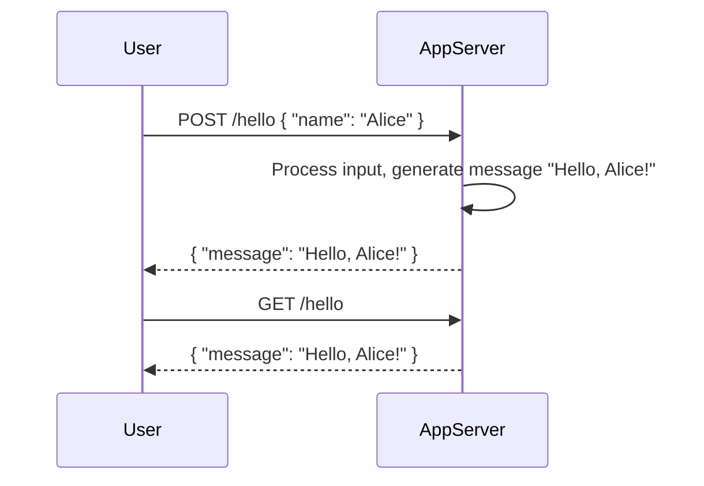

```markdown
# Functional Requirements for Hello World Backend Application

## Overview
This backend application exposes RESTful API endpoints designed to separate data processing and retrieval according to the following rules:
- **POST endpoints**: Handle business logic, external data retrieval, calculations, or any processing.
- **GET endpoints**: Retrieve processed results or application state only.

---

## API Endpoints

### 1. POST /hello
- **Purpose**: Process a request to generate or update the "Hello World" message or perform any business logic if extended.
- **Request Format** (JSON):
  ```json
  {
    "name": "optional_user_name"
  }
  ```
- **Response Format** (JSON):
  ```json
  {
    "message": "Hello, World!" // or "Hello, {name}!" if name provided
  }
  ```
- **Description**: If a name is provided, the backend incorporates it into the greeting. This endpoint can be extended to invoke external services or perform calculations if needed.

---

### 2. GET /hello
- **Purpose**: Retrieve the current greeting message.
- **Request Format**: None (simple GET)
- **Response Format** (JSON):
  ```json
  {
    "message": "Hello, World!"
  }
  ```
- **Description**: Returns the last generated greeting message stored or default.

---

## User-App Interaction Sequence


```mermaid
sequenceDiagram
    participant User
    participant AppServer

    User->>AppServer: POST /hello { "name": "Alice" }
    AppServer->>AppServer: Process input, generate message "Hello, Alice!"
    AppServer-->>User: { "message": "Hello, Alice!" }

    User->>AppServer: GET /hello
    AppServer-->>User: { "message": "Hello, Alice!" }
```

---

## Notes
- POST is used to generate or modify the message, potentially invoking external logic.
- GET is used only to retrieve the current message.
- Request and response formats are JSON for consistency and ease of extension.
```