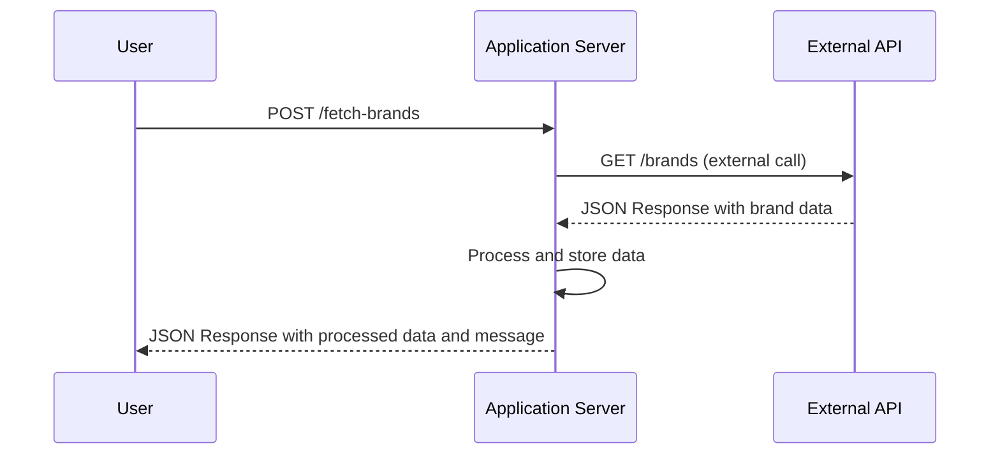
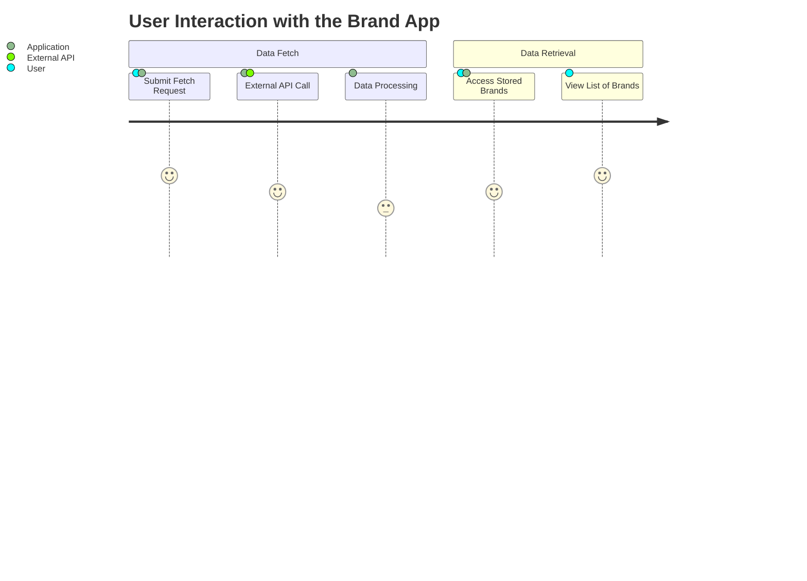

# Functional Requirements Specification

## Overview
This document outlines the functional requirements for a backend application that interacts with an external API to fetch and display brand data. The application adheres to RESTful principles and includes defined endpoints for data retrieval.

## Endpoints

### 1. POST /fetch-brands
- **Purpose:**  
  Executes business logic to contact the external API (`https://api.practicesoftwaretesting.com/brands`), processes the received data, and stores the results internally.

- **Request Format:**  
  - **Content-Type:** application/json  
  - **Body (optional parameters):**  
    ```json
    {
      "fetch_mode": "full"  // optional, defines fetch mode if needed in the future
    }
    ```

- **Response Format:**  
  - **Content-Type:** application/json  
  - **Success Response (HTTP 200):**  
    ```json
    {
      "message": "Data fetched successfully.",
      "data": [
        {
          "id": "01JMWZK3N7PT3XMTMXMQTBACRV",
          "name": "ForgeFlex Tools",
          "slug": "forgeflex-tools"
        },
        {
          "id": "01JMWZK3N7PT3XMTMXMQTBACRW",
          "name": "MightyCraft Hardware",
          "slug": "mightycraft-hardware"
        }
      ]
    }
    ```
  - **Error Responses:**  
    - HTTP 500: Internal error or external API failure  
    - HTTP 400: Validation errors

### 2. GET /brands
- **Purpose:**  
  Retrieves the processed and stored brand data from the application database or in-memory storage.

- **Request Format:**  
  - No body parameters required.  
  - Query parameters may be added in the future for filtering or pagination.

- **Response Format:**  
  - **Content-Type:** application/json  
  - **Success Response (HTTP 200):**  
    ```json
    [
      {
        "id": "01JMWZK3N7PT3XMTMXMQTBACRV",
        "name": "ForgeFlex Tools",
        "slug": "forgeflex-tools"
      },
      {
        "id": "01JMWZK3N7PT3XMTMXMQTBACRW",
        "name": "MightyCraft Hardware",
        "slug": "mightycraft-hardware"
      }
    ]
    ```
  - **Error Responses:**  
    - Appropriate error codes when data is unavailable.

## Business Logic Notes
- External data retrieval and any related calculations are confined to the `POST /fetch-brands` endpoint.
- The `GET /brands` endpoint is strictly for application data retrieval without invoking any external calls.
- The application must include proper error handling, logging, and optionally caching or persistence for performance and reliability.

## Diagrams

### Sequence Diagram: Data Fetch Process


```mermaid
sequenceDiagram
    participant U as User
    participant A as Application Server
    participant E as External API
    U->>A: POST /fetch-brands
    A->>E: GET /brands (external call)
    E-->>A: JSON Response with brand data
    A->>A: Process and store data
    A-->>U: JSON Response with processed data and message
```

### Journey Diagram: User Interaction Flow


```mermaid
journey
    title User Interaction with the Brand App
    section Data Fetch
      Submit Fetch Request: 5: User, Application
      External API Call: 4: Application, External API
      Data Processing: 3: Application
    section Data Retrieval
      Access Stored Brands: 4: User, Application
      View List of Brands: 5: User
```