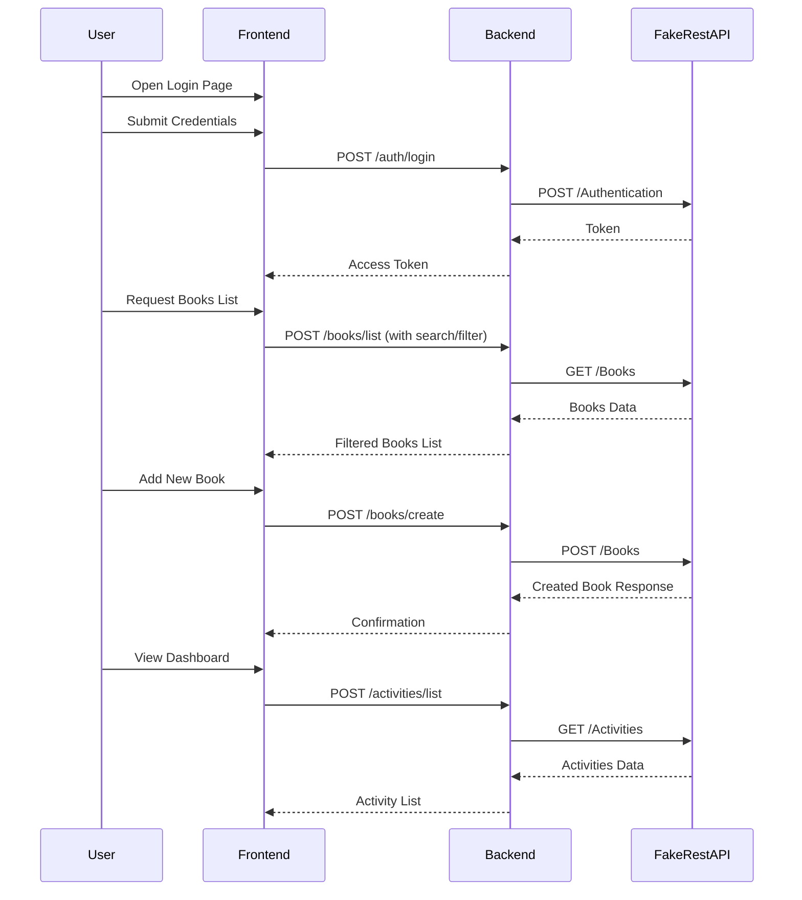
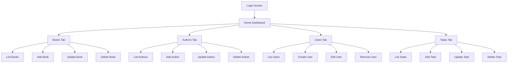

```markdown
# Library Manager Pro - Functional Requirements and API Specification

## Functional Requirements Overview

- Full CRUD for Books, Authors, Users, and Tasks.
- Authentication (login/logout) with secure token.
- User activities dashboard.
- Search functionality for Books, Authors, and Users.
- All external API interactions and business logic in POST endpoints.
- GET endpoints only return application-processed results (no direct external calls).

---

## API Endpoints

### Authentication

#### POST /auth/login  
Authenticate user and return access token.

**Request:**
```json
{
  "username": "string",
  "password": "string"
}
```

**Response:**
```json
{
  "access_token": "string",
  "expires_in": 3600
}
```

#### POST /auth/logout  
Invalidate user token.

**Request:**
```json
{
  "access_token": "string"
}
```

**Response:**
```json
{
  "message": "Logged out successfully"
}
```

---

### Books

#### POST /books/list  
Retrieve list of books from external API and apply optional filters/search.

**Request:**
```json
{
  "search": "optional string",
  "page": "optional integer",
  "page_size": "optional integer"
}
```

**Response:**
```json
{
  "books": [
    {
      "id": "integer",
      "title": "string",
      "description": "string",
      "author_id": "integer"
    }
  ],
  "total": "integer"
}
```

#### POST /books/create  
Add a new book via external API.

**Request:**
```json
{
  "title": "string",
  "description": "string",
  "author_id": "integer"
}
```

**Response:**
```json
{
  "id": "integer",
  "message": "Book created successfully"
}
```

#### POST /books/update  
Update book details via external API.

**Request:**
```json
{
  "id": "integer",
  "title": "optional string",
  "description": "optional string",
  "author_id": "optional integer"
}
```

**Response:**
```json
{
  "message": "Book updated successfully"
}
```

#### POST /books/delete  
Delete a book via external API.

**Request:**
```json
{
  "id": "integer"
}
```

**Response:**
```json
{
  "message": "Book deleted successfully"
}
```

---

### Authors

#### POST /authors/list  
Retrieve list of authors from external API and apply optional filters/search.

**Request:**
```json
{
  "search": "optional string",
  "page": "optional integer",
  "page_size": "optional integer"
}
```

**Response:**
```json
{
  "authors": [
    {
      "id": "integer",
      "name": "string",
      "bio": "string"
    }
  ],
  "total": "integer"
}
```

#### POST /authors/create  
Add a new author via external API.

**Request:**
```json
{
  "name": "string",
  "bio": "string"
}
```

**Response:**
```json
{
  "id": "integer",
  "message": "Author created successfully"
}
```

#### POST /authors/update  
Update author details via external API.

**Request:**
```json
{
  "id": "integer",
  "name": "optional string",
  "bio": "optional string"
}
```

**Response:**
```json
{
  "message": "Author updated successfully"
}
```

#### POST /authors/delete  
Delete an author via external API.

**Request:**
```json
{
  "id": "integer"
}
```

**Response:**
```json
{
  "message": "Author deleted successfully"
}
```

---

### Users

#### POST /users/list  
Retrieve list of users from external API and apply optional filters/search.

**Request:**
```json
{
  "search": "optional string",
  "page": "optional integer",
  "page_size": "optional integer"
}
```

**Response:**
```json
{
  "users": [
    {
      "id": "integer",
      "name": "string",
      "email": "string"
    }
  ],
  "total": "integer"
}
```

#### POST /users/create  
Create a new user via external API.

**Request:**
```json
{
  "name": "string",
  "email": "string"
}
```

**Response:**
```json
{
  "id": "integer",
  "message": "User created successfully"
}
```

#### POST /users/update  
Update user details via external API.

**Request:**
```json
{
  "id": "integer",
  "name": "optional string",
  "email": "optional string"
}
```

**Response:**
```json
{
  "message": "User updated successfully"
}
```

#### POST /users/delete  
Delete a user via external API.

**Request:**
```json
{
  "id": "integer"
}
```

**Response:**
```json
{
  "message": "User deleted successfully"
}
```

---

### Tasks

#### POST /tasks/list  
Retrieve list of tasks from external API and apply optional filters/search.

**Request:**
```json
{
  "search": "optional string",
  "page": "optional integer",
  "page_size": "optional integer"
}
```

**Response:**
```json
{
  "tasks": [
    {
      "id": "integer",
      "title": "string",
      "description": "string",
      "status": "string"
    }
  ],
  "total": "integer"
}
```

#### POST /tasks/create  
Add a new task via external API.

**Request:**
```json
{
  "title": "string",
  "description": "string",
  "status": "string"
}
```

**Response:**
```json
{
  "id": "integer",
  "message": "Task created successfully"
}
```

#### POST /tasks/update  
Update task details via external API.

**Request:**
```json
{
  "id": "integer",
  "title": "optional string",
  "description": "optional string",
  "status": "optional string"
}
```

**Response:**
```json
{
  "message": "Task updated successfully"
}
```

#### POST /tasks/delete  
Delete a task via external API.

**Request:**
```json
{
  "id": "integer"
}
```

**Response:**
```json
{
  "message": "Task deleted successfully"
}
```

---

### User Activities

#### POST /activities/list  
Retrieve user activities for dashboard.

**Request:**
```json
{
  "user_id": "integer",
  "date_range": {
    "from": "YYYY-MM-DD",
    "to": "YYYY-MM-DD"
  }
}
```

**Response:**
```json
{
  "activities": [
    {
      "id": "integer",
      "action": "string",
      "timestamp": "ISO8601 string",
      "details": "string"
    }
  ]
}
```

---

## User-App Interaction Sequence Diagram


```mermaid
sequenceDiagram
    participant User
    participant Frontend
    participant Backend
    participant FakeRestAPI

    User->>Frontend: Open Login Page
    User->>Frontend: Submit Credentials
    Frontend->>Backend: POST /auth/login
    Backend->>FakeRestAPI: POST /Authentication
    FakeRestAPI-->>Backend: Token
    Backend-->>Frontend: Access Token

    User->>Frontend: Request Books List
    Frontend->>Backend: POST /books/list (with search/filter)
    Backend->>FakeRestAPI: GET /Books
    FakeRestAPI-->>Backend: Books Data
    Backend-->>Frontend: Filtered Books List

    User->>Frontend: Add New Book
    Frontend->>Backend: POST /books/create
    Backend->>FakeRestAPI: POST /Books
    FakeRestAPI-->>Backend: Created Book Response
    Backend-->>Frontend: Confirmation

    User->>Frontend: View Dashboard
    Frontend->>Backend: POST /activities/list
    Backend->>FakeRestAPI: GET /Activities
    FakeRestAPI-->>Backend: Activities Data
    Backend-->>Frontend: Activity List
```

---

## User Journey Overview Diagram


```mermaid
flowchart TD
    Login[Login Screen] --> Dashboard[Home Dashboard]
    Dashboard --> BooksTab[Books Tab]
    Dashboard --> AuthorsTab[Authors Tab]
    Dashboard --> UsersTab[Users Tab]
    Dashboard --> TasksTab[Tasks Tab]

    BooksTab --> BookList[List Books]
    BooksTab --> AddBook[Add Book]
    BooksTab --> UpdateBook[Update Book]
    BooksTab --> DeleteBook[Delete Book]

    AuthorsTab --> AuthorList[List Authors]
    AuthorsTab --> AddAuthor[Add Author]
    AuthorsTab --> UpdateAuthor[Update Author]
    AuthorsTab --> DeleteAuthor[Delete Author]

    UsersTab --> UserList[List Users]
    UsersTab --> AddUser[Create User]
    UsersTab --> UpdateUser[Edit User]
    UsersTab --> DeleteUser[Remove User]

    TasksTab --> TaskList[List Tasks]
    TasksTab --> AddTask[Add Task]
    TasksTab --> UpdateTask[Update Task]
    TasksTab --> DeleteTask[Delete Task]
```
```