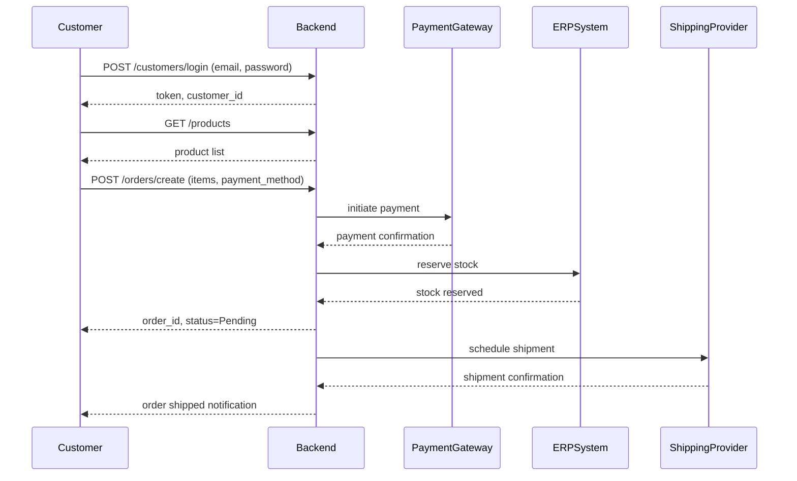
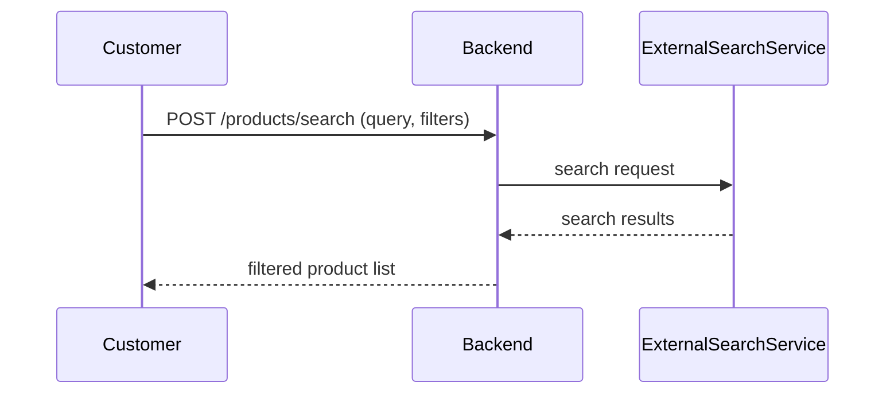
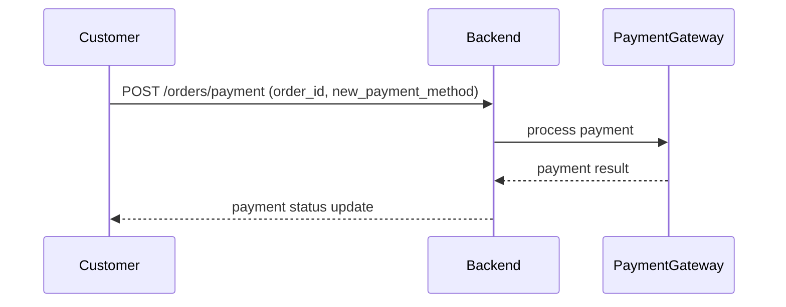

```markdown
# Functional Requirements and API Specification for Retail Backend

## API Endpoints

### 1. Product Catalog

#### GET /products
- Description: Retrieve product list or details (application data only).
- Query Parameters (optional):  
  - `category`: filter by category  
  - `id`: get a single product by ID  
- Response (application/json):  
  ```json
  {
    "products": [
      {
        "id": "string",
        "name": "string",
        "description": "string",
        "price": "number",
        "availability": "number",
        "image_url": "string"
      }
    ]
  }
  ```

#### POST /products/search
- Description: Search products using external data sources or complex filters.
- Request Body (application/json):  
  ```json
  {
    "query": "string",
    "filters": {
      "price_min": "number",
      "price_max": "number",
      "in_stock": "boolean"
    }
  }
  ```
- Response: Same as GET /products.

---

### 2. Inventory Management

#### GET /inventory/{product_id}
- Description: Retrieve current stock for a product.
- Response:  
  ```json
  {
    "product_id": "string",
    "stock": "number"
  }
  ```

#### POST /inventory/update
- Description: Update stock levels (business logic, external ERP sync).
- Request Body:  
  ```json
  {
    "product_id": "string",
    "adjustment": "number"  // positive or negative
  }
  ```
- Response:  
  ```json
  {
    "product_id": "string",
    "new_stock": "number"
  }
  ```

---

### 3. Order Processing

#### POST /orders/create
- Description: Create an order (includes payment initiation).
- Request Body:  
  ```json
  {
    "customer_id": "string",
    "items": [
      {
        "product_id": "string",
        "quantity": "number"
      }
    ],
    "payment_method": "string",
    "promo_code": "string" // optional
  }
  ```
- Response:  
  ```json
  {
    "order_id": "string",
    "status": "Pending"
  }
  ```

#### GET /orders/{order_id}
- Description: Retrieve order status and details.
- Response:  
  ```json
  {
    "order_id": "string",
    "status": "string",
    "items": [
      {
        "product_id": "string",
        "quantity": "number",
        "price": "number"
      }
    ],
    "total": "number",
    "payment_status": "string",
    "shipping_status": "string"
  }
  ```

#### POST /orders/payment
- Description: Confirm or retry payment.
- Request Body:  
  ```json
  {
    "order_id": "string",
    "payment_method": "string"
  }
  ```
- Response:  
  ```json
  {
    "order_id": "string",
    "payment_status": "string"
  }
  ```

#### POST /orders/cancel
- Description: Cancel an order.
- Request Body:  
  ```json
  {
    "order_id": "string",
    "reason": "string"
  }
  ```
- Response:  
  ```json
  {
    "order_id": "string",
    "status": "Canceled"
  }
  ```

---

### 4. Customer Accounts

#### POST /customers/register
- Description: Register new customer.
- Request Body:  
  ```json
  {
    "email": "string",
    "password": "string",
    "name": "string"
  }
  ```
- Response:  
  ```json
  {
    "customer_id": "string",
    "message": "Registration successful"
  }
  ```

#### POST /customers/login
- Description: Authenticate customer.
- Request Body:  
  ```json
  {
    "email": "string",
    "password": "string"
  }
  ```
- Response:  
  ```json
  {
    "token": "string",
    "customer_id": "string"
  }
  ```

#### GET /customers/{customer_id}/orders
- Description: Retrieve order history.
- Response:  
  ```json
  {
    "orders": [
      {
        "order_id": "string",
        "status": "string",
        "total": "number",
        "order_date": "string"
      }
    ]
  }
  ```

---

### 5. Promotions & Discounts

#### POST /promotions/apply
- Description: Apply promo code to an order.
- Request Body:  
  ```json
  {
    "order_id": "string",
    "promo_code": "string"
  }
  ```
- Response:  
  ```json
  {
    "order_id": "string",
    "discount_amount": "number",
    "new_total": "number"
  }
  ```

---

## User-App Interaction Sequence Diagram


```mermaid
sequenceDiagram
    participant Customer
    participant Backend
    participant PaymentGateway
    participant ERPSystem
    participant ShippingProvider

    Customer->>Backend: POST /customers/login (email, password)
    Backend-->>Customer: token, customer_id

    Customer->>Backend: GET /products
    Backend-->>Customer: product list

    Customer->>Backend: POST /orders/create (items, payment_method)
    Backend->>PaymentGateway: initiate payment
    PaymentGateway-->>Backend: payment confirmation
    Backend->>ERPSystem: reserve stock
    ERPSystem-->>Backend: stock reserved
    Backend-->>Customer: order_id, status=Pending

    Backend->>ShippingProvider: schedule shipment
    ShippingProvider-->>Backend: shipment confirmation

    Backend-->>Customer: order shipped notification
```

## Product Search Flow Diagram


```mermaid
sequenceDiagram
    participant Customer
    participant Backend
    participant ExternalSearchService

    Customer->>Backend: POST /products/search (query, filters)
    Backend->>ExternalSearchService: search request
    ExternalSearchService-->>Backend: search results
    Backend-->>Customer: filtered product list
```

## Order Payment Retry Flow


```mermaid
sequenceDiagram
    participant Customer
    participant Backend
    participant PaymentGateway

    Customer->>Backend: POST /orders/payment (order_id, new_payment_method)
    Backend->>PaymentGateway: process payment
    PaymentGateway-->>Backend: payment result
    Backend-->>Customer: payment status update
```
```