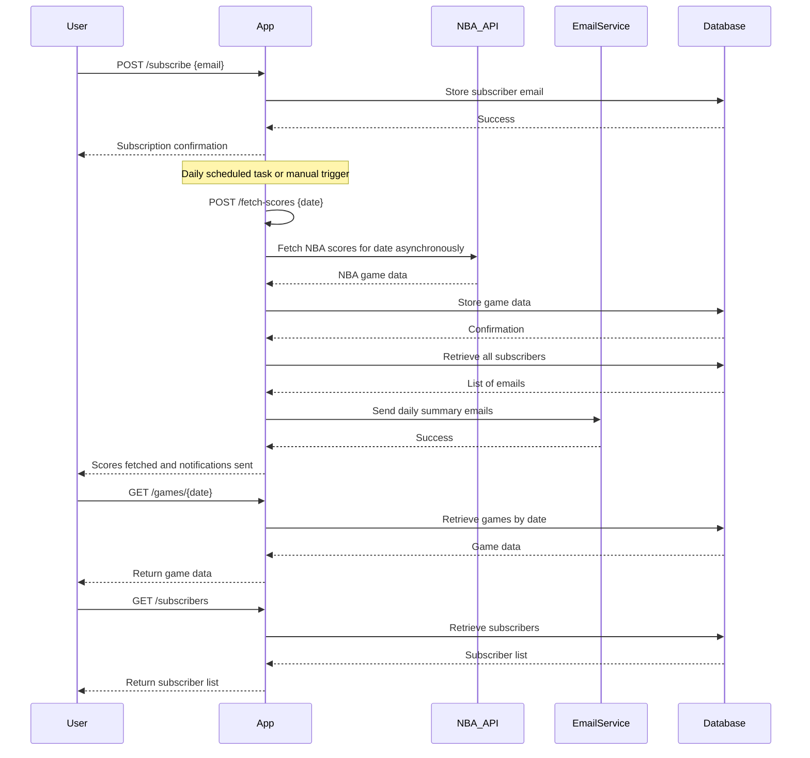

```markdown
# Functional Requirements and API Design for NBA Scores Application

## API Endpoints

### 1. Subscribe to Notifications  
**POST /subscribe**  
- **Description:** Add a user email to the subscription list.  
- **Request Body:**  
  ```json
  {
    "email": "user@example.com"
  }
  ```  
- **Response:**  
  ```json
  {
    "message": "Subscription successful",
    "email": "user@example.com"
  }
  ```  
- **Business Logic:** Validate email format; store subscriber.

---

### 2. Fetch and Store NBA Scores (trigger data fetch)  
**POST /fetch-scores**  
- **Description:** Trigger fetching NBA scores from external API for a specific date.  
- **Request Body:**  
  ```json
  {
    "date": "YYYY-MM-DD"
  }
  ```  
- **Response:**  
  ```json
  {
    "message": "Scores fetched and stored",
    "date": "YYYY-MM-DD",
    "games_count": 10
  }
  ```  
- **Business Logic:**  
  - Call external NBA API asynchronously.  
  - Parse and store game data in DB.  
  - Send notification emails to subscribers with the daily summary.

---

### 3. Get All Subscribers  
**GET /subscribers**  
- **Description:** Retrieve list of all subscribed emails.  
- **Response:**  
  ```json
  {
    "subscribers": [
      "user1@example.com",
      "user2@example.com"
    ]
  }
  ```

---

### 4. Get All Games  
**GET /games/all**  
- **Description:** Retrieve all stored NBA games data (optional filtering/pagination can be added later).  
- **Response:**  
  ```json
  {
    "games": [
      {
        "date": "YYYY-MM-DD",
        "home_team": "Team A",
        "away_team": "Team B",
        "home_score": 110,
        "away_score": 102,
        "status": "Final"
      },
      ...
    ]
  }
  ```

---

### 5. Get Games by Date  
**GET /games/{date}**  
- **Description:** Retrieve all NBA games for a specific date.  
- **Response:** Same format as **GET /games/all**, filtered by date.

---

## User-App Interaction Sequence Diagram


```mermaid
sequenceDiagram
    participant User
    participant App
    participant NBA_API
    participant EmailService
    participant Database

    User->>App: POST /subscribe {email}
    App->>Database: Store subscriber email
    Database-->>App: Success
    App-->>User: Subscription confirmation

    Note over App: Daily scheduled task or manual trigger

    App->>App: POST /fetch-scores {date}
    App->>NBA_API: Fetch NBA scores for date asynchronously
    NBA_API-->>App: NBA game data
    App->>Database: Store game data
    Database-->>App: Confirmation
    App->>Database: Retrieve all subscribers
    Database-->>App: List of emails
    App->>EmailService: Send daily summary emails
    EmailService-->>App: Success
    App-->>User: Scores fetched and notifications sent

    User->>App: GET /games/{date}
    App->>Database: Retrieve games by date
    Database-->>App: Game data
    App-->>User: Return game data

    User->>App: GET /subscribers
    App->>Database: Retrieve subscribers
    Database-->>App: Subscriber list
    App-->>User: Return subscriber list
```
```