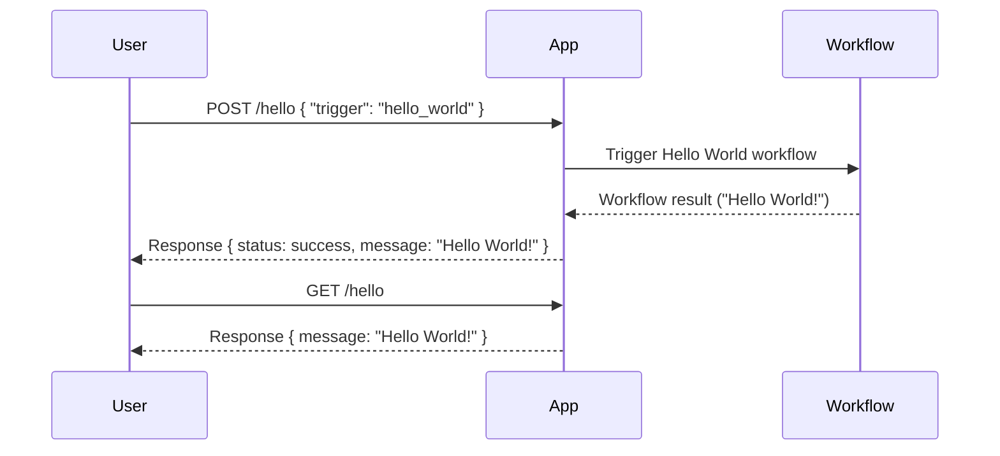
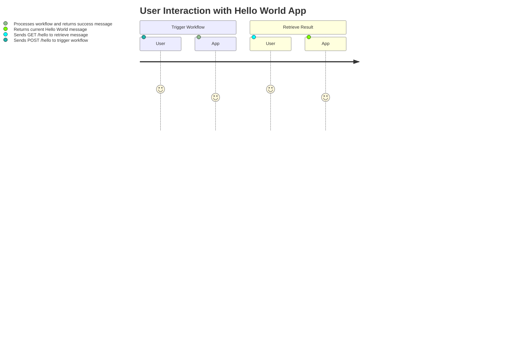

```markdown
# Functional Requirements for Hello World Python Quart Application

## API Endpoints

### POST `/hello`
- **Purpose**: Trigger the Hello World workflow including any business logic, external data retrieval, or calculations.
- **Request Format** (JSON):
  ```json
  {
    "trigger": "hello_world"
  }
  ```
- **Response Format** (JSON):
  ```json
  {
    "status": "success",
    "message": "Hello World!"
  }
  ```

### GET `/hello`
- **Purpose**: Retrieve the current or last Hello World message produced by the application.
- **Response Format** (JSON):
  ```json
  {
    "message": "Hello World!"
  }
  ```

## Business Logic Notes
- All business logic, including calls to external data sources or computations, must be implemented in the POST endpoint.
- The GET endpoint is read-only and serves only to retrieve results from the application.

---

## User-App Interaction Sequence Diagram


```mermaid
sequenceDiagram
    participant User
    participant App
    participant Workflow

    User->>App: POST /hello { "trigger": "hello_world" }
    App->>Workflow: Trigger Hello World workflow
    Workflow-->>App: Workflow result ("Hello World!")
    App-->>User: Response { status: success, message: "Hello World!" }

    User->>App: GET /hello
    App-->>User: Response { message: "Hello World!" }
```

---

## User Journey Diagram


```mermaid
journey
    title User Interaction with Hello World App
    section Trigger Workflow
      User: 5: Sends POST /hello to trigger workflow
      App: 4: Processes workflow and returns success message
    section Retrieve Result
      User: 5: Sends GET /hello to retrieve message
      App: 4: Returns current Hello World message
```
```