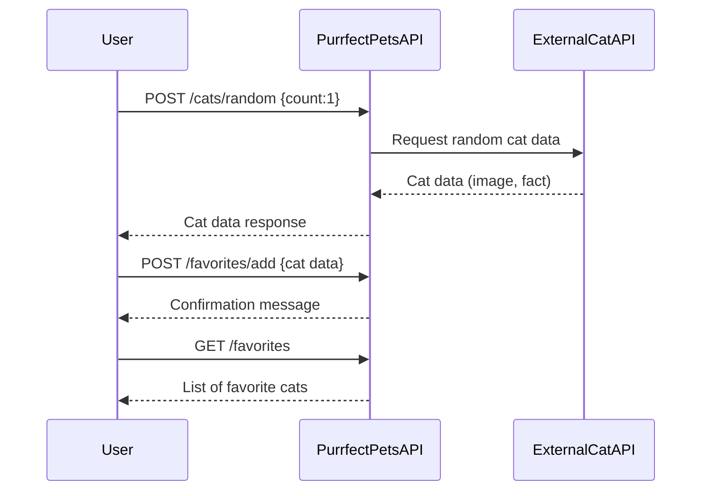
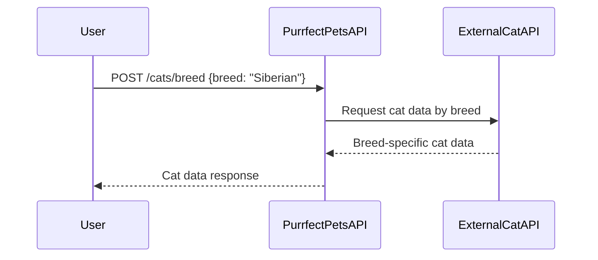

```markdown
# Purrfect Pets API - Functional Requirements

## API Endpoints

### 1. POST /cats/random
- **Description:** Fetches live random cat data from an external source (e.g., images, facts).
- **Request:**
  ```json
  {
    "count": 1  // number of random cats requested, optional, default = 1
  }
  ```
- **Response:**
  ```json
  {
    "cats": [
      {
        "id": "abc123",
        "image_url": "https://...",
        "fact": "Cats sleep 70% of their lives."
      }
    ]
  }
  ```

### 2. POST /cats/breed
- **Description:** Retrieves live cat data filtered by breed from an external source.
- **Request:**
  ```json
  {
    "breed": "Siberian",
    "count": 1  // optional, default = 1
  }
  ```
- **Response:**
  ```json
  {
    "cats": [
      {
        "id": "xyz789",
        "breed": "Siberian",
        "image_url": "https://...",
        "fact": "The Siberian cat is hypoallergenic."
      }
    ]
  }
  ```

### 3. GET /favorites
- **Description:** Retrieves user’s favorite cats stored in the application.
- **Response:**
  ```json
  {
    "favorites": [
      {
        "id": "abc123",
        "breed": "Siberian",
        "image_url": "https://...",
        "fact": "Cats sleep 70% of their lives."
      }
    ]
  }
  ```

### 4. POST /favorites/add
- **Description:** Adds a cat to user’s favorites.
- **Request:**
  ```json
  {
    "cat_id": "abc123",
    "breed": "Siberian",
    "image_url": "https://...",
    "fact": "Cats sleep 70% of their lives."
  }
  ```
- **Response:**
  ```json
  {
    "message": "Cat added to favorites."
  }
  ```

---

## Mermaid Diagrams

### User Journey


```mermaid
sequenceDiagram
    participant User
    participant PurrfectPetsAPI
    participant ExternalCatAPI

    User->>PurrfectPetsAPI: POST /cats/random {count:1}
    PurrfectPetsAPI->>ExternalCatAPI: Request random cat data
    ExternalCatAPI-->>PurrfectPetsAPI: Cat data (image, fact)
    PurrfectPetsAPI-->>User: Cat data response

    User->>PurrfectPetsAPI: POST /favorites/add {cat data}
    PurrfectPetsAPI-->>User: Confirmation message

    User->>PurrfectPetsAPI: GET /favorites
    PurrfectPetsAPI-->>User: List of favorite cats
```

### API Interaction for Breed Search


```mermaid
sequenceDiagram
    participant User
    participant PurrfectPetsAPI
    participant ExternalCatAPI

    User->>PurrfectPetsAPI: POST /cats/breed {breed: "Siberian"}
    PurrfectPetsAPI->>ExternalCatAPI: Request cat data by breed
    ExternalCatAPI-->>PurrfectPetsAPI: Breed-specific cat data
    PurrfectPetsAPI-->>User: Cat data response
```
```