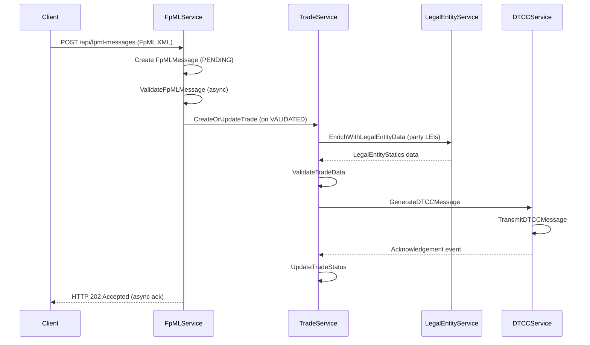
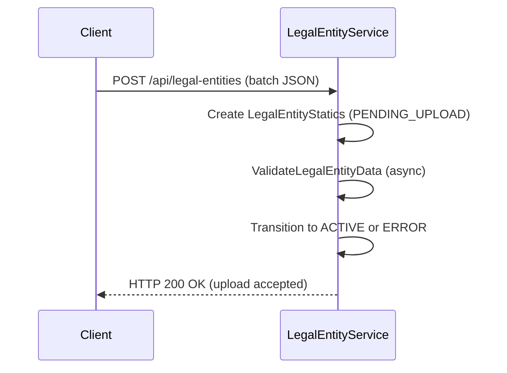
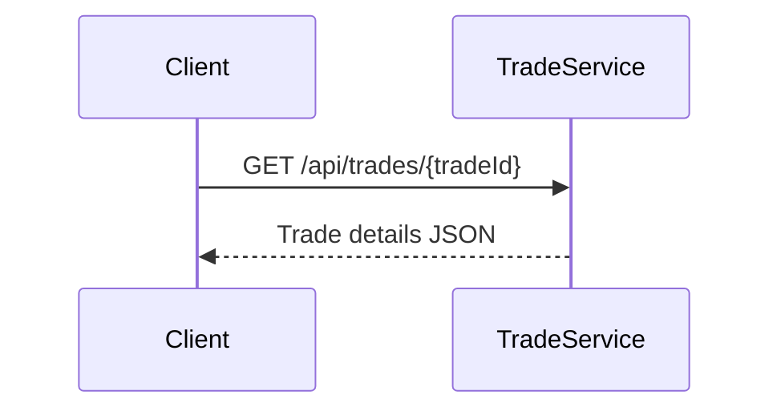

```markdown
# Functional Requirements and API Design for FpML Trade Processing System

## API Endpoints

### 1. Receive FpML Trade Execution Message  
**Endpoint:** `POST /api/fpml-messages`  
**Description:** Receives FpML XML payload, creates an `FpMLMessage` entity with status `PENDING`, triggers validation and processing asynchronously.  
**Request Body:**  
```json
{
  "payload": "<FpML XML content as string>"
}
```  
**Response:**  
```json
{
  "messageId": "uuid",
  "status": "PENDING",
  "acknowledgement": "Received"
}
```

---

### 2. Upload Legal Entity Static Data  
**Endpoint:** `POST /api/legal-entities`  
**Description:** Uploads LegalEntityStatics data (single or batch). Creates records with `PENDING_UPLOAD` status, then triggers validation workflow.  
**Request Body:**  
```json
[
  {
    "lei": "string",
    "legalName": "string",
    "address": "string",
    "countryCode": "string"
  }
]
```  
**Response:**  
```json
{
  "uploadedCount": 10,
  "status": "PENDING_UPLOAD"
}
```

---

### 3. Query Trade Data  
**Endpoint:** `GET /api/trades/{tradeId}`  
**Description:** Retrieves trade data, including status, trade details, events, and processing log.  
**Response:**  
```json
{
  "tradeId": "string",
  "productType": "string",
  "party1LEI": "string",
  "party2LEI": "string",
  "tradeDetails": { /* trade parameters */ },
  "status": "string",
  "events": [ /* list of trade events */ ],
  "processingLog": [ /* history of state transitions */ ]
}
```

---

### 4. Query DTCC Message Status  
**Endpoint:** `GET /api/dtcc-messages/{dtccMessageId}`  
**Description:** Retrieves status and timestamps for a specific DTCC message.  
**Response:**  
```json
{
  "id": "string",
  "type": "string",
  "status": "string",
  "creationTimestamp": "ISO8601 datetime",
  "transmissionTimestamp": "ISO8601 datetime or null",
  "acknowledgementTimestamp": "ISO8601 datetime or null",
  "relatedTradeId": "string",
  "processingLog": [ /* history of state transitions */ ]
}
```

---

### 5. Update Trade Status via External Event  
**Endpoint:** `POST /api/trades/{tradeId}/status`  
**Description:** Receives external trade status updates (e.g., DTCC acknowledgements) to update trade FSM.  
**Request Body:**  
```json
{
  "newStatus": "string",
  "eventDetails": { /* optional event-specific info */ }
}
```  
**Response:**  
```json
{
  "tradeId": "string",
  "updatedStatus": "string"
}
```

---

# User Interaction Sequence Diagram


```mermaid
sequenceDiagram
    participant Client
    participant FpMLService
    participant TradeService
    participant LegalEntityService
    participant DTCCService

    Client->>FpMLService: POST /api/fpml-messages (FpML XML)
    FpMLService->>FpMLService: Create FpMLMessage (PENDING)
    FpMLService->>FpMLService: ValidateFpMLMessage (async)
    FpMLService->>TradeService: CreateOrUpdateTrade (on VALIDATED)
    TradeService->>LegalEntityService: EnrichWithLegalEntityData (party LEIs)
    LegalEntityService-->>TradeService: LegalEntityStatics data
    TradeService->>TradeService: ValidateTradeData
    TradeService->>DTCCService: GenerateDTCCMessage
    DTCCService->>DTCCService: TransmitDTCCMessage
    DTCCService-->>TradeService: Acknowledgement event
    TradeService->>TradeService: UpdateTradeStatus
    FpMLService-->>Client: HTTP 202 Accepted (async ack)
```

# LegalEntity Upload Flow


```mermaid
sequenceDiagram
    participant Client
    participant LegalEntityService

    Client->>LegalEntityService: POST /api/legal-entities (batch JSON)
    LegalEntityService->>LegalEntityService: Create LegalEntityStatics (PENDING_UPLOAD)
    LegalEntityService->>LegalEntityService: ValidateLegalEntityData (async)
    LegalEntityService->>LegalEntityService: Transition to ACTIVE or ERROR
    LegalEntityService-->>Client: HTTP 200 OK (upload accepted)
```

# Trade Query Flow


```mermaid
sequenceDiagram
    participant Client
    participant TradeService

    Client->>TradeService: GET /api/trades/{tradeId}
    TradeService-->>Client: Trade details JSON
```

---

This design ensures all external data retrieval and business logic occurs in POST endpoints, while GET endpoints serve only for retrieving processed data.
```