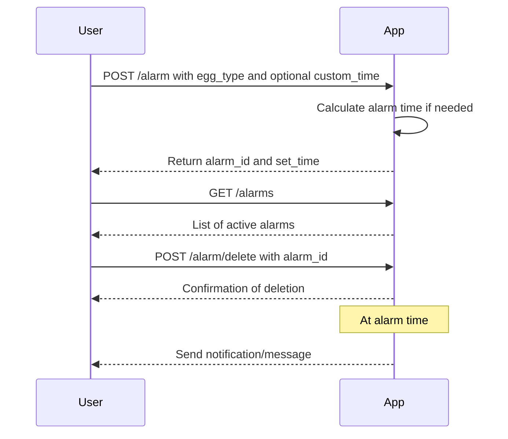

```markdown
# Egg Alarm App - Functional Requirements & API Design

## Functional Requirements

1. User selects egg type (soft-boiled, medium-boiled, hard-boiled).
2. User sets the alarm either by:
   - Providing a custom alarm time, or
   - Using automatic alarm time based on typical cooking duration for chosen egg type.
3. The system calculates the alarm time if automatic mode is selected.
4. User can view active alarm(s).
5. User can cancel/delete an alarm.
6. Alarm triggers notification/message at the set time.

---

## API Endpoints

### 1. Create/Set Alarm  
**POST** `/alarm`  
- Purpose: Set a new alarm based on egg type and either custom or automatic time calculation.  
- Request JSON:
  ```json
  {
    "egg_type": "soft" | "medium" | "hard",
    "custom_time": "HH:MM" | null
  }
  ```
- Response JSON:
  ```json
  {
    "alarm_id": "string",
    "set_time": "ISO8601 datetime string",
    "egg_type": "soft" | "medium" | "hard",
    "status": "created"
  }
  ```

### 2. Get Active Alarms  
**GET** `/alarms`  
- Purpose: Retrieve all active alarms.  
- Response JSON:
  ```json
  [
    {
      "alarm_id": "string",
      "set_time": "ISO8601 datetime string",
      "egg_type": "soft" | "medium" | "hard",
      "status": "active"
    }
  ]
  ```

### 3. Delete Alarm  
**POST** `/alarm/delete`  
- Purpose: Cancel/delete an existing alarm.  
- Request JSON:
  ```json
  {
    "alarm_id": "string"
  }
  ```
- Response JSON:
  ```json
  {
    "alarm_id": "string",
    "status": "deleted"
  }
  ```

---

## User-App Interaction Sequence Diagram


```mermaid
sequenceDiagram
  participant User
  participant App

  User->>App: POST /alarm with egg_type and optional custom_time
  App->>App: Calculate alarm time if needed
  App-->>User: Return alarm_id and set_time

  User->>App: GET /alarms
  App-->>User: List of active alarms

  User->>App: POST /alarm/delete with alarm_id
  App-->>User: Confirmation of deletion

  Note over App: At alarm time
  App-->>User: Send notification/message
```
```