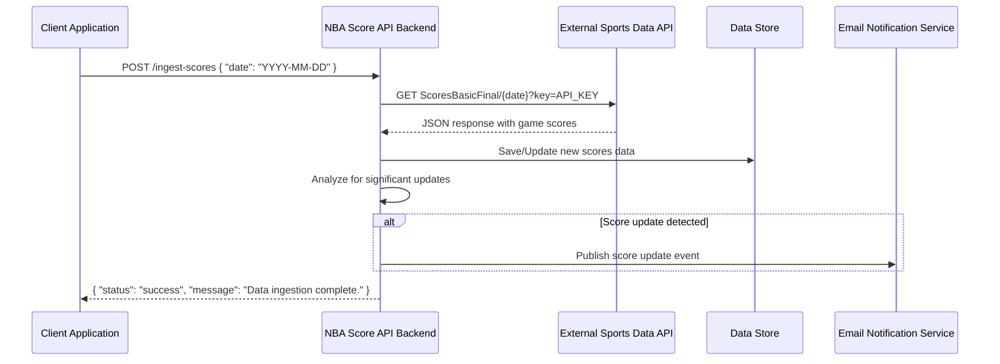
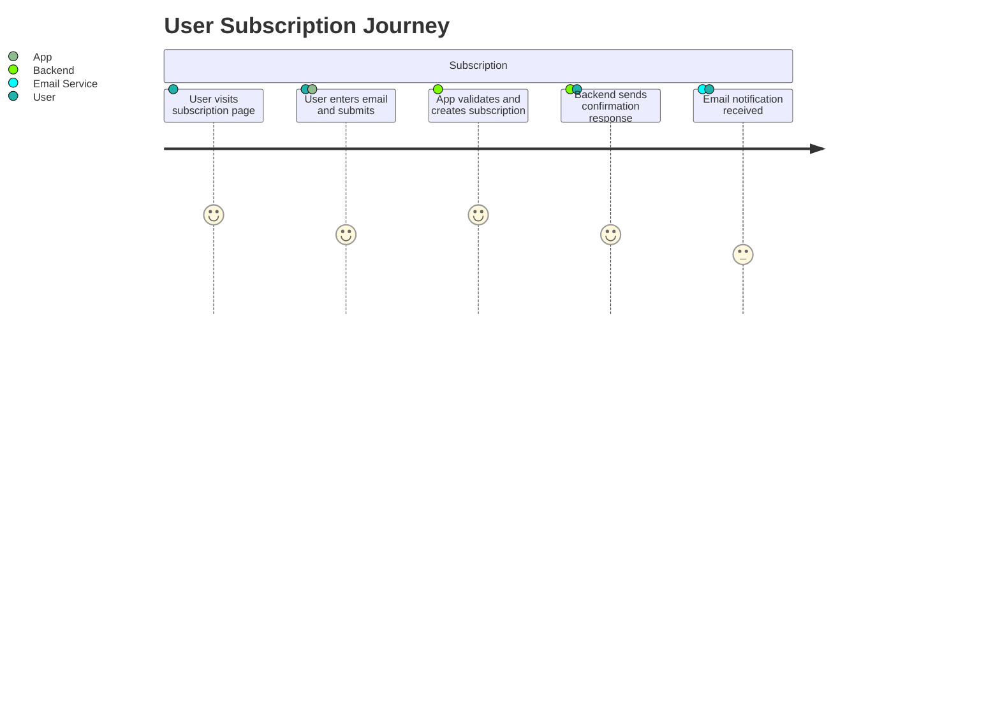

# Functional Requirements Specification

## Overview

This document outlines the functional requirements for the NBA score application. The application will ingest real-time NBA game score data from an external API, process it, and provide notifications to users based on their subscriptions. 

## API Endpoints

### 1. POST /ingest-scores
- **Purpose:**  
  Trigger ingestion of NBA scores from the external API.
  
- **Request Format:**  
  Content-Type: application/json  
  ```json
  {
    "date": "YYYY-MM-DD"
  }
  ```
  
- **Behavior:**  
  - Validate the provided date.
  - Fetch data from the external endpoint:  
    `GET https://api.sportsdata.io/v3/nba/scores/json/ScoresBasicFinal/{date}?key=f8824354d80d45368063dd2e6fb16c38`
  - Process and update the internal data store.
  - Log errors in case of failures.
  - Publish score update events if significant changes are detected.
  
- **Response Format:**  
  Content-Type: application/json  
  ```json
  {
    "status": "success",
    "message": "Data ingestion complete.",
    "ingestedRecords": 10
  }
  ```

### 2. GET /scores
- **Purpose:**  
  Retrieve the processed NBA scores from the internal data store.
  
- **Request Format:**  
  May include query parameters (e.g., date filter):
  ```http
  GET /scores?date=YYYY-MM-DD
  ```
  
- **Response Format:**  
  Content-Type: application/json  
  ```json
  {
    "date": "YYYY-MM-DD",
    "games": [
      {
        "GameID": 21852,
        "HomeTeam": "BOS",
        "AwayTeam": "POR",
        "HomeTeamScore": 102,
        "AwayTeamScore": 98,
        "Status": "Final",
        "Updated": "2025-03-05T09:45:13"
      }
    ]
  }
  ```

### 3. POST /subscribe
- **Purpose:**  
  Register a new user subscription to receive email notifications for score updates.
  
- **Request Format:**  
  Content-Type: application/json  
  ```json
  {
    "email": "user@example.com"
  }
  ```
  
- **Behavior:**  
  - Validate the email address.
  - Create a subscription record.
  
- **Response Format:**  
  Content-Type: application/json  
  ```json
  {
    "status": "success",
    "message": "Subscription created successfully.",
    "subscriptionId": "abc123"
  }
  ```

### 4. GET /subscriptions
- **Purpose:**  
  Retrieve a list of user subscriptions.
  
- **Request Format:**  
  ```http
  GET /subscriptions
  ```
  
- **Response Format:**  
  Content-Type: application/json  
  ```json
  {
    "subscriptions": [
      {
        "subscriptionId": "abc123",
        "email": "user@example.com"
      }
    ]
  }
  ```

## Mermaid Diagrams

### Sequence Diagram: Data Ingestion and Notification Flow


```mermaid
sequenceDiagram
    participant Client as Client Application
    participant API as NBA Score API Backend
    participant External as External Sports Data API
    participant Store as Data Store
    participant Email as Email Notification Service

    Client->>API: POST /ingest-scores { "date": "YYYY-MM-DD" }
    API->>External: GET ScoresBasicFinal/{date}?key=API_KEY
    External-->>API: JSON response with game scores
    API->>Store: Save/Update new scores data
    API->>API: Analyze for significant updates
    alt Score update detected
      API->>Email: Publish score update event
    end
    API-->>Client: { "status": "success", "message": "Data ingestion complete." }
```

### Journey Diagram: User Subscription Experience


```mermaid
journey
    title User Subscription Journey
    section Subscription
      User visits subscription page: 5: User
      User enters email and submits: 4: User, App
      App validates and creates subscription: 5: Backend
      Backend sends confirmation response: 4: Backend, User
      Email notification received: 3: Email Service, User
```

This specification serves as a foundation for the development of the NBA score application, ensuring clarity in functional requirements and user interactions.