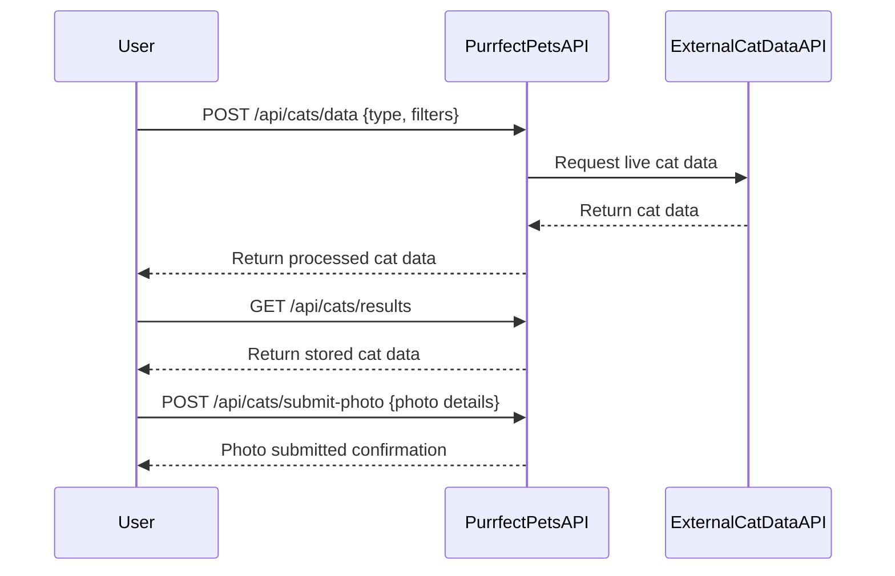
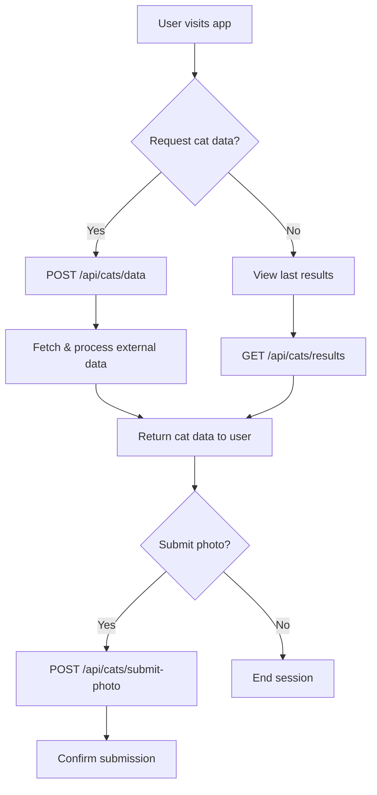

```markdown
# Purrfect Pets API - Functional Requirements

## API Endpoints

### 1. POST /api/cats/data
- **Purpose**: Fetch live cat data from external sources (facts, images, breeds) and optionally process or filter it.
- **Request Body** (JSON):
  ```json
  {
    "type": "facts" | "images" | "breeds",
    "filters": {
      "breed": "optional_breed_name",
      "limit": 10
    }
  }
  ```
- **Response** (JSON):
  ```json
  {
    "status": "success",
    "data": [ /* array of requested cat info objects */ ]
  }
  ```

### 2. GET /api/cats/results
- **Purpose**: Retrieve stored or last fetched cat data results for the user.
- **Response** (JSON):
  ```json
  {
    "status": "success",
    "data": [ /* array of cat info objects */ ]
  }
  ```

### 3. POST /api/cats/submit-photo
- **Purpose**: (Optional) Allow users to submit cat photos for fun or future features.
- **Request Body** (JSON):
  ```json
  {
    "user_id": "string",
    "photo_url": "string",
    "description": "optional description"
  }
  ```
- **Response** (JSON):
  ```json
  {
    "status": "success",
    "message": "Photo submitted"
  }
  ```

---

## User-App Interaction Sequence


```mermaid
sequenceDiagram
    participant User
    participant PurrfectPetsAPI
    participant ExternalCatDataAPI

    User->>PurrfectPetsAPI: POST /api/cats/data {type, filters}
    PurrfectPetsAPI->>ExternalCatDataAPI: Request live cat data
    ExternalCatDataAPI-->>PurrfectPetsAPI: Return cat data
    PurrfectPetsAPI-->>User: Return processed cat data

    User->>PurrfectPetsAPI: GET /api/cats/results
    PurrfectPetsAPI-->>User: Return stored cat data

    User->>PurrfectPetsAPI: POST /api/cats/submit-photo {photo details}
    PurrfectPetsAPI-->>User: Photo submitted confirmation
```

---

## User Journey Flow


```mermaid
flowchart TD
    A[User visits app] --> B{Request cat data?}
    B -- Yes --> C[POST /api/cats/data]
    C --> D[Fetch & process external data]
    D --> E[Return cat data to user]
    B -- No --> F[View last results]
    F --> G[GET /api/cats/results]
    G --> E
    E --> H{Submit photo?}
    H -- Yes --> I[POST /api/cats/submit-photo]
    I --> J[Confirm submission]
    H -- No --> K[End session]
```
```