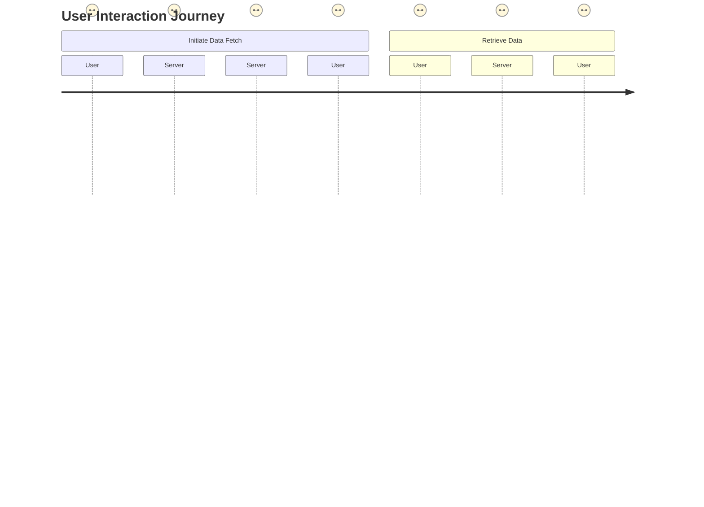
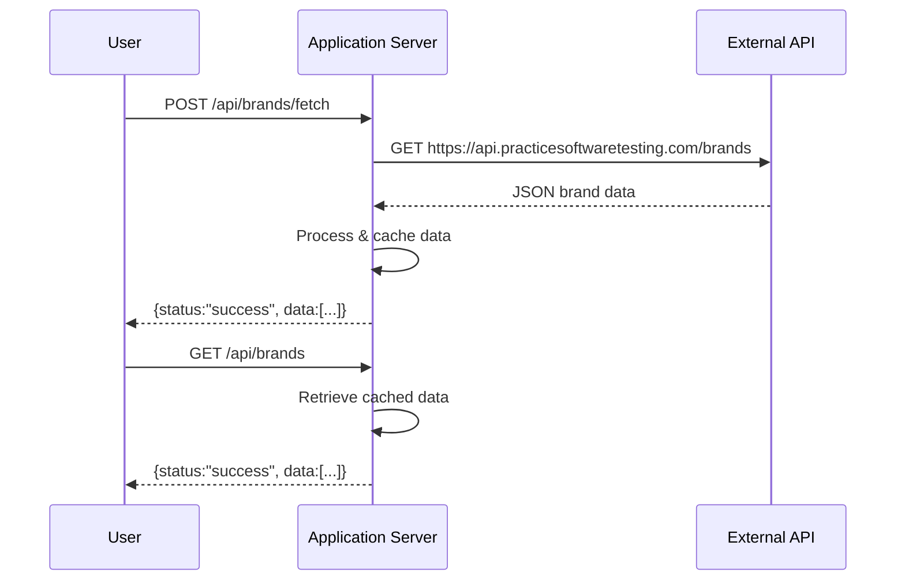

# Final Functional Requirements

## Overview

This document outlines the functional requirements for a backend application that retrieves brand data from an external API and serves it to users. The design adheres to RESTful principles, where POST endpoints handle external data retrieval and business logic, while GET endpoints are used for application results retrieval.

## API Endpoints

### 1. POST /api/brands/fetch

- **Description:**  
  Invokes the external API ("https://api.practicesoftwaretesting.com/brands") to fetch brand data. This endpoint handles all business logic related to data retrieval and processing.

- **Request Format:**  
  - **Content-Type:** application/json  
  - **Example Request Body:**  
    ```json
    {
      "filter": "optional_filter_value"
    }
    ```

- **Response Format:**  
  - **Content-Type:** application/json  
  - **Example Response Body:**  
    ```json
    {
      "status": "success",
      "message": "Data fetched successfully",
      "data": [
        {
          "id": "01JMWZK3N7PT3XMTMXMQTBACRV",
          "name": "ForgeFlex Tools",
          "slug": "forgeflex-tools"
        },
        {
          "id": "01JMWZK3N7PT3XMTMXMQTBACRW",
          "name": "MightyCraft Hardware",
          "slug": "mightycraft-hardware"
        }
      ]
    }
    ```

- **Business Logic:**  
  - Send a GET request to the external API.
  - Validate the external response.
  - Transform the data if necessary.
  - Cache or store the results for future use.
  - Return processed data in the response.

### 2. GET /api/brands

- **Description:**  
  Retrieves the cached or stored list of brand data that was fetched through the POST endpoint.

- **Request Format:**  
  - No request body is required.

- **Response Format:**  
  - **Content-Type:** application/json  
  - **Example Response Body:**  
    ```json
    {
      "status": "success",
      "data": [
        {
          "id": "01JMWZK3N7PT3XMTMXMQTBACRV",
          "name": "ForgeFlex Tools",
          "slug": "forgeflex-tools"
        },
        {
          "id": "01JMWZK3N7PT3XMTMXMQTBACRW",
          "name": "MightyCraft Hardware",
          "slug": "mightycraft-hardware"
        }
      ]
    }
    ```

## User-App Interaction Diagrams

### Journey Diagram


```mermaid
journey
    title User Interaction Journey
    section Initiate Data Fetch
      User: Initiates POST /api/brands/fetch
      Server: Calls external API and processes data
      Server: Stores/Cache fetched data
      User: Receives confirmation response

    section Retrieve Data
      User: Requests GET /api/brands
      Server: Retrieves stored data
      User: Receives the list of brands
```

### Sequence Diagram


```mermaid
sequenceDiagram
    participant U as User
    participant S as Application Server
    participant E as External API

    U->>S: POST /api/brands/fetch
    S->>E: GET https://api.practicesoftwaretesting.com/brands
    E-->>S: JSON brand data
    S->>S: Process & cache data
    S-->>U: {status:"success", data:[...]}

    U->>S: GET /api/brands
    S->>S: Retrieve cached data
    S-->>U: {status:"success", data:[...]}
```

These functional requirements provide a clear structure for the backend application, ensuring proper interaction with the external API and a user-friendly experience.