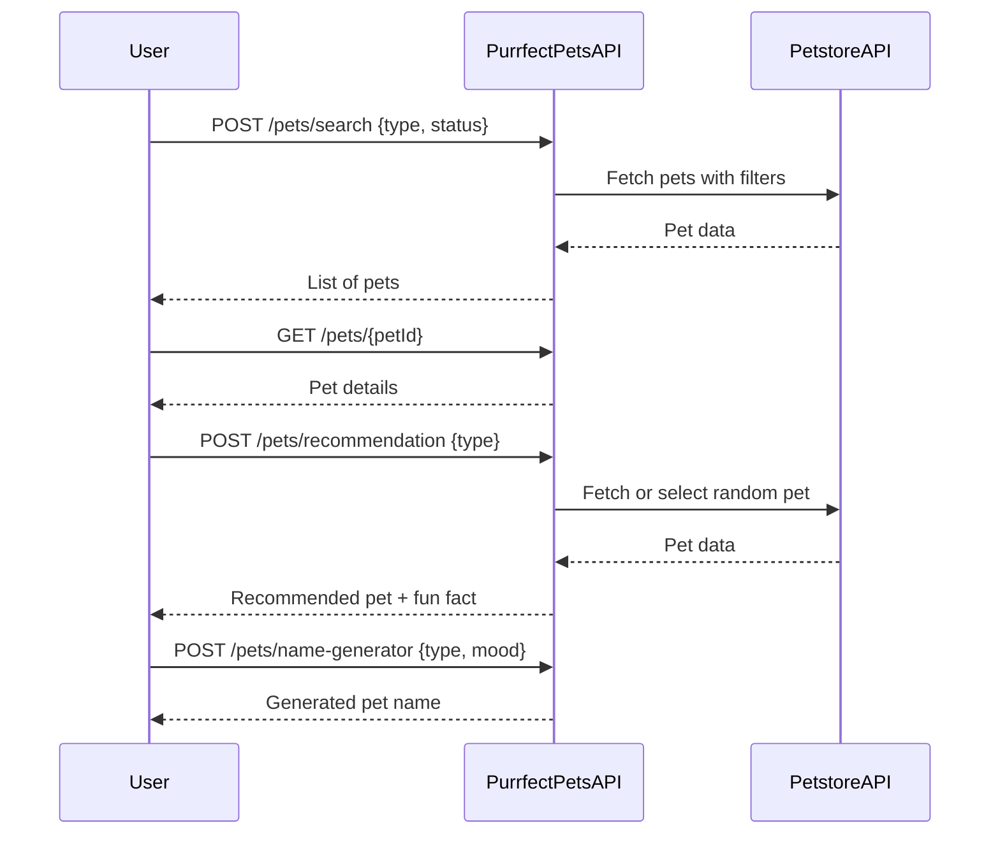
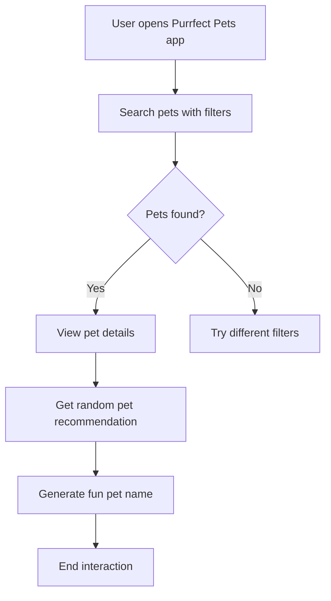

```markdown
# Purrfect Pets API - Functional Requirements

## API Endpoints

### 1. POST /pets/search  
**Description:** Search pets using Petstore API data with filters (e.g., type, status).  
**Request:**  
```json
{
  "type": "dog",          // optional, string
  "status": "available"   // optional, string
}
```  
**Response:**  
```json
{
  "pets": [
    {
      "id": 1,
      "name": "Fido",
      "type": "dog",
      "status": "available"
    },
    ...
  ]
}
```

---

### 2. GET /pets/{petId}  
**Description:** Retrieve cached pet details by petId from previous search or internal store.  
**Response:**  
```json
{
  "id": 1,
  "name": "Fido",
  "type": "dog",
  "status": "available",
  "description": "Friendly dog loving walks."
}
```

---

### 3. POST /pets/recommendation  
**Description:** Get a fun random pet recommendation, optionally filtered by type.  
**Request:**  
```json
{
  "type": "cat"  // optional
}
```  
**Response:**  
```json
{
  "pet": {
    "id": 7,
    "name": "Whiskers",
    "type": "cat",
    "status": "available",
    "funFact": "Loves chasing laser pointers!"
  }
}
```

---

### 4. POST /pets/name-generator  
**Description:** Generate a fun pet name based on type or mood.  
**Request:**  
```json
{
  "type": "dog",      // optional
  "mood": "playful"   // optional
}
```  
**Response:**  
```json
{
  "name": "Bouncy Buddy"
}
```

---

## Business Logic Notes
- All external Petstore API calls happen in POST endpoints to comply with Cyoda design.
- GET endpoints serve only cached or internal data for quick retrieval.
- POST `/pets/search` fetches and caches data from Petstore API.
- POST `/pets/recommendation` and `/pets/name-generator` use internal logic or cached data.

---

## User-App Interaction Sequence Diagram


```mermaid
sequenceDiagram
    participant User
    participant PurrfectPetsAPI
    participant PetstoreAPI

    User->>PurrfectPetsAPI: POST /pets/search {type, status}
    PurrfectPetsAPI->>PetstoreAPI: Fetch pets with filters
    PetstoreAPI-->>PurrfectPetsAPI: Pet data
    PurrfectPetsAPI-->>User: List of pets

    User->>PurrfectPetsAPI: GET /pets/{petId}
    PurrfectPetsAPI-->>User: Pet details

    User->>PurrfectPetsAPI: POST /pets/recommendation {type}
    PurrfectPetsAPI->>PetstoreAPI: Fetch or select random pet
    PetstoreAPI-->>PurrfectPetsAPI: Pet data
    PurrfectPetsAPI-->>User: Recommended pet + fun fact

    User->>PurrfectPetsAPI: POST /pets/name-generator {type, mood}
    PurrfectPetsAPI-->>User: Generated pet name
```

---

## User Journey Diagram


```mermaid
flowchart TD
    A[User opens Purrfect Pets app] --> B[Search pets with filters]
    B --> C{Pets found?}
    C -- Yes --> D[View pet details]
    C -- No --> E[Try different filters]
    D --> F[Get random pet recommendation]
    F --> G[Generate fun pet name]
    G --> H[End interaction]
```
```