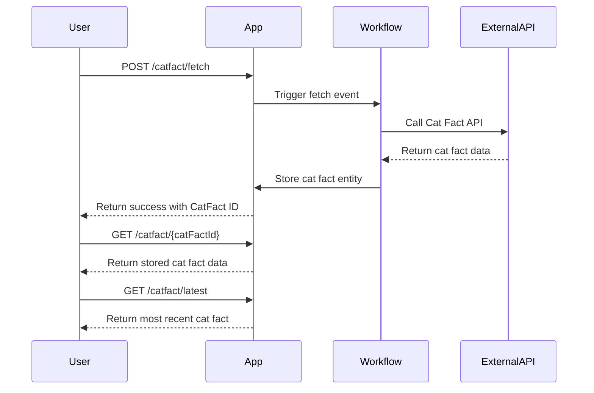

```markdown
# Functional Requirements for CatFact Cyoda App

## API Endpoints

### 1. POST /catfact/fetch
- **Purpose:** Trigger the workflow to fetch a new cat fact from the external Cat Fact API and store it in the system.
- **Request Body:**  
  ```json
  {}
  ```
  No additional parameters required.
- **Response:**  
  ```json
  {
    "status": "success",
    "message": "Cat fact fetched and stored",
    "catFactId": "<entity_id>"
  }
  ```
- **Business Logic:**  
  - Invokes workflow event to fetch a cat fact.
  - Calls external Cat Fact API.
  - Stores the cat fact in the entity state.
  - Returns the ID of the stored CatFact entity.

---

### 2. GET /catfact/{catFactId}
- **Purpose:** Retrieve a stored cat fact by its entity ID.
- **Request Parameters:**  
  - `catFactId` (path parameter): Identifier of the CatFact entity.
- **Response:**  
  ```json
  {
    "catFactId": "<entity_id>",
    "fact": "<cat_fact_text>",
    "fetchedAt": "<timestamp>"
  }
  ```
- **Business Logic:**  
  - Retrieves stored cat fact data from internal storage.
  - No external API calls performed in GET endpoint.

---

### 3. GET /catfact/latest
- **Purpose:** Retrieve the most recently fetched cat fact.
- **Response:**  
  ```json
  {
    "catFactId": "<entity_id>",
    "fact": "<cat_fact_text>",
    "fetchedAt": "<timestamp>"
  }
  ```
- **Business Logic:**  
  - Retrieves latest stored cat fact from internal storage.

---

## User-App Interaction Sequence


```mermaid
sequenceDiagram
    participant User
    participant App
    participant Workflow
    participant ExternalAPI

    User->>App: POST /catfact/fetch
    App->>Workflow: Trigger fetch event
    Workflow->>ExternalAPI: Call Cat Fact API
    ExternalAPI-->>Workflow: Return cat fact data
    Workflow->>App: Store cat fact entity
    App-->>User: Return success with CatFact ID

    User->>App: GET /catfact/{catFactId}
    App-->>User: Return stored cat fact data

    User->>App: GET /catfact/latest
    App-->>User: Return most recent cat fact
```

---

## Notes
- POST endpoint is used for any operation invoking external API and updating state.
- GET endpoints are read-only and return stored data only.
- Request and response formats use JSON.
```