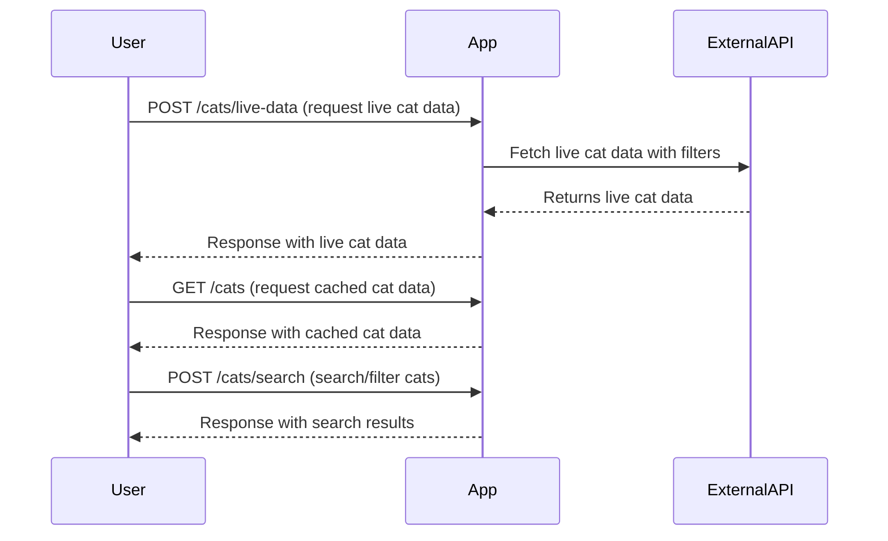

```markdown
# Purrfect Pets API - Functional Requirements

## API Endpoints

### 1. POST /cats/live-data
- **Description:** Fetch live cat data from external sources (e.g., breeds, images, facts).
- **Request Body:**
  ```json
  {
    "filters": {
      "breed": "string (optional)",
      "limit": "integer (optional, default 10)"
    }
  }
  ```
- **Response:**
  ```json
  {
    "cats": [
      {
        "id": "string",
        "name": "string",
        "breed": "string",
        "image_url": "string",
        "fact": "string"
      }
    ]
  }
  ```

---

### 2. GET /cats
- **Description:** Retrieve previously fetched cat data stored or cached in the app.
- **Response:**
  ```json
  {
    "cats": [
      {
        "id": "string",
        "name": "string",
        "breed": "string",
        "image_url": "string",
        "fact": "string"
      }
    ]
  }
  ```

---

### 3. POST /cats/search
- **Description:** Search cats based on criteria, perform any filtering or calculations.
- **Request Body:**
  ```json
  {
    "search": {
      "breed": "string (optional)",
      "name": "string (optional)"
    }
  }
  ```
- **Response:**
  ```json
  {
    "results": [
      {
        "id": "string",
        "name": "string",
        "breed": "string",
        "image_url": "string",
        "fact": "string"
      }
    ]
  }
  ```

---

## Business Logic Notes
- External data retrieval (live cat data) is handled only in POST endpoints.
- GET endpoints are for fetching app’s stored/cached data.
- POST /cats/search can involve filtering or combined business logic.

---

## User-App Interaction Sequence


```mermaid
sequenceDiagram
    participant User
    participant App
    participant ExternalAPI

    User->>App: POST /cats/live-data (request live cat data)
    App->>ExternalAPI: Fetch live cat data with filters
    ExternalAPI-->>App: Returns live cat data
    App-->>User: Response with live cat data

    User->>App: GET /cats (request cached cat data)
    App-->>User: Response with cached cat data

    User->>App: POST /cats/search (search/filter cats)
    App-->>User: Response with search results
```

---

## User Journey Overview

```mermaid
graph TD
    A[User] --> B[Request live cat data (POST /cats/live-data)]
    B --> C[App fetches from External API]
    C --> D[App returns live cat data]
    A --> E[Request cached cats (GET /cats)]
    E --> F[App returns cached data]
    A --> G[Search cats (POST /cats/search)]
    G --> H[App filters/searches data]
    H --> I[App returns search results]
```
```