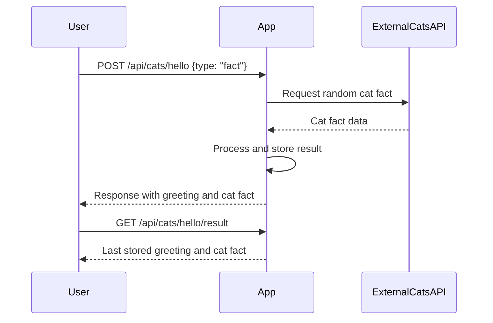
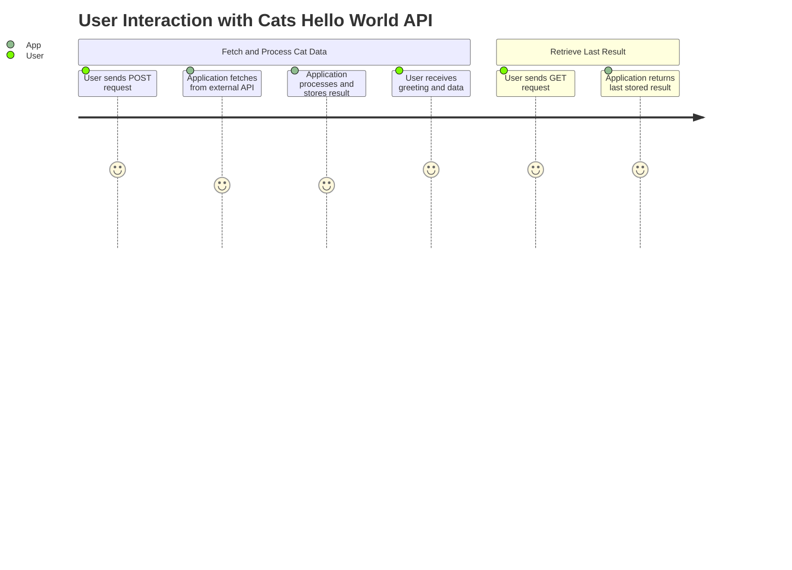

```markdown
# Functional Requirements for Cats API Hello World Application

## Overview
This backend application exposes RESTful API endpoints to interact with a Cats API. It follows the rule that any business logic involving external data retrieval or calculations happens in POST endpoints. GET endpoints are for retrieving application results only.

---

## API Endpoints

### 1. POST /api/cats/hello
- **Description:**  
  Fetches data from an external Cats API (e.g., random cat image or cat fact) and processes it to produce a "hello world" style response.
- **Request:**
  ```json
  {
    "type": "image" | "fact" | "greeting"
  }
  ```
  - `type` (string): Specifies what kind of cat data to fetch or generate a greeting.  
    - `"image"`: Fetch random cat image URL  
    - `"fact"`: Fetch random cat fact  
    - `"greeting"`: Return a static "Hello, Cat Lover!" message
- **Response:**
  ```json
  {
    "message": "Hello, Cat Lover!",
    "data": "<cat-data>"
  }
  ```
  - `message` (string): Greeting message  
  - `data` (string | null): Cat image URL or cat fact, or null if type is `"greeting"`

---

### 2. GET /api/cats/hello/result
- **Description:**  
  Retrieves the last processed "hello world" result stored in the application.
- **Request:**  
  No body, query params optional for filtering (not required in initial version).
- **Response:**
  ```json
  {
    "timestamp": "2024-06-01T12:00:00Z",
    "message": "Hello, Cat Lover!",
    "data": "<cat-data>"
  }
  ```
  - `timestamp` (string): When the last POST result was processed  
  - `message` (string): Greeting message  
  - `data` (string | null): Cat image URL or cat fact

---

## User-App Interaction Sequence


```mermaid
sequenceDiagram
    participant User
    participant App
    participant ExternalCatsAPI

    User->>App: POST /api/cats/hello {type: "fact"}
    App->>ExternalCatsAPI: Request random cat fact
    ExternalCatsAPI-->>App: Cat fact data
    App->>App: Process and store result
    App-->>User: Response with greeting and cat fact

    User->>App: GET /api/cats/hello/result
    App-->>User: Last stored greeting and cat fact
```

---

## User Journey Overview


```mermaid
journey
    title User Interaction with Cats Hello World API
    section Fetch and Process Cat Data
      User sends POST request: 5: User
      Application fetches from external API: 4: App
      Application processes and stores result: 4: App
      User receives greeting and data: 5: User
    section Retrieve Last Result
      User sends GET request: 5: User
      Application returns last stored result: 5: App
```
```