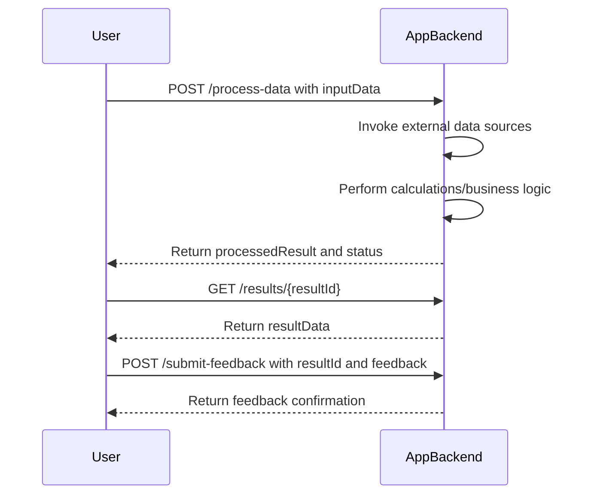

```markdown
# Functional Requirements for Your Project

## API Endpoints

### 1. **POST /process-data**
- **Purpose:** Accept input data, invoke external data sources, perform calculations or business logic, and process the request.
- **Request Format (JSON):**
```json
{
  "inputData": { "type": "object", "description": "Input data for processing" }
}
```
- **Response Format (JSON):**
```json
{
  "status": "string",
  "processedResult": { "type": "object", "description": "Result after processing" },
  "message": "string"
}
```

### 2. **GET /results/{resultId}**
- **Purpose:** Retrieve processed results by `resultId`. This endpoint only accesses stored results without invoking external data sources or business logic.
- **Response Format (JSON):**
```json
{
  "resultId": "string",
  "resultData": { "type": "object", "description": "Processed result data" }
}
```

### 3. **POST /submit-feedback**
- **Purpose:** Accept user feedback related to processed results or application experience.
- **Request Format (JSON):**
```json
{
  "resultId": "string",
  "feedback": "string"
}
```
- **Response Format (JSON):**
```json
{
  "status": "string",
  "message": "Feedback received"
}
```

---

## User-App Interaction Diagram


```mermaid
sequenceDiagram
    participant User
    participant AppBackend

    User->>AppBackend: POST /process-data with inputData
    AppBackend->>AppBackend: Invoke external data sources
    AppBackend->>AppBackend: Perform calculations/business logic
    AppBackend-->>User: Return processedResult and status

    User->>AppBackend: GET /results/{resultId}
    AppBackend-->>User: Return resultData

    User->>AppBackend: POST /submit-feedback with resultId and feedback
    AppBackend-->>User: Return feedback confirmation
```
```