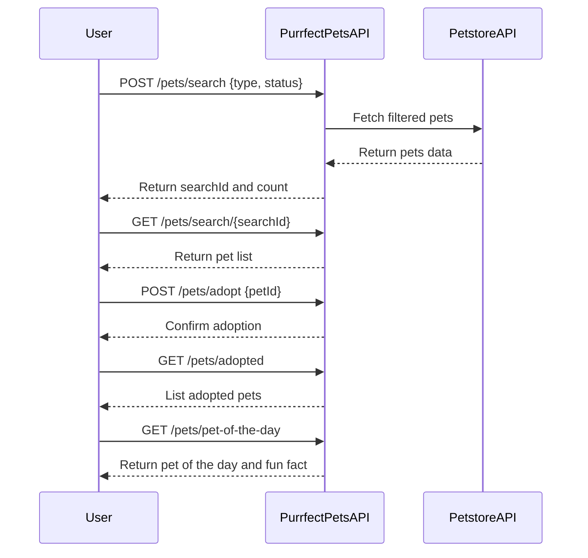

```markdown
# Purrfect Pets API - Functional Requirements

## Overview
The Purrfect Pets API provides fun and engaging pet-related data by integrating with the Petstore API. It follows RESTful principles where:

- **POST endpoints** handle business logic, including calling the Petstore API, data retrieval, and processing.
- **GET endpoints** retrieve data already processed or stored within the application.

---

## API Endpoints

### 1. POST /pets/search
- **Description:** Search pets by type, status, or other filters using Petstore API data.
- **Request Body:**
  ```json
  {
    "type": "string",        // optional, e.g., "cat", "dog"
    "status": "string"       // optional, e.g., "available", "sold"
  }
  ```
- **Response:**
  ```json
  {
    "searchId": "string",    // unique ID for this search result
    "count": "integer"
  }
  ```
- **Notes:** Fetches filtered pet data from Petstore API and stores results internally.

---

### 2. GET /pets/search/{searchId}
- **Description:** Retrieve previously searched pet results by search ID.
- **Response:**
  ```json
  {
    "searchId": "string",
    "pets": [
      {
        "id": "integer",
        "name": "string",
        "type": "string",
        "status": "string",
        "photoUrls": ["string"]
      }
    ]
  }
  ```

---

### 3. POST /pets/adopt
- **Description:** Simulate adopting a pet by ID, marking it as adopted internally.
- **Request Body:**
  ```json
  {
    "petId": "integer"
  }
  ```
- **Response:**
  ```json
  {
    "petId": "integer",
    "adopted": true,
    "message": "Pet successfully adopted!"
  }
  ```
- **Notes:** Adoption status is maintained internally; Petstore API remains read-only.

---

### 4. GET /pets/adopted
- **Description:** Retrieve a list of adopted pets.
- **Response:**
  ```json
  {
    "adoptedPets": [
      {
        "id": "integer",
        "name": "string",
        "type": "string",
        "photoUrls": ["string"]
      }
    ]
  }
  ```

---

### 5. GET /pets/pet-of-the-day
- **Description:** Retrieve the "Pet of the Day" selected internally with a fun fact.
- **Response:**
  ```json
  {
    "id": "integer",
    "name": "string",
    "type": "string",
    "status": "string",
    "photoUrls": ["string"],
    "funFact": "string"
  }
  ```

---

## User-App Interaction Sequence Diagram


```mermaid
sequenceDiagram
  participant User
  participant PurrfectPetsAPI
  participant PetstoreAPI

  User->>PurrfectPetsAPI: POST /pets/search {type, status}
  PurrfectPetsAPI->>PetstoreAPI: Fetch filtered pets
  PetstoreAPI-->>PurrfectPetsAPI: Return pets data
  PurrfectPetsAPI-->>User: Return searchId and count

  User->>PurrfectPetsAPI: GET /pets/search/{searchId}
  PurrfectPetsAPI-->>User: Return pet list

  User->>PurrfectPetsAPI: POST /pets/adopt {petId}
  PurrfectPetsAPI-->>User: Confirm adoption

  User->>PurrfectPetsAPI: GET /pets/adopted
  PurrfectPetsAPI-->>User: List adopted pets

  User->>PurrfectPetsAPI: GET /pets/pet-of-the-day
  PurrfectPetsAPI-->>User: Return pet of the day and fun fact
```

---

## Notes
- POST requests perform external data retrieval and business logic.
- GET requests retrieve processed or stored data only.
- Internal state manages adoption and pet of the day features.
- JSON is the standard request and response format.
```
