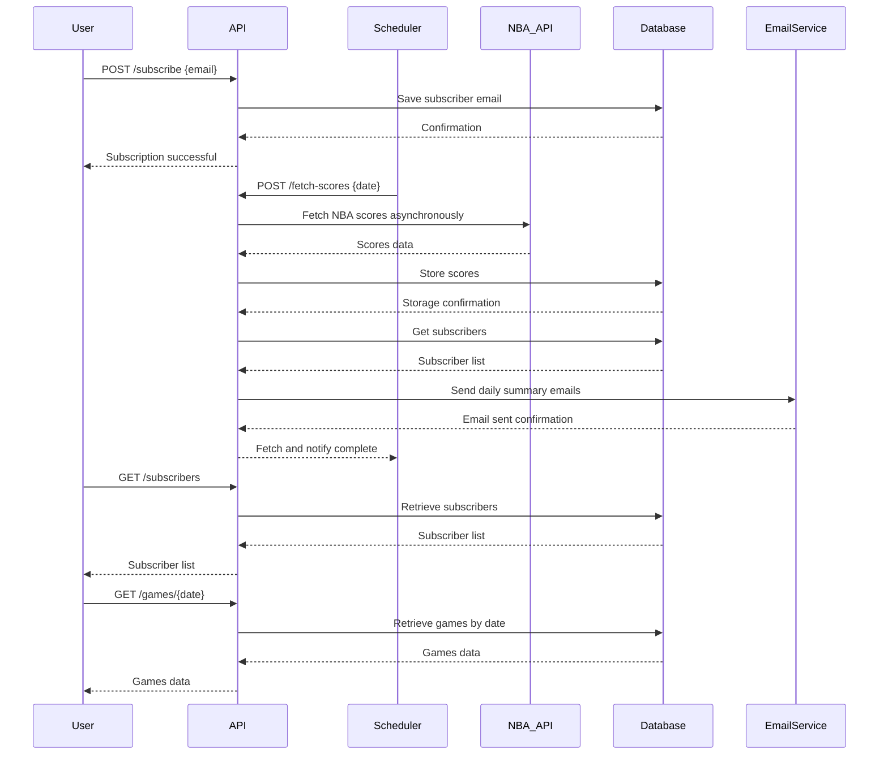

```markdown
# Functional Requirements and API Design for NBA Scores Notification System

## API Endpoints

### 1. Subscribe User  
**POST /subscribe**  
- Description: Add a new subscriber email to the notification list.  
- Request Body:  
```json
{
  "email": "user@example.com"
}
```  
- Response:  
```json
{
  "message": "Subscription successful",
  "email": "user@example.com"
}
```  
- Business Logic: Validate email uniqueness, save subscriber.

---

### 2. Fetch and Store NBA Scores (Trigger Data Fetch)  
**POST /fetch-scores**  
- Description: Trigger fetching NBA scores from external API for a given date, store results, and send notifications.  
- Request Body:  
```json
{
  "date": "YYYY-MM-DD"
}
```  
- Response:  
```json
{
  "message": "Scores fetched, stored, and notifications sent for YYYY-MM-DD"
}
```  
- Business Logic:  
  - Fetch external NBA scores asynchronously  
  - Store scores locally  
  - Send email notifications to subscribers with daily summary

---

### 3. List Subscribers  
**GET /subscribers**  
- Description: Retrieve all subscriber emails.  
- Response:  
```json
{
  "subscribers": [
    "user1@example.com",
    "user2@example.com"
  ]
}
```

---

### 4. Get All Games Data  
**GET /games/all**  
- Description: Retrieve all stored NBA game data with optional pagination/filtering.  
- Query Parameters (optional):  
  - `page` (integer)  
  - `limit` (integer)  
- Response:  
```json
{
  "games": [
    {
      "date": "YYYY-MM-DD",
      "home_team": "...",
      "away_team": "...",
      "home_score": 100,
      "away_score": 95
    }
  ],
  "page": 1,
  "limit": 50,
  "total": 200
}
```

---

### 5. Get Games by Date  
**GET /games/{date}**  
- Description: Retrieve all NBA games for a specific date.  
- Response:  
```json
{
  "date": "YYYY-MM-DD",
  "games": [
    {
      "home_team": "...",
      "away_team": "...",
      "home_score": 100,
      "away_score": 95
    }
  ]
}
```

---

## Visual User-App Interaction (Sequence Diagram)


```mermaid
sequenceDiagram
    participant User
    participant API
    participant Scheduler
    participant NBA_API
    participant Database
    participant EmailService

    User->>API: POST /subscribe {email}
    API->>Database: Save subscriber email
    Database-->>API: Confirmation
    API-->>User: Subscription successful

    Scheduler->>API: POST /fetch-scores {date}
    API->>NBA_API: Fetch NBA scores asynchronously
    NBA_API-->>API: Scores data
    API->>Database: Store scores
    Database-->>API: Storage confirmation
    API->>Database: Get subscribers
    Database-->>API: Subscriber list
    API->>EmailService: Send daily summary emails
    EmailService-->>API: Email sent confirmation
    API-->>Scheduler: Fetch and notify complete

    User->>API: GET /subscribers
    API->>Database: Retrieve subscribers
    Database-->>API: Subscriber list
    API-->>User: Subscriber list

    User->>API: GET /games/{date}
    API->>Database: Retrieve games by date
    Database-->>API: Games data
    API-->>User: Games data
```

---

## Summary  
- POST endpoints handle all business logic & external API fetching.  
- GET endpoints only retrieve stored application data.  
- Scheduler triggers daily fetch and notification via POST /fetch-scores.  
- Subscription system manages unique emails.  
- Email notifications sent after successful data fetch and storage.
```