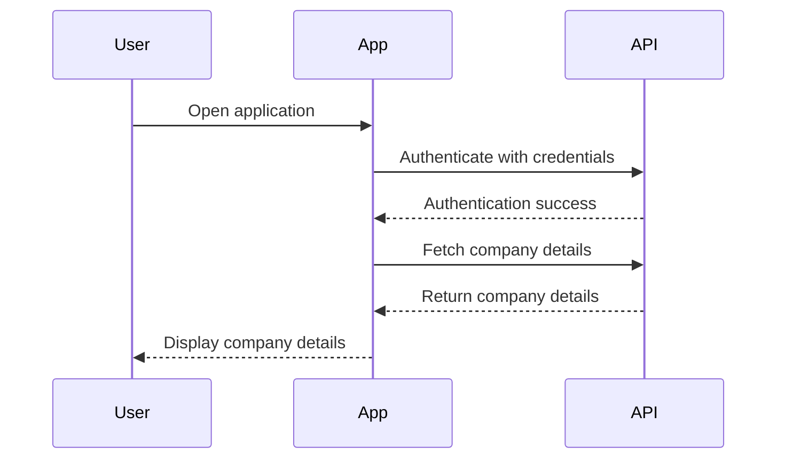

Here are the finalized functional requirements for your project, formatted for clarity:

### Functional Requirements

#### User Stories

1. **User Story 1: View Company Details**
   - **As a user**, I want to view all details of companies returned by the API so that I can gather information about them.

2. **User Story 2: Automatic Authentication**
   - **As a user**, I want the application to automatically authenticate with the API so that I don’t have to enter credentials manually.

3. **User Story 3: Loading Indicator**
   - **As a user**, I want to see a loading indicator while data is being fetched so that I know the application is working.

#### API Endpoints

1. **GET /companies**
   - **Description**: Fetch company details based on a query.
   - **Request Format**:
     ```http
     GET /companies?company_name=ryanair&skip=0&max=5&htmlEnc=1
     ```
   - **Response Format**:
     ```json
     {
       "companies": [
         {
           "name": "Ryanair",
           "address": "Sample Address",
           "registration_number": "123456",
           // Additional fields as per the API response
         }
       ],
       "total": 100 // Total number of companies matching the query
     }
     ```

#### User-App Interaction (Sequence Diagram)


```mermaid
sequenceDiagram
    participant User
    participant App
    participant API

    User->>App: Open application
    App->>API: Authenticate with credentials
    API-->>App: Authentication success
    App->>API: Fetch company details
    API-->>App: Return company details
    App-->>User: Display company details
```

### Summary

These requirements provide a comprehensive overview of what the application should accomplish, how it will interact with the API, and the expected user experience. If you have any additional features or modifications in mind, please let me know!