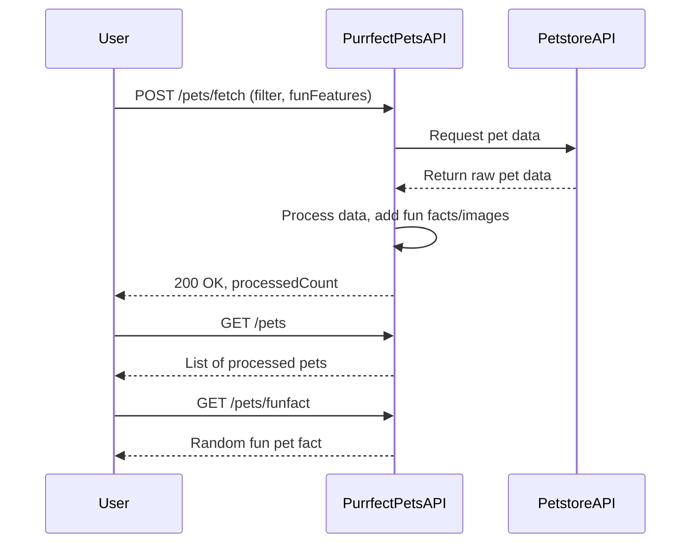

```markdown
# Purrfect Pets API - Functional Requirements

## API Endpoints

### 1. Fetch and Process Pets Data  
**POST** `/pets/fetch`  
- **Description:** Fetch pet data from the external Petstore API, process it (e.g., filter by type, enrich with fun facts and images), and store results in the app state.  
- **Request:**  
  ```json
  {
    "filter": {
      "type": "cat" | "dog" | "all"  // Optional, default: "all"
    },
    "funFeatures": {
      "includeFacts": true | false,  // Optional, default: false
      "includeImages": true | false  // Optional, default: false
    }
  }
  ```  
- **Response:**  
  ```json
  {
    "message": "Pets data fetched and processed successfully",
    "processedCount": 42
  }
  ```

### 2. Retrieve Processed Pets List  
**GET** `/pets`  
- **Description:** Retrieve the list of processed pets stored in the app (result of a previous fetch).  
- **Response:**  
  ```json
  {
    "pets": [
      {
        "id": "123",
        "name": "Whiskers",
        "type": "cat",
        "age": 2,
        "funFact": "Cats sleep 70% of their lives",
        "imageUrl": "https://example.com/cat1.jpg"
      },
      ...
    ]
  }
  ```

### 3. Retrieve Random Fun Pet Fact  
**GET** `/pets/funfact`  
- **Description:** Return a random fun fact about pets from the processed data or built-in facts.  
- **Response:**  
  ```json
  {
    "funFact": "A group of cats is called a clowder."
  }
  ```

---

## User-App Interaction Sequence


```mermaid
sequenceDiagram
    participant User
    participant PurrfectPetsAPI
    participant PetstoreAPI

    User->>PurrfectPetsAPI: POST /pets/fetch (filter, funFeatures)
    PurrfectPetsAPI->>PetstoreAPI: Request pet data
    PetstoreAPI-->>PurrfectPetsAPI: Return raw pet data
    PurrfectPetsAPI->>PurrfectPetsAPI: Process data, add fun facts/images
    PurrfectPetsAPI-->>User: 200 OK, processedCount

    User->>PurrfectPetsAPI: GET /pets
    PurrfectPetsAPI-->>User: List of processed pets

    User->>PurrfectPetsAPI: GET /pets/funfact
    PurrfectPetsAPI-->>User: Random fun pet fact
```

---

## Notes  
- POST endpoints trigger external Petstore API data retrieval and processing.  
- GET endpoints serve stored processed data only, ensuring clear separation of concerns and RESTful design.  
- Fun features (facts, images) are optional and controlled via POST request parameters.
```