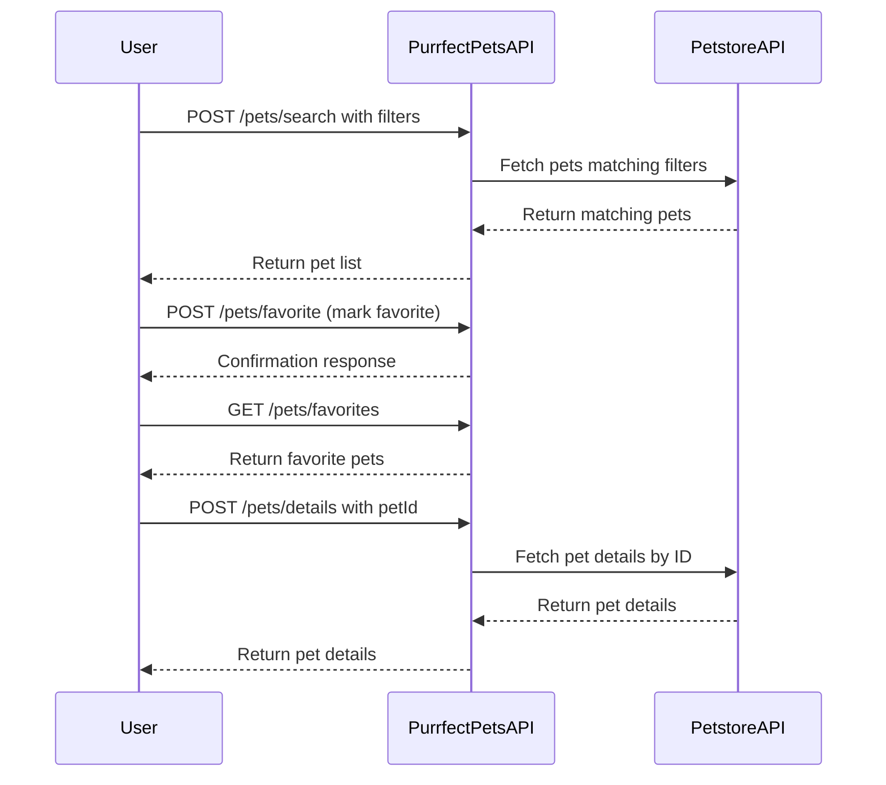
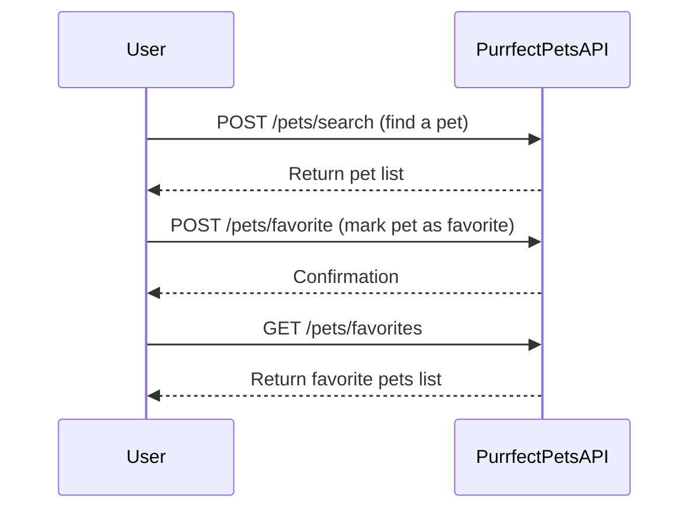

```markdown
# Purrfect Pets API - Functional Requirements

## API Endpoints

### 1. POST /pets/search
- **Purpose:** Search pets using Petstore API data with filters (e.g., type, status).
- **Request:**
  ```json
  {
    "type": "cat",          // optional, string
    "status": "available"   // optional, string
  }
  ```
- **Response:**
  ```json
  {
    "pets": [
      {
        "id": 123,
        "name": "Whiskers",
        "type": "cat",
        "status": "available",
        "photoUrls": ["url1", "url2"]
      },
      ...
    ]
  }
  ```

### 2. POST /pets/favorite
- **Purpose:** Mark or unmark a pet as favorite.
- **Request:**
  ```json
  {
    "petId": 123,
    "favorite": true
  }
  ```
- **Response:**
  ```json
  {
    "success": true,
    "message": "Pet marked as favorite"
  }
  ```

### 3. GET /pets/favorites
- **Purpose:** Retrieve the list of user's favorite pets.
- **Response:**
  ```json
  {
    "favorites": [
      {
        "id": 123,
        "name": "Whiskers",
        "type": "cat",
        "status": "available",
        "photoUrls": ["url1", "url2"]
      },
      ...
    ]
  }
  ```

### 4. POST /pets/details
- **Purpose:** Retrieve detailed info about a pet by ID, fetching fresh data from Petstore API.
- **Request:**
  ```json
  {
    "petId": 123
  }
  ```
- **Response:**
  ```json
  {
    "id": 123,
    "name": "Whiskers",
    "type": "cat",
    "status": "available",
    "photoUrls": ["url1", "url2"],
    "description": "A friendly cat"
  }
  ```

---

## User-App Interaction Sequence


```mermaid
sequenceDiagram
    participant User
    participant PurrfectPetsAPI
    participant PetstoreAPI

    User->>PurrfectPetsAPI: POST /pets/search with filters
    PurrfectPetsAPI->>PetstoreAPI: Fetch pets matching filters
    PetstoreAPI-->>PurrfectPetsAPI: Return matching pets
    PurrfectPetsAPI-->>User: Return pet list

    User->>PurrfectPetsAPI: POST /pets/favorite (mark favorite)
    PurrfectPetsAPI-->>User: Confirmation response

    User->>PurrfectPetsAPI: GET /pets/favorites
    PurrfectPetsAPI-->>User: Return favorite pets

    User->>PurrfectPetsAPI: POST /pets/details with petId
    PurrfectPetsAPI->>PetstoreAPI: Fetch pet details by ID
    PetstoreAPI-->>PurrfectPetsAPI: Return pet details
    PurrfectPetsAPI-->>User: Return pet details
```

---

## User Journey: Marking a pet as favorite and viewing favorites


```mermaid
sequenceDiagram
    participant User
    participant PurrfectPetsAPI

    User->>PurrfectPetsAPI: POST /pets/search (find a pet)
    PurrfectPetsAPI-->>User: Return pet list

    User->>PurrfectPetsAPI: POST /pets/favorite (mark pet as favorite)
    PurrfectPetsAPI-->>User: Confirmation

    User->>PurrfectPetsAPI: GET /pets/favorites
    PurrfectPetsAPI-->>User: Return favorite pets list
```
```