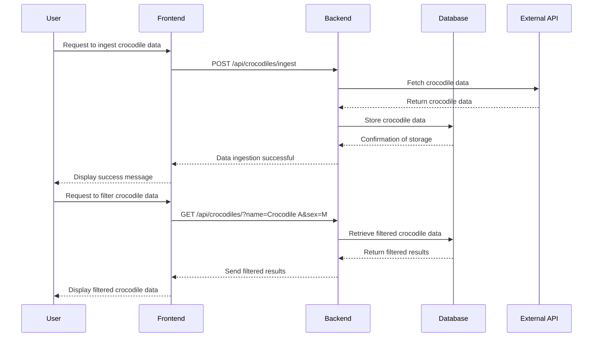

```markdown
# Final Functional Requirements for Crocodile Data Application

## API Endpoints

### 1. Ingest Crocodile Data
- **Endpoint**: `POST /api/crocodiles/ingest`
- **Description**: Fetches data from the external API and stores it in the database.
- **Request Format**:
  ```json
  {
    "refresh": true   // optional, indicates whether to refresh existing data
  }
  ```
- **Response Format**:
  ```json
  {
    "message": "Data ingestion successful",
    "total_records": 100  // number of records ingested
  }
  ```

### 2. Retrieve Crocodile Data
- **Endpoint**: `GET /api/crocodiles/`
- **Description**: Retrieves stored crocodile data with optional filtering.
- **Query Parameters**:
  - `name`: (optional) filter by name
  - `sex`: (optional) filter by sex ('M' or 'F')
  - `min_age`: (optional) minimum age for filtering
  - `max_age`: (optional) maximum age for filtering
- **Response Format**:
  ```json
  {
    "crocodiles": [
      {
        "id": 1,
        "name": "Crocodile A",
        "sex": "M",
        "age": 5
      },
      ...
    ]
  }
  ```

## User-App Interaction Diagram


```mermaid
sequenceDiagram
    participant User
    participant Frontend
    participant Backend
    participant Database

    User->>Frontend: Request to ingest crocodile data
    Frontend->>Backend: POST /api/crocodiles/ingest
    Backend->>External API: Fetch crocodile data
    External API-->>Backend: Return crocodile data
    Backend->>Database: Store crocodile data
    Database-->>Backend: Confirmation of storage
    Backend-->>Frontend: Data ingestion successful
    Frontend-->>User: Display success message

    User->>Frontend: Request to filter crocodile data
    Frontend->>Backend: GET /api/crocodiles/?name=Crocodile A&sex=M
    Backend->>Database: Retrieve filtered crocodile data
    Database-->>Backend: Return filtered results
    Backend-->>Frontend: Send filtered results
    Frontend-->>User: Display filtered crocodile data
```
```