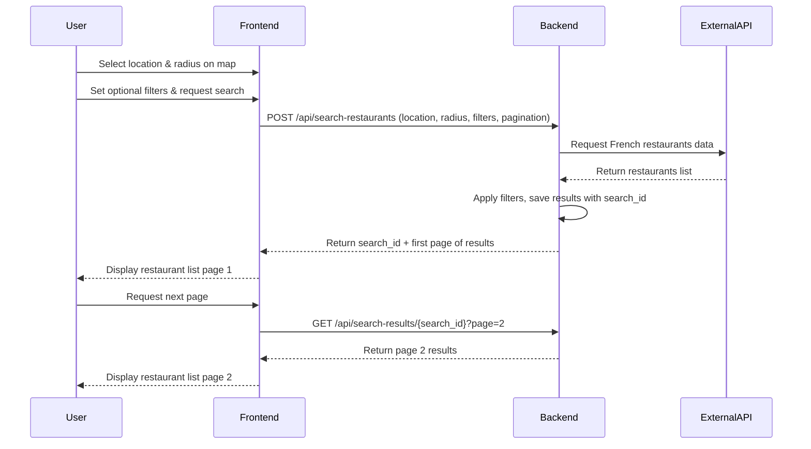
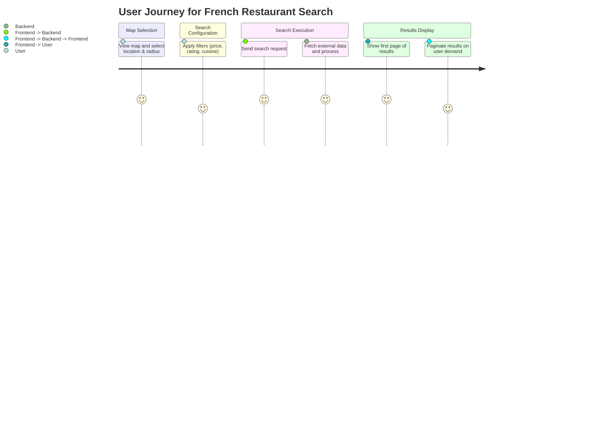

```markdown
# Functional Requirements and API Specification

## Overview
The backend application supports searching for the closest French restaurants within a user-selected area on a map, applying optional filters, and retrieving paginated results.

---

## API Endpoints

### 1. POST `/api/search-restaurants`

**Purpose:**  
Invoke restaurant search based on user-selected location, radius, and optional filters. This endpoint calls external data sources (e.g., Google Places API) and applies business logic.

**Request Body (JSON):**
```json
{
  "location": {
    "latitude": 48.8566,
    "longitude": 2.3522
  },
  "radius": 5000,               // in meters
  "filters": {
    "price_range": [1, 3],     // optional, e.g. 1 (cheap) to 4 (expensive)
    "rating_min": 4.0,         // optional
    "cuisine_subtypes": ["bistro", "brasserie"] // optional
  },
  "pagination": {
    "page": 1,
    "page_size": 20
  }
}
```

**Response Body (JSON):**
```json
{
  "search_id": "uuid-string",    // unique ID for this search session
  "total_results": 120,
  "page": 1,
  "page_size": 20,
  "restaurants": [
    {
      "id": "restaurant-id",
      "name": "Le Gourmet",
      "address": "10 Rue de Paris, 75001 Paris",
      "contact": "+33 1 23 45 67 89",
      "rating": 4.5,
      "price_level": 2,
      "cuisine_types": ["French", "Bistro"],
      "location": {
        "latitude": 48.857,
        "longitude": 2.351
      }
    }
    // ... up to page_size items
  ]
}
```

---

### 2. GET `/api/search-results/{search_id}`

**Purpose:**  
Retrieve paginated results of a previously performed search by `search_id`. No external data calls here; only cached or stored results.

**Query Parameters:**
- `page` (optional, default=1)
- `page_size` (optional, default=20)

**Response Body (JSON):**
```json
{
  "search_id": "uuid-string",
  "total_results": 120,
  "page": 1,
  "page_size": 20,
  "restaurants": [
    {
      "id": "restaurant-id",
      "name": "Le Gourmet",
      "address": "10 Rue de Paris, 75001 Paris",
      "contact": "+33 1 23 45 67 89",
      "rating": 4.5,
      "price_level": 2,
      "cuisine_types": ["French", "Bistro"],
      "location": {
        "latitude": 48.857,
        "longitude": 2.351
      }
    }
    // ... up to page_size items
  ]
}
```

---

## Business Logic Notes

- POST `/api/search-restaurants` triggers:
  - Validation of input coordinates and radius.
  - Calls external restaurant data APIs (e.g., Google Places).
  - Applies filters (price, rating, cuisine subtypes).
  - Stores results in a temporary cache or database with a unique `search_id`.
  - Returns the initial page of results and `search_id`.

- GET `/api/search-results/{search_id}`:
  - Retrieves stored search results by `search_id`.
  - Supports pagination parameters to navigate results.

---

## User-App Interaction Sequence Diagram


```mermaid
sequenceDiagram
  participant User
  participant Frontend
  participant Backend
  participant ExternalAPI

  User->>Frontend: Select location & radius on map
  User->>Frontend: Set optional filters & request search
  Frontend->>Backend: POST /api/search-restaurants (location, radius, filters, pagination)
  Backend->>ExternalAPI: Request French restaurants data
  ExternalAPI-->>Backend: Return restaurants list
  Backend->>Backend: Apply filters, save results with search_id
  Backend-->>Frontend: Return search_id + first page of results
  Frontend-->>User: Display restaurant list page 1

  User->>Frontend: Request next page
  Frontend->>Backend: GET /api/search-results/{search_id}?page=2
  Backend-->>Frontend: Return page 2 results
  Frontend-->>User: Display restaurant list page 2
```

---

## User Journey Diagram


```mermaid
journey
    title User Journey for French Restaurant Search
    section Map Selection
      View map and select location & radius: 5: User
    section Search Configuration
      Apply filters (price, rating, cuisine): 4: User
    section Search Execution
      Send search request: 5: Frontend -> Backend
      Fetch external data and process: 5: Backend
    section Results Display
      Show first page of results: 5: Frontend -> User
      Paginate results on user demand: 4: Frontend -> Backend -> Frontend
```
```