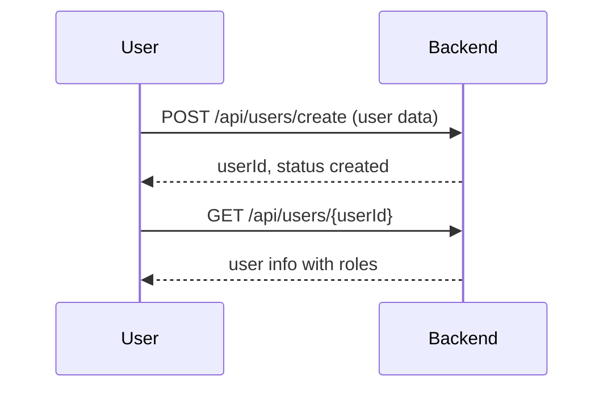
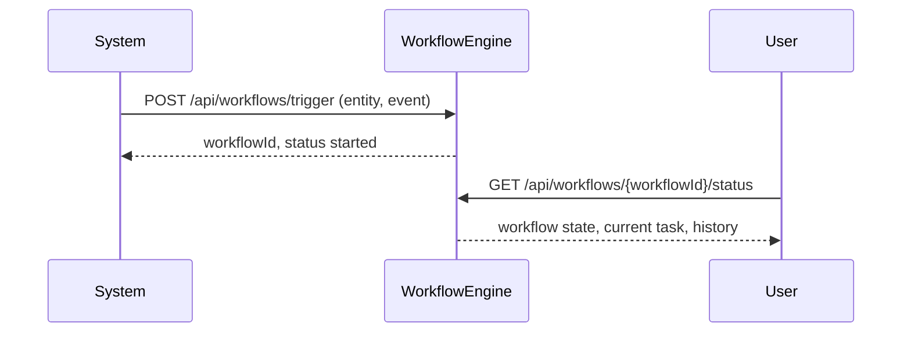
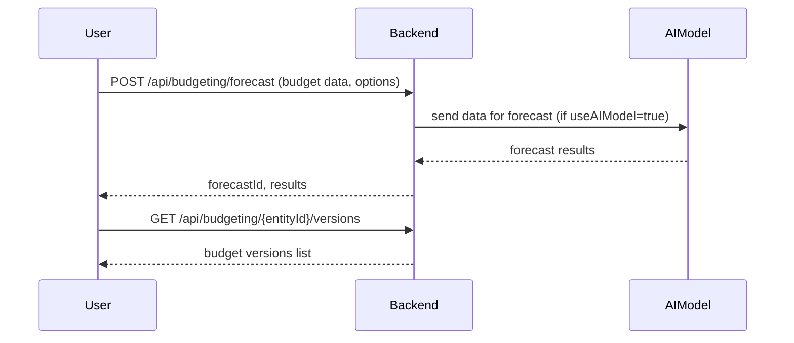

```markdown
# FinanceX Suite - Functional API Specification

## 1. User Management and Roles

### 1.1 Create User  
**POST** `/api/users/create`  
Request:
```json
{
  "username": "string",
  "email": "string",
  "role": "string",
  "department": "string",
  "delegateTo": "string (optional)"
}
```
Response:
```json
{
  "userId": "uuid",
  "status": "created"
}
```

### 1.2 Get User Info  
**GET** `/api/users/{userId}`  
Response:
```json
{
  "userId": "uuid",
  "username": "string",
  "email": "string",
  "role": "string",
  "department": "string",
  "delegation": "string (optional)"
}
```

### 1.3 Update User Roles and Permissions  
**POST** `/api/users/{userId}/updateRoles`  
Request:
```json
{
  "role": "string",
  "permissions": {
    "module": "string",
    "actions": ["CREATE", "READ", "UPDATE", "DELETE", "WORKFLOW_ACTION"]
  }
}
```
Response:
```json
{
  "status": "updated"
}
```

---

## 2. Workflow Engine

### 2.1 Create/Trigger Workflow  
**POST** `/api/workflows/trigger`  
Request:
```json
{
  "entityType": "string",
  "entityId": "uuid",
  "event": "string",
  "payload": {}
}
```
Response:
```json
{
  "workflowId": "uuid",
  "status": "started"
}
```

### 2.2 Get Workflow Status  
**GET** `/api/workflows/{workflowId}/status`  
Response:
```json
{
  "workflowId": "uuid",
  "state": "string",
  "currentTask": "string",
  "history": [
    {
      "task": "string",
      "user": "string",
      "timestamp": "ISO8601",
      "action": "string"
    }
  ]
}
```

---

## 3. Budgeting and Forecasting

### 3.1 Submit Budget Data / Run Forecast  
**POST** `/api/budgeting/forecast`  
Request:
```json
{
  "entityId": "uuid",
  "budgetVersion": "string",
  "period": "YYYY-MM",
  "budgetData": { "department": "amount", ... },
  "forecastOptions": {
    "useAIModel": true
  }
}
```
Response:
```json
{
  "forecastId": "uuid",
  "status": "completed",
  "results": {
    "department": {
      "forecasted": "number",
      "variance": "number"
    }
  }
}
```

### 3.2 Get Budget Versions  
**GET** `/api/budgeting/{entityId}/versions`  
Response:
```json
[
  {
    "version": "string",
    "createdDate": "ISO8601",
    "status": "string"
  }
]
```

---

## 4. Procurement Workflow

### 4.1 Submit Requisition  
**POST** `/api/procurement/requisition`  
Request:
```json
{
  "requestorId": "uuid",
  "items": [
    {"productId": "string", "quantity": "int", "price": "number"}
  ],
  "budgetVersion": "string"
}
```
Response:
```json
{
  "requisitionId": "uuid",
  "status": "submitted"
}
```

### 4.2 Get Requisition Status  
**GET** `/api/procurement/requisition/{requisitionId}`  
Response:
```json
{
  "requisitionId": "uuid",
  "status": "string",
  "approvalHistory": [
    {
      "approver": "string",
      "action": "approved/rejected",
      "timestamp": "ISO8601"
    }
  ]
}
```

---

## 5. Payments and Cash Management

### 5.1 Submit Payment Request  
**POST** `/api/payments/request`  
Request:
```json
{
  "vendorId": "uuid",
  "amount": "number",
  "dueDate": "YYYY-MM-DD",
  "currency": "string",
  "paymentMethod": "string"
}
```
Response:
```json
{
  "paymentId": "uuid",
  "status": "queued"
}
```

### 5.2 Get Payment Status  
**GET** `/api/payments/{paymentId}`  
Response:
```json
{
  "paymentId": "uuid",
  "status": "string",
  "processedDate": "ISO8601 (optional)"
}
```

---

## 6. Reporting and Analytics

### 6.1 Generate Report  
**POST** `/api/reports/generate`  
Request:
```json
{
  "reportType": "string",
  "filters": {},
  "format": "PDF|Excel|XML|XBRL"
}
```
Response:
```json
{
  "reportId": "uuid",
  "status": "ready",
  "downloadUrl": "string"
}
```

### 6.2 Get Report Metadata  
**GET** `/api/reports/{reportId}`  
Response:
```json
{
  "reportId": "uuid",
  "createdDate": "ISO8601",
  "status": "string",
  "downloadUrl": "string"
}
```

---

# Mermaid Diagrams

## User Management Flow


```mermaid
sequenceDiagram
    participant User
    participant Backend
    User->>Backend: POST /api/users/create (user data)
    Backend-->>User: userId, status created
    User->>Backend: GET /api/users/{userId}
    Backend-->>User: user info with roles
```

## Workflow Trigger Flow


```mermaid
sequenceDiagram
    participant System
    participant WorkflowEngine
    participant User
    System->>WorkflowEngine: POST /api/workflows/trigger (entity, event)
    WorkflowEngine-->>System: workflowId, status started
    User->>WorkflowEngine: GET /api/workflows/{workflowId}/status
    WorkflowEngine-->>User: workflow state, current task, history
```

## Budget Forecasting Flow


```mermaid
sequenceDiagram
    participant User
    participant Backend
    participant AIModel
    User->>Backend: POST /api/budgeting/forecast (budget data, options)
    Backend->>AIModel: send data for forecast (if useAIModel=true)
    AIModel-->>Backend: forecast results
    Backend-->>User: forecastId, results
    User->>Backend: GET /api/budgeting/{entityId}/versions
    Backend-->>User: budget versions list
```
```