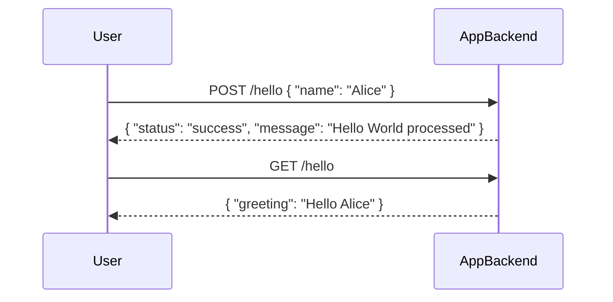

```markdown
# Functional Requirements for Hello World Backend Application

## Overview
The application exposes two API endpoints following RESTful principles:

- **POST /hello**  
  Endpoint to trigger any business logic or external data retrieval. This endpoint can process input data if needed and prepare the application result.
  
- **GET /hello**  
  Endpoint to retrieve the application result (e.g., the "Hello World" message or any processed output).

---

## API Endpoints

### 1. POST /hello

- **Description:**  
  Accepts input if needed, performs any business logic or external data retrieval, and stores or processes the application result.

- **Request Format:**  
  ```json
  {
    "name": "optional string"
  }
  ```
  - `name`: (optional) a string to personalize the greeting.

- **Response Format:**  
  ```json
  {
    "status": "success",
    "message": "Hello World processed"
  }
  ```

- **Notes:**  
  - The POST endpoint is the place to implement any external data calls or calculations.
  - For a simple Hello World, this can be minimal or skipped.

---

### 2. GET /hello

- **Description:**  
  Retrieves the current application result, e.g., the greeting message.

- **Request Parameters:**  
  None

- **Response Format:**  
  ```json
  {
    "greeting": "Hello World"
  }
  ```

---

## User-App Interaction Sequence Diagram


```mermaid
sequenceDiagram
    participant User
    participant AppBackend

    User->>AppBackend: POST /hello { "name": "Alice" }
    AppBackend-->>User: { "status": "success", "message": "Hello World processed" }
    User->>AppBackend: GET /hello
    AppBackend-->>User: { "greeting": "Hello Alice" }
```

---

## Summary

- POST endpoint is for any input processing, external data retrieval, or calculations.
- GET endpoint retrieves the final processed result.
- Request and response formats are JSON for consistency and ease of integration.
```