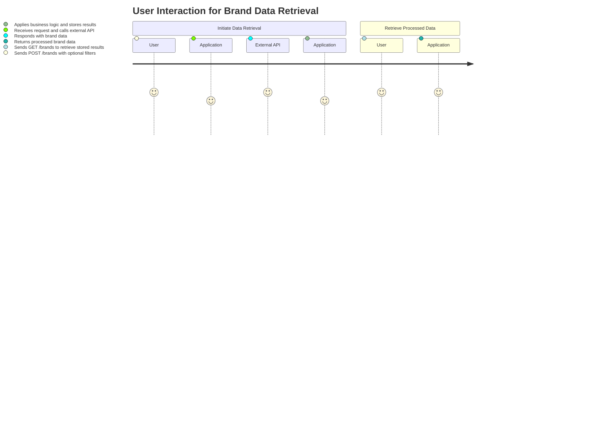
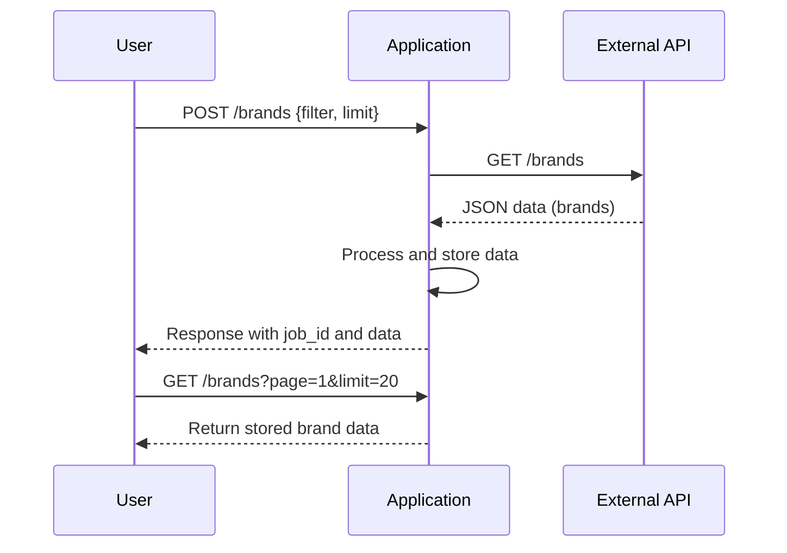

# Final Functional Requirements Document

## Overview
This document outlines the functional requirements for the backend application that interacts with an external API to retrieve and display brand data.

## API Endpoints

### 1. POST /brands
- **Purpose:**  
  Trigger retrieval of brand data from an external API and perform necessary business logic.

- **Request Format:**  
  - **Content-Type:** application/json  
  - **Body (optional):**  
    ```json
    {
      "filter": "active",
      "limit": 50
    }
    ```

- **Behavior:**  
  - Invoke the external API at "https://api.practicesoftwaretesting.com/brands".
  - Apply business logic to the retrieved data (e.g., filtering, transformation).
  - Store processed data temporarily or persistently.
  - Generate a unique retrieval identifier for tracking.

- **Response Format:**  
  - **HTTP Status:** 201 Created  
  - **Example Response:**  
    ```json
    {
      "job_id": "12345",
      "data": [
        {
          "id": "01JMWZK3N7PT3XMTMXMQTBACRV",
          "name": "ForgeFlex Tools",
          "slug": "forgeflex-tools"
        },
        {
          "id": "01JMWZK3N7PT3XMTMXMQTBACRW",
          "name": "MightyCraft Hardware",
          "slug": "mightycraft-hardware"
        }
      ]
    }
    ```

### 2. GET /brands
- **Purpose:**  
  Retrieve the processed brand data stored by the POST operation.

- **Request Format:**  
  - **HTTP Method:** GET  
  - **Query Parameters (optional):**  
    - `page`: The page number for pagination (e.g., `page=1`)
    - `limit`: The number of results per page (e.g., `limit=20`)

- **Behavior:**  
  - Retrieve the stored brand data.
  - Return an appropriate error message if no data is available.

- **Response Format:**  
  - **HTTP Status:** 200 OK  
  - **Example Response:**  
    ```json
    [
      {
        "id": "01JMWZK3N7PT3XMTMXMQTBACRV",
        "name": "ForgeFlex Tools",
        "slug": "forgeflex-tools"
      },
      {
        "id": "01JMWZK3N7PT3XMTMXMQTBACRW",
        "name": "MightyCraft Hardware",
        "slug": "mightycraft-hardware"
      }
    ]
    ```

## User-App Interaction Diagrams

### Journey Diagram

```mermaid
journey
    title User Interaction for Brand Data Retrieval
    section Initiate Data Retrieval
      User: 5: Sends POST /brands with optional filters
      Application: 4: Receives request and calls external API
      External API: 5: Responds with brand data
      Application: 4: Applies business logic and stores results
    section Retrieve Processed Data
      User: 5: Sends GET /brands to retrieve stored results
      Application: 5: Returns processed brand data
```

### Sequence Diagram

```mermaid
sequenceDiagram
    participant U as User
    participant A as Application
    participant E as External API
    U->>A: POST /brands {filter, limit}
    A->>E: GET /brands
    E-->>A: JSON data (brands)
    A->>A: Process and store data
    A-->>U: Response with job_id and data
    U->>A: GET /brands?page=1&limit=20
    A-->>U: Return stored brand data
```