```markdown
# Functional Requirements and API Design for Weather Data App

## API Endpoints

### 1. POST /weather/fetch
- **Purpose**: Fetch weather data from the external API based on user input and store the results internally.
- **Request Body** (JSON):
  ```json
  {
    "latitude": 52.52,
    "longitude": 13.405,
    "parameters": ["temperature_2m", "precipitation"],
    "start_date": "2024-06-01",
    "end_date": "2024-06-02"
  }
  ```
- **Response** (JSON):
  ```json
  {
    "status": "success",
    "message": "Weather data fetched and stored",
    "data_id": "abc123"
  }
  ```

### 2. GET /weather/result/{data_id}
- **Purpose**: Retrieve previously fetched weather data by its unique ID.
- **Response** (JSON):
  ```json
  {
    "data_id": "abc123",
    "latitude": 52.52,
    "longitude": 13.405,
    "parameters": {
      "temperature_2m": [22.5, 23.1, 21.8],
      "precipitation": [0, 0.5, 1.2]
    },
    "timestamps": ["2024-06-01T00:00", "2024-06-01T06:00", "2024-06-01T12:00"]
  }
  ```

---

## Business Logic Summary
- The POST `/weather/fetch` endpoint receives input parameters, triggers a call to the external Open-Meteo API, processes and stores the response internally with a unique `data_id`.
- The GET `/weather/result/{data_id}` endpoint returns stored weather data for the requested `data_id` without invoking the external API.

---

## User-App Interaction Sequence Diagram

```mermaid
sequenceDiagram
    participant User
    participant App
    participant ExternalAPI

    User->>App: POST /weather/fetch with location & params
    App->>ExternalAPI: Request weather data
    ExternalAPI-->>App: Return weather data
    App->>App: Process & store data, generate data_id
    App-->>User: Respond with data_id

    User->>App: GET /weather/result/{data_id}
    App-->>User: Return stored weather data
```



---

## User Journey Diagram

```mermaid
flowchart TD
    A[User submits location & parameters] --> B[App triggers POST /weather/fetch]
    B --> C[App fetches data from Open-Meteo API]
    C --> D[App stores weather data & returns data_id]
    D --> E[User requests data with GET /weather/result/{data_id}]
    E --> F[App returns stored weather data]
```
```