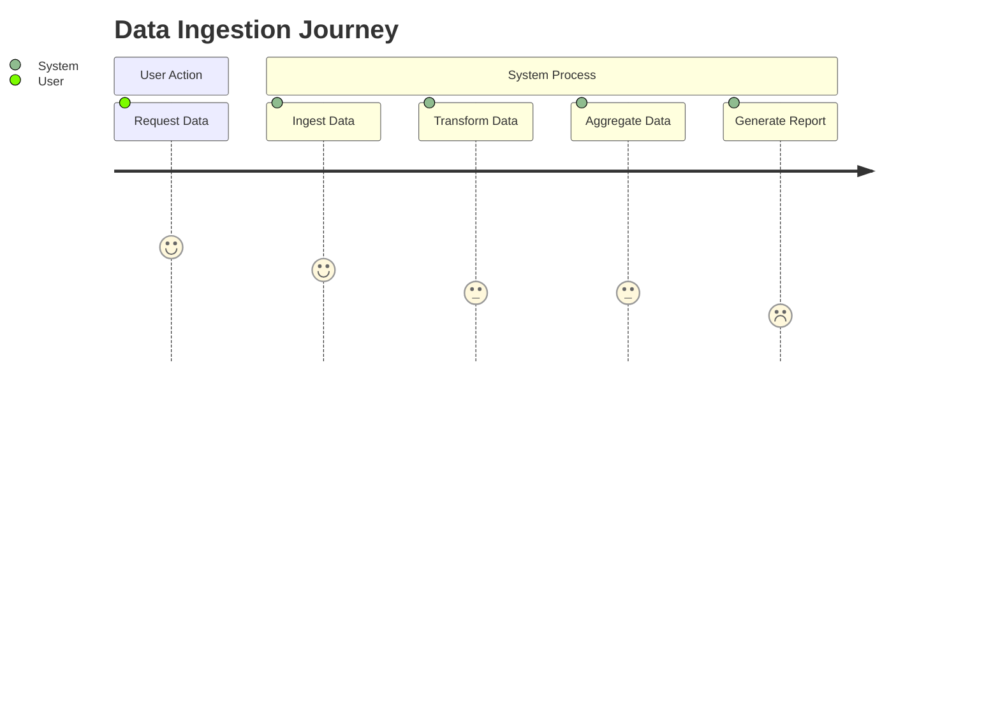
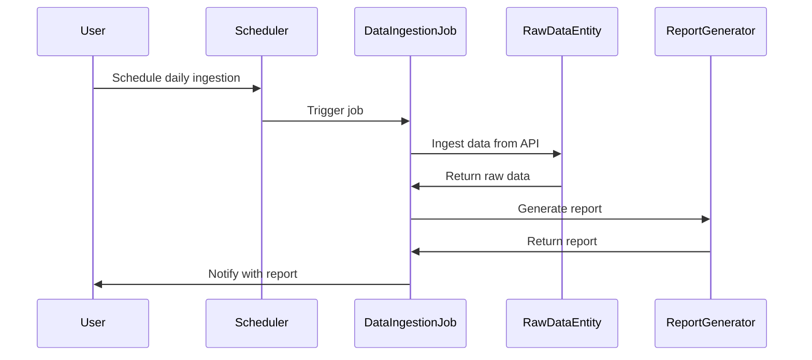

I understand that you would like me to validate your requirement and create a detailed user requirement document that includes user stories, a journey diagram, and a sequence diagram. This document will help visualize the process and interactions involved in building the application that ingests data from the Automation Exercise API.

### User Requirement Document

#### 1. User Requirement Summary
The user (you) wants to build an application that:
- **Ingests data** from the Automation Exercise API.
- **Transforms** the data by renaming fields and aggregating information.
- **Generates reports** based on the aggregated data.
- **Schedules** the data ingestion to occur once a day.

#### 2. User Stories
User stories capture the specific needs and expectations of the user. Here are the relevant user stories based on your requirement:

- **User Story 1**: As a user, I want to ingest product data from the Automation Exercise API so that I can analyze available products.
- **User Story 2**: As a user, I want to transform the ingested data by renaming fields and aggregating information based on categories and brands.
- **User Story 3**: As a user, I want to generate reports that provide insights into the product data, including average prices and quantities by category.
- **User Story 4**: As a user, I want the data ingestion process to be scheduled daily so that I always have the most up-to-date information.

#### 3. Journey Diagram
The journey diagram illustrates the process flow of the application. Here’s a simple representation using Mermaid syntax:

#### 4. Sequence Diagram
The sequence diagram shows the interactions between different components of the system during the data ingestion process. Here’s the representation using Mermaid syntax:

### Explanation of Choices
- **User Stories**: They are a straightforward way to capture your requirements from the perspective of the user. They help ensure that the application is built to meet specific needs.
- **Journey Diagram**: This visual representation simplifies the process flow, making it easy to understand the key actions involved in data ingestion.
- **Sequence Diagram**: It details the interactions between various components, providing a clear picture of how the system will work together to achieve the desired outcome.

By creating this document, we can effectively communicate the requirements and visualize the processes involved in developing the application. If you have any further adjustments or additional details you would like to include, please let me know! I'm here to help, and I want to ensure that we have a comprehensive and accurate representation of your requirements.