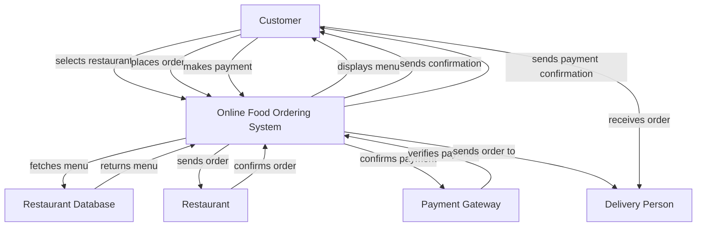
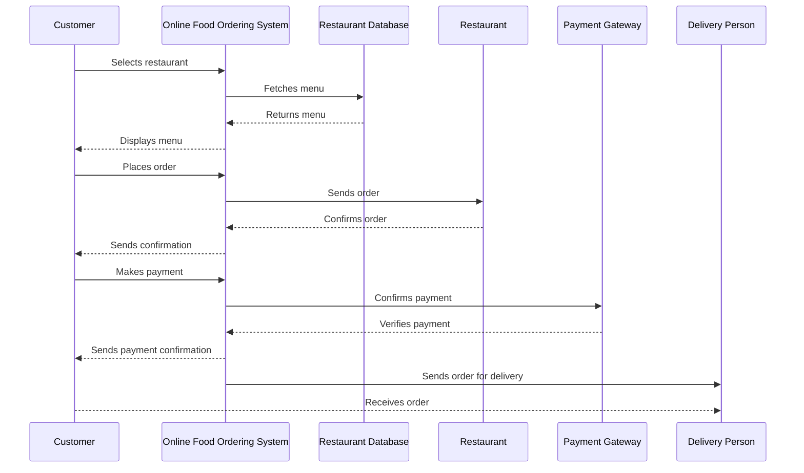

What I understood from your requirement is that you're looking to validate the flow of an online food ordering system and want to create a user requirements document. This document should include user stories, a journey diagram, and a sequence diagram, all formatted nicely in markdown.

Here's a draft for your user requirements document:

---

# User Requirements Document for Online Food Ordering System

## User Stories

1. **As a customer**, I want to select a restaurant so that I can view its menu and choose my meal.
2. **As a customer**, I want to place an order so that I can enjoy my food from the restaurant.
3. **As a customer**, I want to make a payment after placing my order to ensure my meal is confirmed.
4. **As a customer**, I want to receive confirmation of my payment to know that my order is being processed.
5. **As a customer**, I want my order to be delivered to me so that I can enjoy my meal without leaving home.

## Journey Diagram

Here's a journey diagram that represents the overall experience of a customer using the online food ordering system:

## Sequence Diagram

Lastly, here's a sequence diagram that outlines the interactions among the entities involved:

### Explanation of Choices

- **User Stories**: They help capture what the users want to do in a straightforward way, making it easy to understand the system's requirements.
- **Journey Diagram**: It visually represents the customer's experience, showing how they interact with various components of the system step by step.
- **Sequence Diagram**: This diagram breaks down the interactions over time, detailing how information flows between the different entities involved in the process.

Feel free to suggest any changes or additional details you’d like to add! What do you think of this draft?