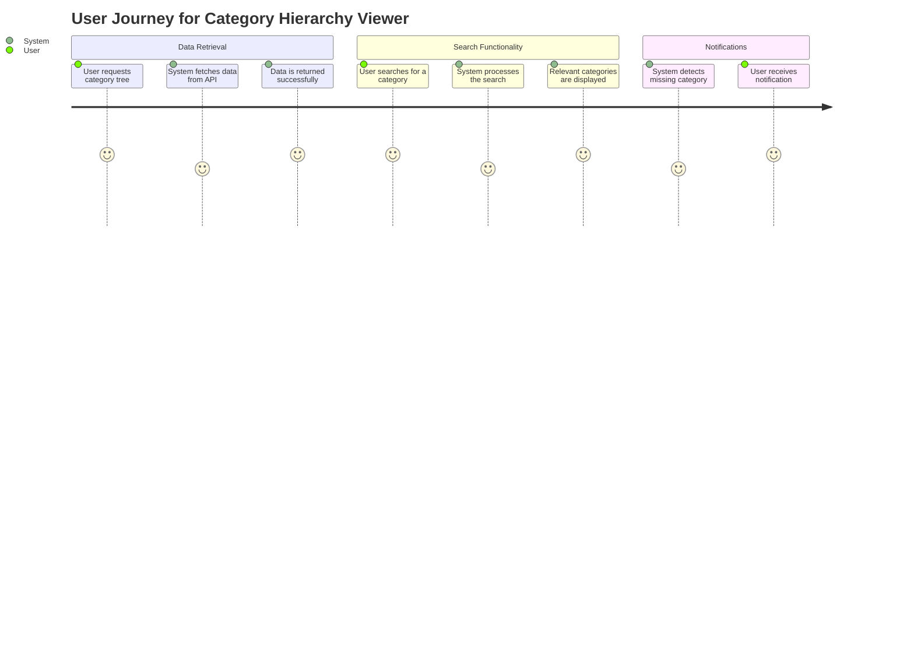
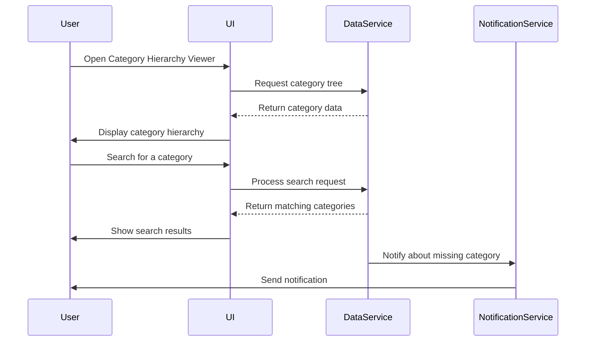

I understand that you want me to validate your requirement for the **Category Hierarchy Viewer Application** and create a detailed user requirement document. This document will include user stories, a journey diagram, and a sequence diagram, all designed to illustrate how the application will function and meet your needs.

### Explanation of the Choice

1. **User Stories**: These will capture the specific needs and expectations of the users in a simple and understandable way. They help us focus on what features are necessary for the application to be effective.

2. **Journey Diagram**: This visual representation will illustrate the steps users take as they interact with the application. It helps us see the user experience and identify any potential areas for improvement.

3. **Sequence Diagram**: This diagram will depict the interactions between different components of the system, showing how data flows and how various parts of the application communicate with each other. It is crucial for understanding the technical aspects of the application.

### User Requirement Document

```markdown
# User Requirement Document for Category Hierarchy Viewer Application

## Overview
This document outlines the requirements for the Category Hierarchy Viewer Application, which aims to visualize category hierarchies using data from the Practice Software Testing API.

## User Stories
1. **As a User**, I want to retrieve the complete category tree structure so that I can view all categories and their sub-categories.
2. **As a User**, I want to search for specific categories by name or ID, allowing me to quickly find relevant information.
3. **As a User**, I want to receive notifications if a selected category or sub-category does not exist, so I am aware of any issues with the data.

## Journey Diagram


## Sequence Diagram


### Conclusion

This user requirement document provides a clear and concise representation of how the Category Hierarchy Viewer Application is expected to function. By incorporating user stories, a journey diagram, and a sequence diagram, we can ensure that the design aligns with your needs and facilitates effective communication among the development team.

If you have any further questions, suggestions, or if there are specific aspects you'd like to modify, please let me know! I'm here to support you and make this project a success!