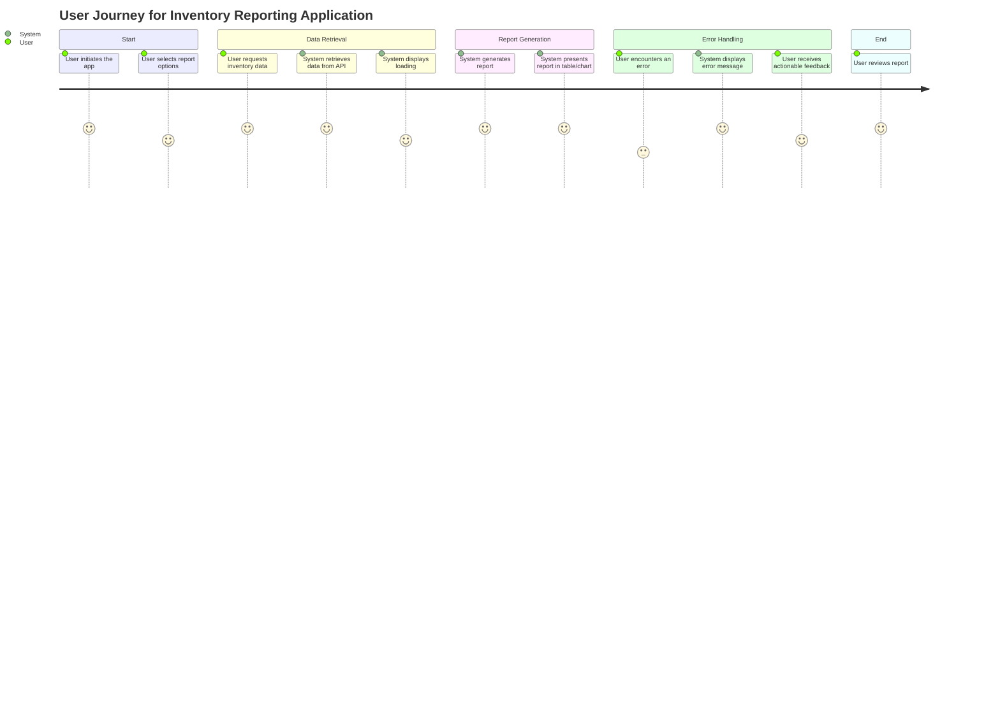
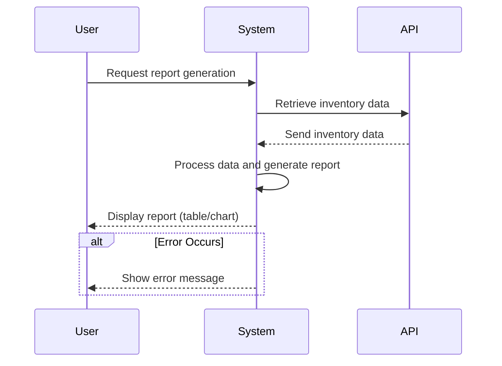

Hey! I see you're looking for a structured user requirement document that includes user stories, a journey diagram, and a sequence diagram. Your goal is to clearly outline the expectations for the application that generates inventory reports.

From your previous messages, here's what I understand about your requirements:

1. **Focus on Inventory Reporting:** The application should retrieve data from the SwaggerHub API and generate insightful reports.
2. **User Interaction:** Users should be able to trigger report generation easily, and the application should present data clearly.
3. **Error Handling and User Experience:** It’s essential for users to receive actionable error messages and feedback throughout their interactions.

Now, let's put together that user requirement document!

### User Requirement Document

#### User Stories

1. **As a user**, I want to retrieve inventory data from the API so that I can analyze the current stock levels.
2. **As a user**, I want the application to generate a report summarizing key metrics like total items and average price so that I can make informed decisions.
3. **As a user**, I want to view the reports in a clear format (table/chart) so that I can quickly understand the data.
4. **As a user**, I want to be informed of any errors during data retrieval or report generation so that I can take action.

#### User Journey Diagram

#### Sequence Diagram

### Explanation of Choices

- **User Stories:** These capture the specific needs and expectations from the end user's perspective, making it clear what functionalities are required.
- **User Journey Diagram:** This visually represents the steps the user takes within the application, highlighting key interactions and decisions.
- **Sequence Diagram:** This shows how different components interact with each other during the report generation process, making it clear what happens at each step.

By putting this document together, you can help the development team understand what needs to be built and how users will interact with the application. If you have any more details or adjustments you'd like to make, just let me know!