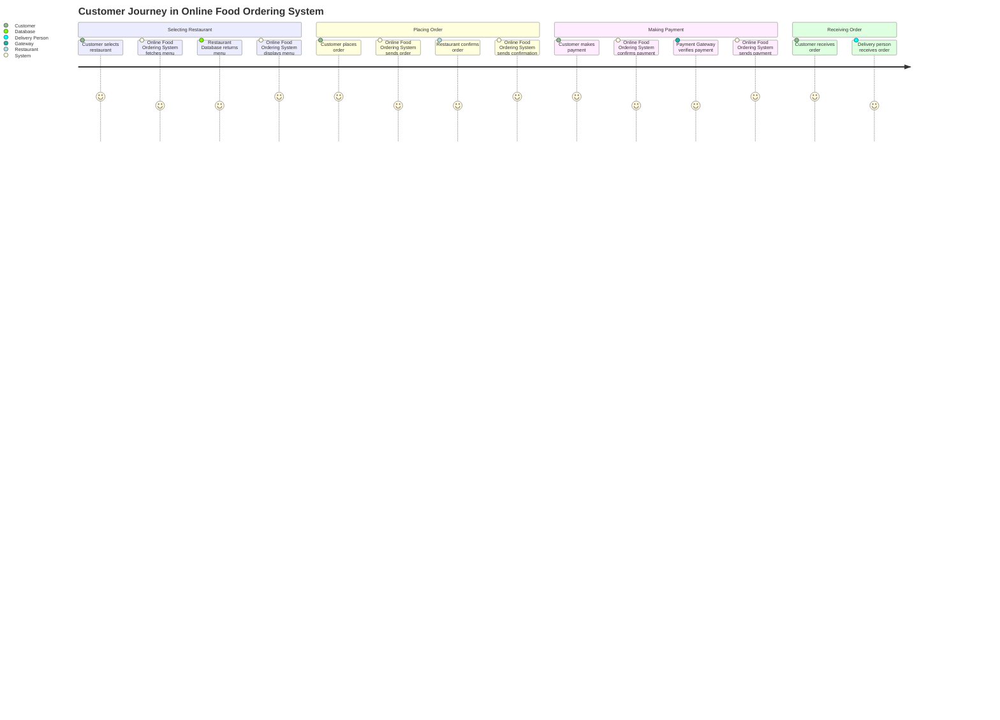
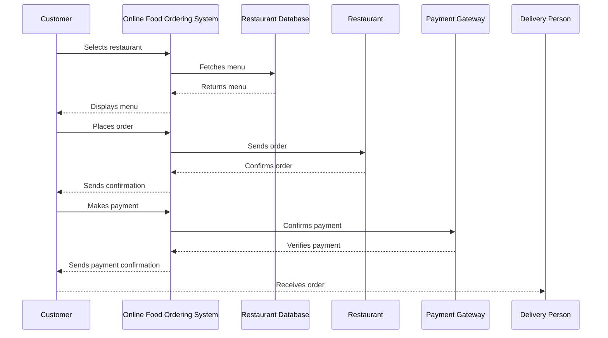

What I understood from your requirement is that you want me to validate your requirements and create a user requirement document that includes user stories, a journey diagram, and a sequence diagram, all formatted in Markdown using the mermaid dialect. This document will help clarify the flow and interactions in your application.

### User Requirement Document

#### User Stories
Here are some user stories for your Online Food Ordering System:

1. **As a customer**, I want to select a restaurant so that I can view its menu.
2. **As a customer**, I want to see the menu items so that I can choose what to order.
3. **As a customer**, I want to place an order so that my food can be prepared.
4. **As a customer**, I want to make a payment so that I can confirm my order.
5. **As a restaurant**, I want to receive orders so that I can prepare the food.
6. **As a delivery person**, I want to receive the order details so that I can deliver the food to the customer.

#### Journey Diagram

#### Sequence Diagram

### Explanation
- **User Stories**: These capture the specific needs of different users in a simple way. They help us understand what features to prioritize.
- **Journey Diagram**: This visually represents the steps the customer goes through while using the application. It helps in understanding user interactions and the flow of the system.
- **Sequence Diagram**: This shows the order of operations and interactions between different components of the system. It clarifies how data flows and how the system components communicate.

Let’s tweak anything if you feel something is missing or needs to be adjusted! What do you think?