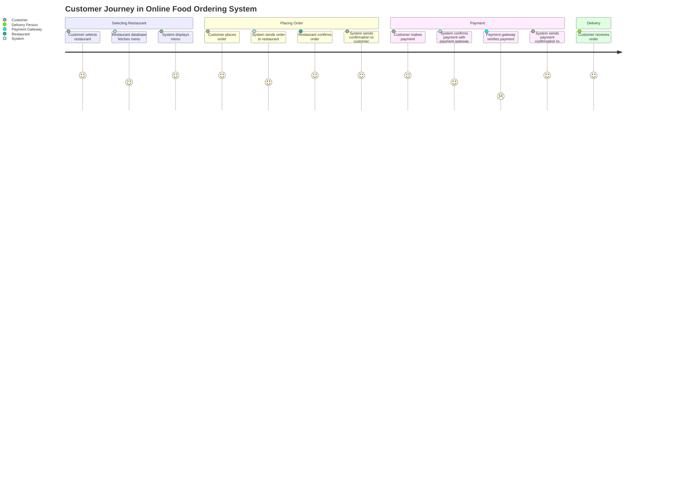
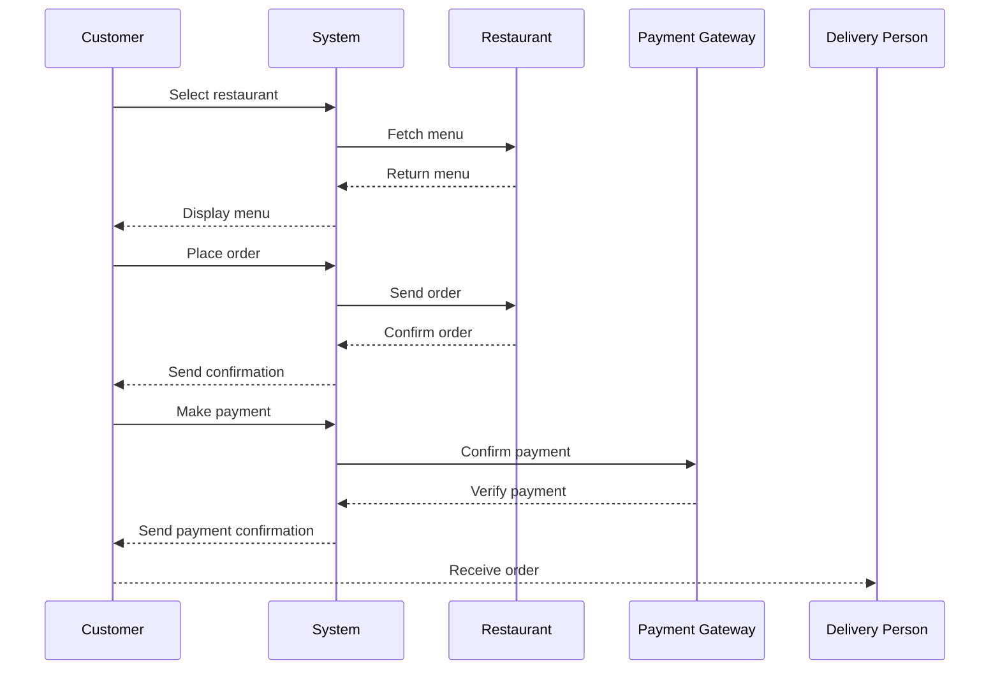

I understood that you want to validate your requirement for the Online Food Ordering System and create a user requirement document that includes user stories, a journey diagram, and a sequence diagram. This document will help clarify the user experience and the interactions in the system.

Let's break this down into user stories first. User stories are a great way to capture what users want to accomplish in the system. Here are a few user stories based on your requirement:

### User Requirement Document

#### User Stories

1. **As a Customer**, I want to select a restaurant so that I can view their menu and order food.
2. **As a Customer**, I want to see the menu items fetched from the restaurant database so that I can choose what I want to order.
3. **As a Customer**, I want to place an order so that I can receive my food.
4. **As a Customer**, I want to make a payment after placing my order to complete the transaction.
5. **As a Customer**, I want to receive a confirmation of my order and payment so that I know my order is being processed.
6. **As a Customer**, I want to receive my order when it's delivered by the delivery person.

#### Journey Diagram

Here’s a simple journey diagram that represents the flow a customer goes through while using the system:

#### Sequence Diagram

Now, let's capture the interactions between the entities in a sequence diagram:

### Explanation of Choices

- **User Stories**: These help us understand the user's needs clearly and guide our development choices.
- **Journey Diagram**: This visualizes the customer's experience from selecting a restaurant to receiving their order, making it easy to see the flow of interactions.
- **Sequence Diagram**: This outlines the specific sequence of actions and responses between the customer, system, restaurant, and payment gateway, helping us understand how the components interact in real-time.

Feel free to share your thoughts or any additional details you’d like to include! Let's keep refining this together.