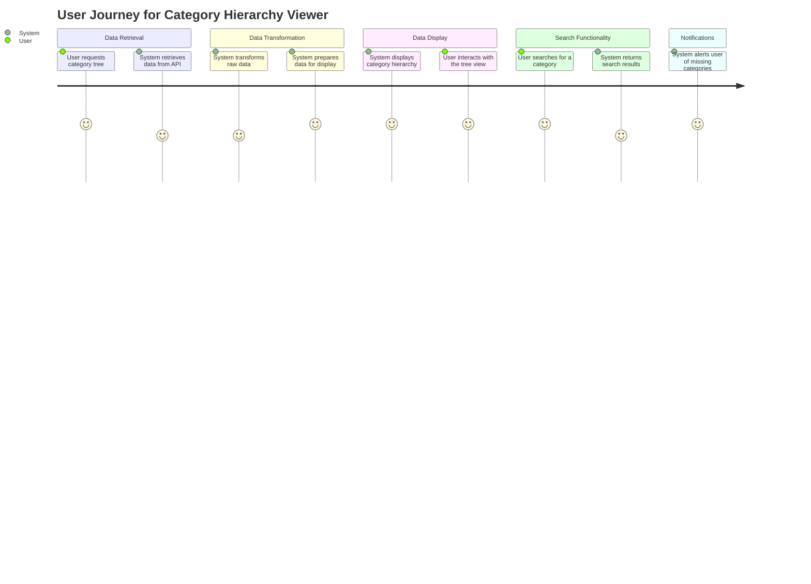
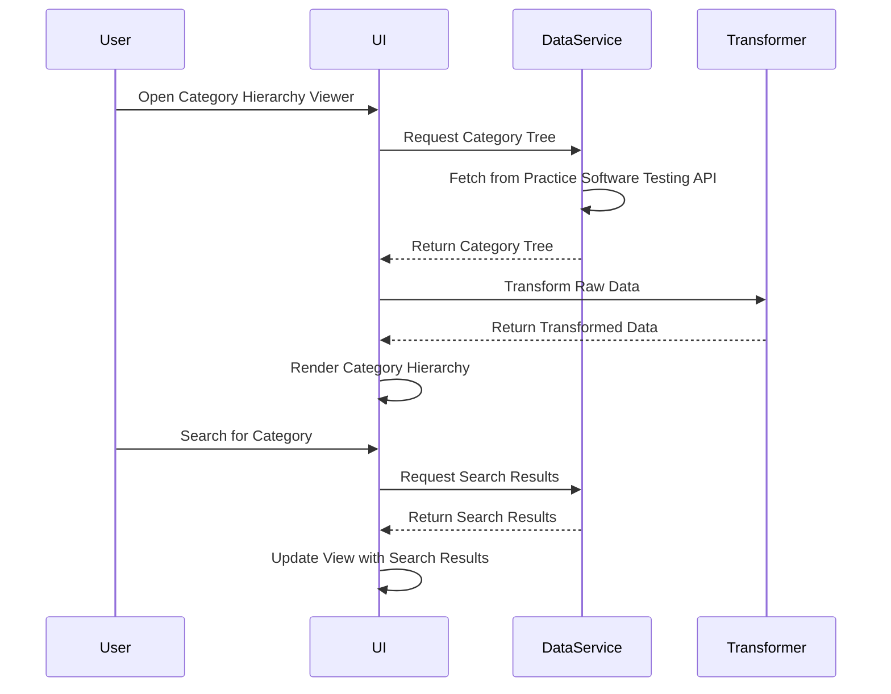

I understand that you want me to validate your requirement for the **Category Hierarchy Viewer Application** and create a detailed user requirement document. This document will include user stories, a journey diagram, and a sequence diagram, all presented in markdown format using the mermaid dialect for visual representations.

### Explanation of the User Requirement Document

1. **User Stories**: These will capture the key functionalities from the perspective of the users. They help in understanding what the users need the application to do. For example, a user story might express the need to view category hierarchies or search for specific categories.

2. **Journey Diagram**: This visual representation will depict the steps users take while interacting with the application. It will illustrate the process from data ingestion through to the visualization of category hierarchies. This helps in identifying key touchpoints and interactions within the application.

3. **Sequence Diagram**: This diagram will outline the flow of actions between different components of the application as it processes user requests. It will show how the application ingests data, transforms it, and presents it to the user, highlighting the relationships between various entities involved in the process.

### Requirement Document

Here’s the detailed requirement document containing user stories, a journey diagram, and a sequence diagram:

```markdown
# User Requirement Document for Category Hierarchy Viewer Application

## Overview
This document outlines the requirements for the Category Hierarchy Viewer Application, which aims to visualize category hierarchies using data from the Practice Software Testing API.

## User Stories
1. **As a User**, I want to retrieve the complete category tree structure from the API so that I can view all available categories.
2. **As a User**, I want to convert raw category data into a hierarchical tree structure for better visualization of categories and sub-categories.
3. **As a User**, I want to present the category hierarchy in a tree view, allowing me to explore sub-categories and access related category IDs.
4. **As a User**, I want to search for specific categories by name or category ID so that I can quickly find the information I need.
5. **As a User**, I want to receive notifications when a selected category or sub-category does not exist, ensuring I am aware of any issues with the data.

## Journey Diagram


## Sequence Diagram


### Conclusion

The user requirement document effectively captures the essential aspects of the Category Hierarchy Viewer Application. It provides a clear representation of user needs through user stories, visualizes the user journey, and outlines the interactions between components with the sequence diagram.

If you have any further adjustments or additional information you'd like to include, please let me know! I'm here to help and ensure that this document meets your expectations perfectly.