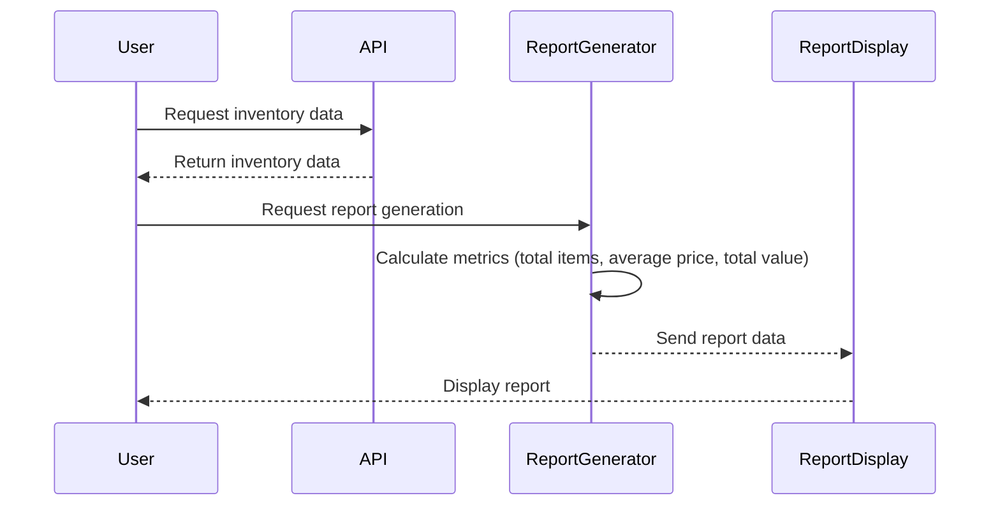

I understand that you want to validate your requirement for the application that generates inventory reports using the SwaggerHub API. You’re looking for a user requirement document that includes user stories, a journey diagram, and a sequence diagram, all presented in a friendly and understandable format.

Here’s a draft of the user requirement document based on what you provided:

---

# User Requirement Document for Inventory Reporting Application

## User Stories

1. **As a user**, I want to retrieve all inventory items from the API so that I can generate reports.
2. **As a user**, I want to filter inventory items based on specific criteria so that I can focus on relevant data.
3. **As a user**, I want to see key metrics in the report (total number of items, average price, total value) so that I can understand the inventory performance.
4. **As a user**, I want the reports to be presented in a user-friendly format, such as tables or charts, so that I can easily interpret the data.
5. **As a user**, I want to receive error messages if something goes wrong during data retrieval or report generation so that I can address any issues promptly.

## User Journey Diagram

## Sequence Diagram

---

### Explanation of Choices

- **User Stories**: I kept them straightforward, focusing on what you want to achieve. They express the needs and desires of the users simply and clearly.
  
- **User Journey Diagram**: This shows the step-by-step process from retrieving data to generating reports, providing a clear visual of the user experience.

- **Sequence Diagram**: It illustrates how interactions happen between the user, the API, and the report generator, showing the order of operations in a clean manner.

How does this look to you? If there’s anything you’d like to add or adjust, just let me know!