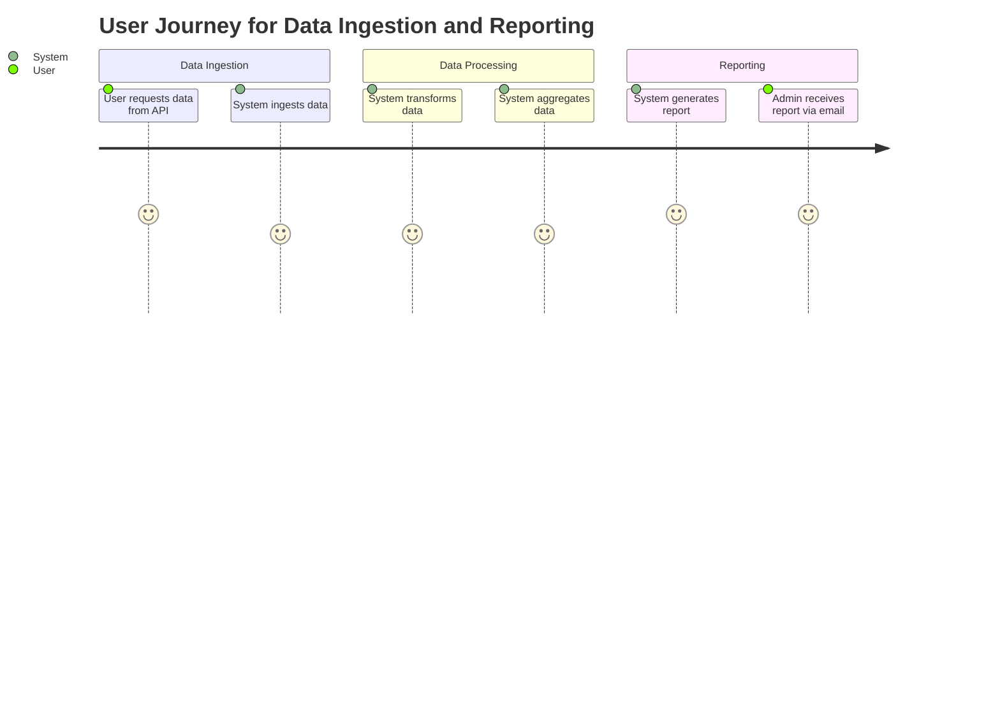
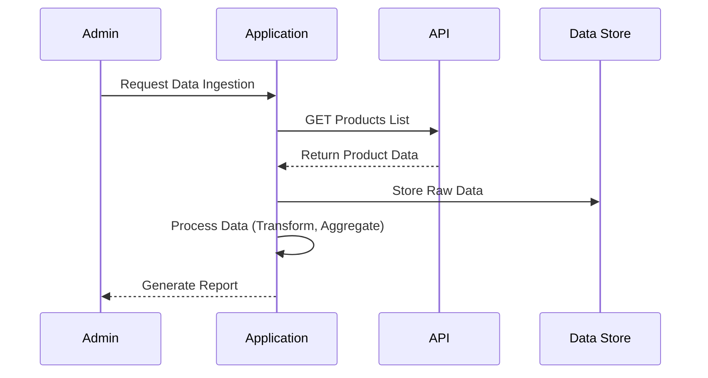

### What I Understood from Your Requirement

You've requested a detailed validation of your requirement, specifically aiming to create a **user requirement document** that includes:

- **User Stories**: These will capture the specific needs and expectations of users interacting with the application.
- **Journey Diagram**: This will visualize the process users go through while using the application to achieve their goals.
- **Sequence Diagram**: This will outline the steps and interactions between different components of the system during the data ingestion and reporting processes.

### Explanation of the Document Components

1. **User Stories**: These are written from the perspective of the user and describe what they want to achieve. For example, "As an admin, I want to receive a daily report of products so that I can monitor the available inventory." User stories help ensure that the development focuses on delivering real value to the users.

2. **Journey Diagram**: This visual representation maps out the user's journey through the application. It highlights the key steps the user takes, such as initiating a data ingestion process, viewing reports, and receiving notifications. The journey diagram helps identify important interactions and can guide the design of the user experience.

3. **Sequence Diagram**: This diagram illustrates the order of operations and how different components of the system interact with each other. For instance, it can show how the application requests data from the API, processes it, and generates a report. The sequence diagram is valuable for understanding the flow of information and ensuring that all necessary interactions are accounted for.

### User Requirement Document

```markdown
# User Requirement Document

## User Stories

1. **As an admin**, I want to build an application that ingests data from the Automation Exercise API so that I can manage product information effectively.
2. **As an admin**, I want the application to perform data transformation, aggregation, and reporting so that I can analyze the product data.
3. **As an admin**, I want to receive a daily report summarizing the aggregated data, including key metrics like count by type and average price.
4. **As a user**, I want to be notified if there are any errors during the data ingestion process so that I can take appropriate actions.

## Journey Diagram



## Sequence Diagram



### Summary

This document captures the essential aspects of your requirement, focusing on the user's needs and the processes involved in data ingestion and reporting. If you have any further suggestions or need additional information, just let me know. I'm here to help!