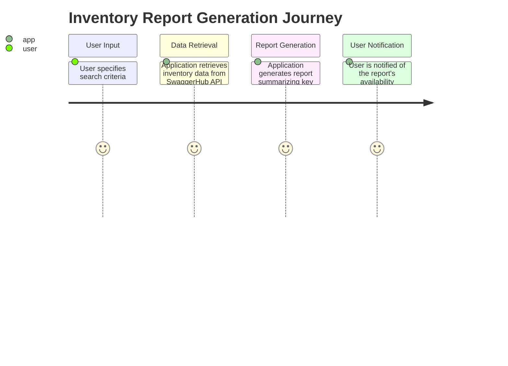
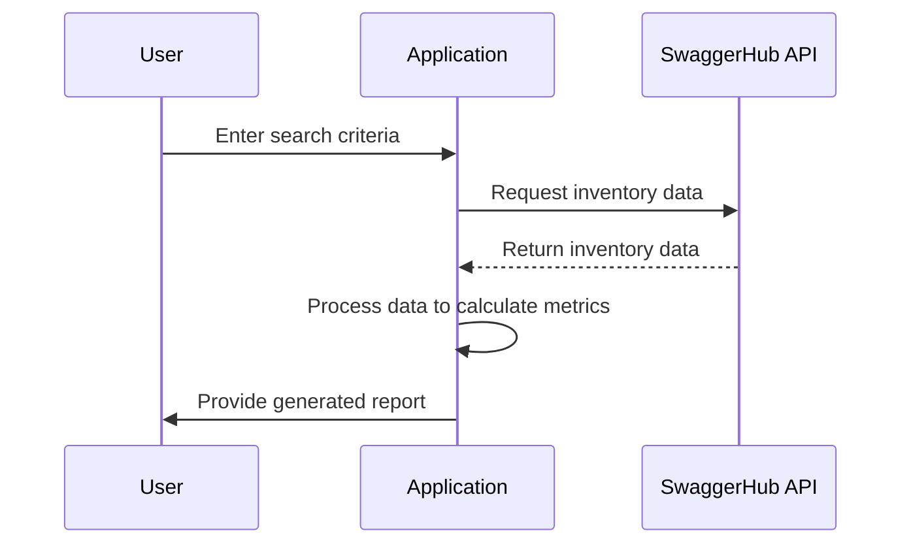

I understand that you need a comprehensive document that validates your requirement for the application that generates reports on inventory data using the SwaggerHub API. This document should include user stories, a journey diagram, and a sequence diagram, all formatted in Markdown with Mermaid dialect for visual representations.

### User Requirement Document

#### Title: User Requirement Document for Inventory Report Generation Application

---

### User Stories

1. **User Story 1: Data Retrieval**
   - **As a** developer
   - **I want to** retrieve all inventory items from the SwaggerHub API
   - **So that** I can use this data to generate reports summarizing key metrics.

2. **User Story 2: Report Generation**
   - **As a** business analyst
   - **I want to** generate reports that summarize key metrics such as the total number of items, average price, and total value
   - **So that** I can provide insights to stakeholders for better decision-making.

3. **User Story 3: User-Friendly Presentation**
   - **As a** user
   - **I want to** view the generated reports in a user-friendly format, such as tables or charts
   - **So that** I can easily understand and analyze the inventory data.

4. **User Story 4: Error Handling**
   - **As a** user
   - **I want to** have error handling mechanisms in place
   - **So that** I am informed of any issues during data retrieval or report generation.

---

### Journey Diagram

The journey diagram illustrates the process from user input to report generation:

---

### Sequence Diagram

The sequence diagram visualizes the interactions involved in the report generation process:

### Explanation of Choices
- **User Stories**: I chose to break down the requirements into specific stories that capture different aspects of the project, from data retrieval to user-friendly presentations and error handling.
- **Journey Diagram**: This diagram helps visualize the user's journey through the application, highlighting key steps in the report generation process.
- **Sequence Diagram**: The sequence diagram illustrates the interactions between the user, application, and SwaggerHub API, providing a clear view of the workflow involved in generating the report.

This document should serve as a solid foundation for understanding and implementing the project. If you need any revisions or additional information, just let me know!