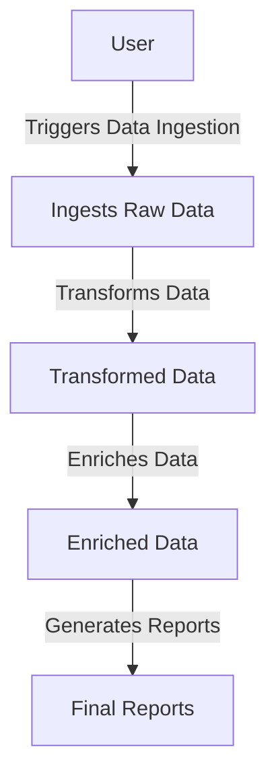
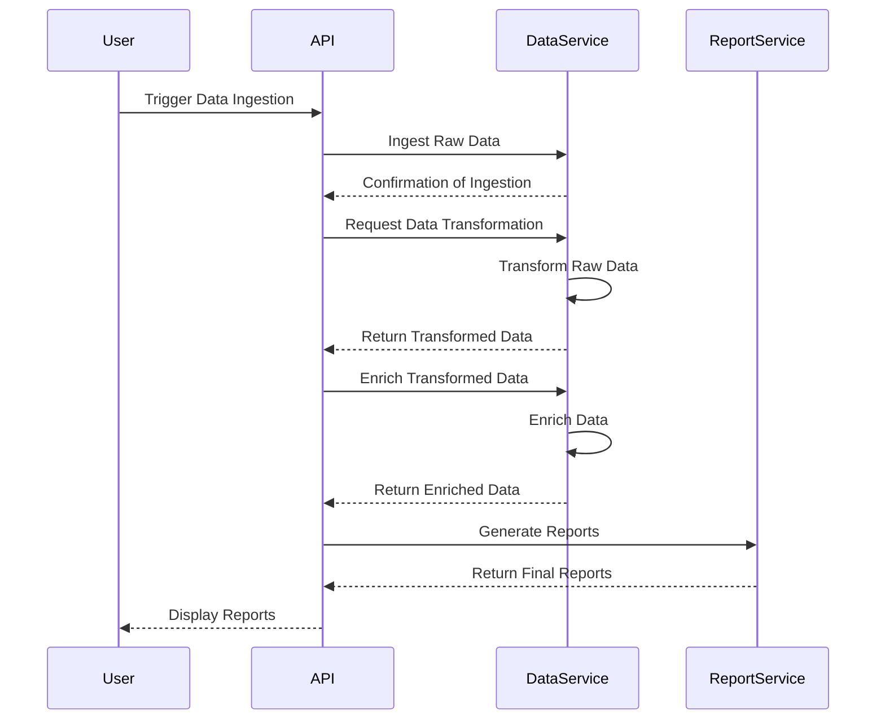

I understand that you're looking for validation of your requirements and you want to create a user requirement document that includes user stories, a journey diagram, and a sequence diagram. This will help you visualize the workflows and interactions in your system.

### User Requirement Document

#### User Stories
1. **As a user**, I want to trigger data ingestion so that I can gather raw data from external sources.
2. **As a data analyst**, I want to transform the ingested data into a usable format so that I can analyze it effectively.
3. **As a user**, I want to enrich the transformed data with additional information to gain further insights.
4. **As a decision-maker**, I want to generate reports from the aggregated data to facilitate informed decisions.

#### Journey Diagram
Here's a basic overview of the user journey in a Mermaid format:

#### Sequence Diagram
This sequence diagram illustrates how data flows through the system:

### Explanation
- **User Stories**: They capture the needs of different users interacting with your system, helping ensure you build features that matter.
- **Journey Diagram**: This gives a high-level view of how users navigate through the workflow, making it easier to spot areas for improvement.
- **Sequence Diagram**: This breaks down the interactions between various components of your system, showing how data flows and processes are triggered.

Would you like to add or change anything based on this structure? 😊