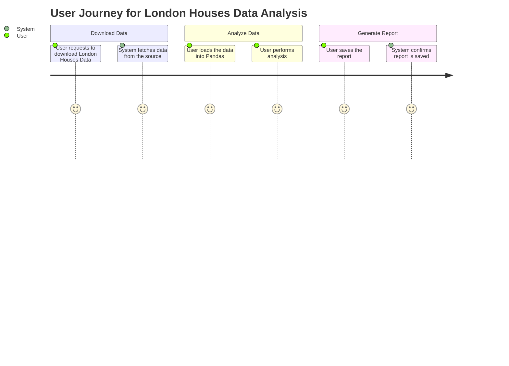
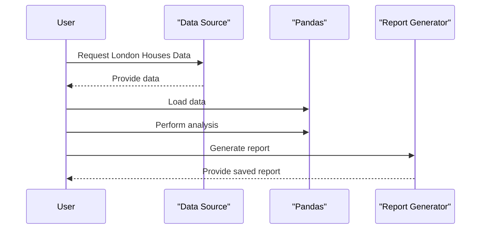

Got it! You want to validate your requirement for downloading the London Houses Data, analyzing it with Pandas, and saving a report. To help with that, I'll create a user requirement document that includes user stories, a journey diagram, and a sequence diagram. All in Markdown format using Mermaid for the diagrams. Let’s make it clear and straightforward!

### User Requirement Document

## User Stories

1. **As a user**, I want to download London Houses Data, so that I can analyze the real estate market trends.
2. **As a user**, I want to analyze this data using Pandas, so I can gain insights and generate reports.
3. **As a user**, I want to save the analysis report, so I can share it with others or refer to it later.

## Journey Diagram

## Sequence Diagram

### Explanation of Choices

- **User Stories**: These reflect what you want to achieve from a user perspective. They help keep the focus on the user's needs.
  
- **Journey Diagram**: It visualizes the steps the user takes from downloading the data to saving the report. It gives a clear picture of the user experience.

- **Sequence Diagram**: This clearly shows the interactions between the user and different components (data source, analysis, and report generation) in a step-by-step manner.

These elements will guide the development process and help ensure we meet your requirements. If there’s anything else you think I should add or change, just let me know! 😊