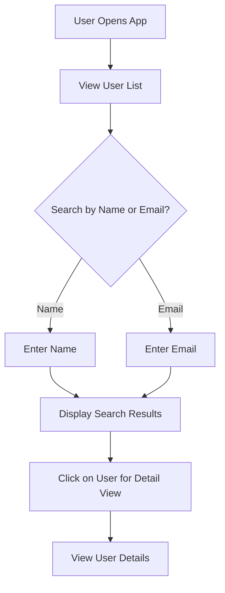
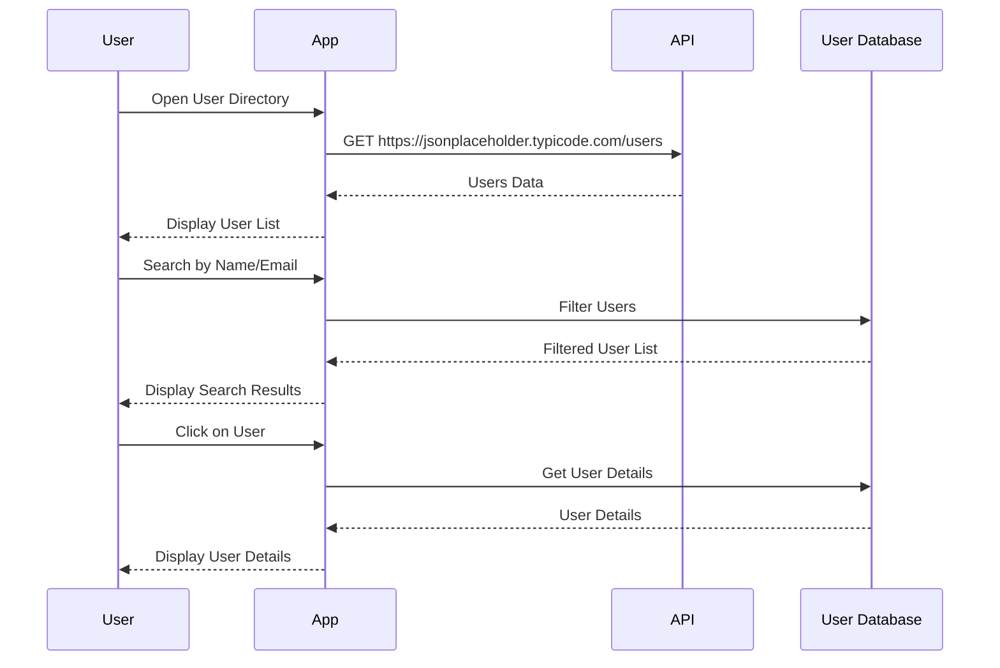

What I understood from your request is that you want to create a user requirement document that includes user stories, a journey diagram, and a sequence diagram for your user directory application. You’re looking for a concise and friendly explanation of the choices made in the document.

Here’s a draft of the user requirement document in markdown format:

```markdown
# User Requirement Document for User Directory Application

## User Stories

1. **As a user, I want to view a list of all users**, so that I can easily see their basic contact details.
2. **As a user, I want to search for users by name**, so that I can find specific individuals quickly.
3. **As a user, I want to search for users by email**, so that I can locate users based on their email addresses.
4. **As a user, I want to click on a user to view detailed information**, so that I can see additional information like address and company details.

## User Journey

Here's a simple journey diagram illustrating how users interact with the application:



## Sequence Diagram

This sequence diagram describes the interaction between the user and the system when fetching user data:



## Explanation of Choices

- **User Stories**: These are short descriptions that capture what users want from the application. They help us understand the features needed and prioritize development accordingly.
- **Journey Diagram**: This shows the steps a user takes while interacting with the app. It highlights key actions, making it easier to visualize the user experience.
- **Sequence Diagram**: This illustrates the order of operations when a user accesses the directory. It helps clarify how data flows between the user, the app, and the API.

I hope this document provides a clear direction for your user directory application! Let me know if you have any tweaks or additional thoughts, and we can adjust it together!