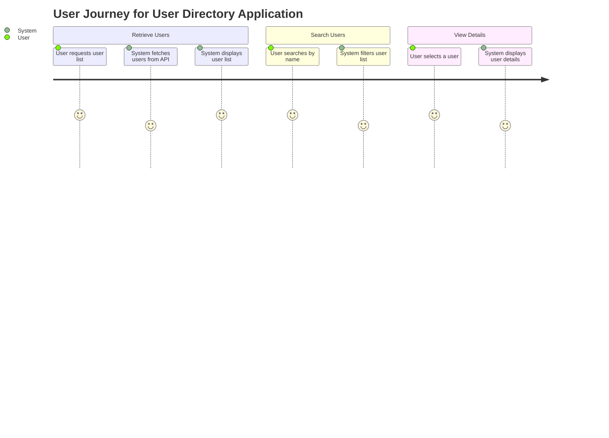
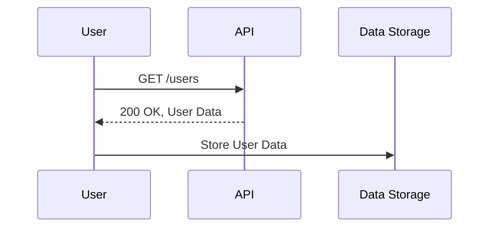

I understand that you want me to validate your requirement for the User Directory application and create a comprehensive user requirement document. This document will include user stories, a journey diagram, and a sequence diagram, all presented in Markdown format using the Mermaid dialect for diagrams.

### Explanation of My Choice

- **User Stories**: These will capture the specific needs of the users in a simple and understandable way. They will help us focus on what features are essential for the application.

- **Journey Diagram**: This diagram will visualize the process users go through when interacting with the application. It will highlight the key steps and interactions, making it easier to understand the user experience.

- **Sequence Diagram**: This diagram will depict the interactions between different components of the system as users perform actions within the application. It will provide a clear view of how data flows and how various parts of the system communicate.

By organizing the requirement in this manner, we can ensure that we have a clear roadmap for development and that the application will meet the users' needs effectively. 

### User Requirement Document

Here’s the Markdown document that includes the user stories, journey diagram, and sequence diagram:

```markdown
# User Requirement Document for User Directory Application

## Overview
This document outlines the requirement for the User Directory application, which aims to provide a simple interface for listing users and their contact details.

## User Stories

1. **As a user**, I want to retrieve a list of users from the API so that I can view their basic contact information.
2. **As a user**, I want to search for specific users by name or email, so that I can quickly find the information I need.
3. **As a user**, I want to view detailed information about a selected user, including their address and company details.
4. **As a developer**, I want to store the retrieved user data in a persistent format, so that it can be accessed and managed later.

## Journey Diagram


## Sequence Diagram


### Conclusion
This document provides a structured overview of the User Directory application's requirement. By incorporating user stories, journey diagrams, and sequence diagrams, we can ensure that our development process is aligned with the users' needs and that the application is designed for optimal usability.

If you have any further suggestions or if there's anything else you'd like me to add, please let me know! I'm here to help and ensure that we create an application that meets your expectations.