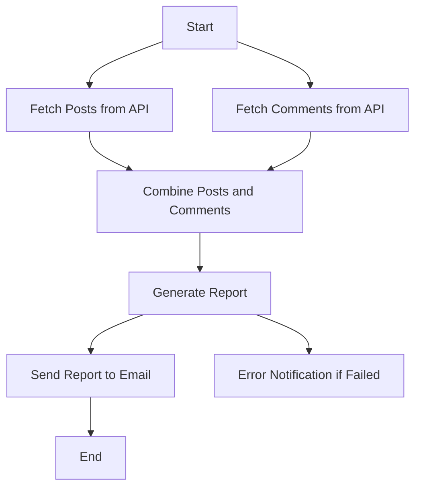
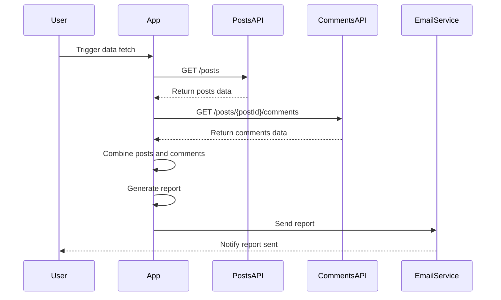

What I understood from your requirement is that you want a comprehensive user requirement document that captures user stories, a journey diagram, and a sequence diagram for your application. This document will help clarify the application's functionality and flow, making it easier for everyone involved in the project.

Here’s a user requirement document outline based on what we've discussed so far:

```markdown
# User Requirement Document for Data Ingestion and Reporting Application

## User Stories

1. **As a user, I want to fetch posts and comments from APIs so that I can analyze user engagement.**
   - **Acceptance Criteria**:
     - Data is successfully fetched from both the posts and comments APIs.
     - Comments are correctly nested under the respective posts.

2. **As a user, I want to generate a report with the number of comments for each post immediately after data ingestion.**
   - **Acceptance Criteria**:
     - The report contains the post ID, title, and quantity of comments.
     - The report is sent to my email in a simple text format.

3. **As a user, I want to be notified if there’s an error in fetching data or generating the report.**
   - **Acceptance Criteria**:
     - Notifications are sent if any issues occur during data processing.

## User Journey Diagram



## Sequence Diagram



## Explanation of Choices

- **User Stories**: These help clarify what the user expects from the application in a simple way. Each story emphasizes the value that the functionality brings.
  
- **Journey Diagram**: This visualizes the flow of actions that users will take, illustrating how the application interacts with APIs and the order of operations.

- **Sequence Diagram**: This shows the interactions between the user, the app, the APIs, and the email service. It helps in understanding the order of operations and how data flows through the application.

Let me know if you’d like to tweak anything or if you’d like to add more details! I'm here to help! 😊