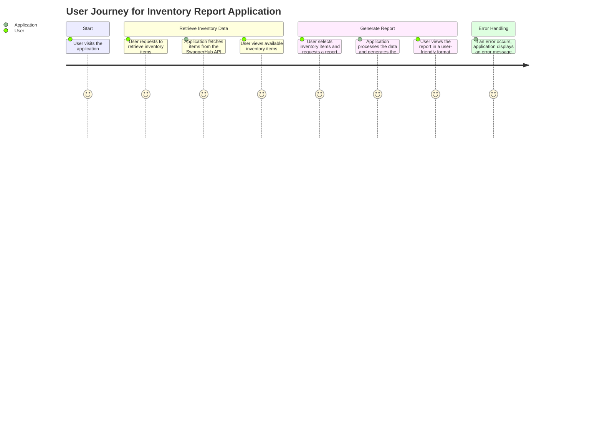
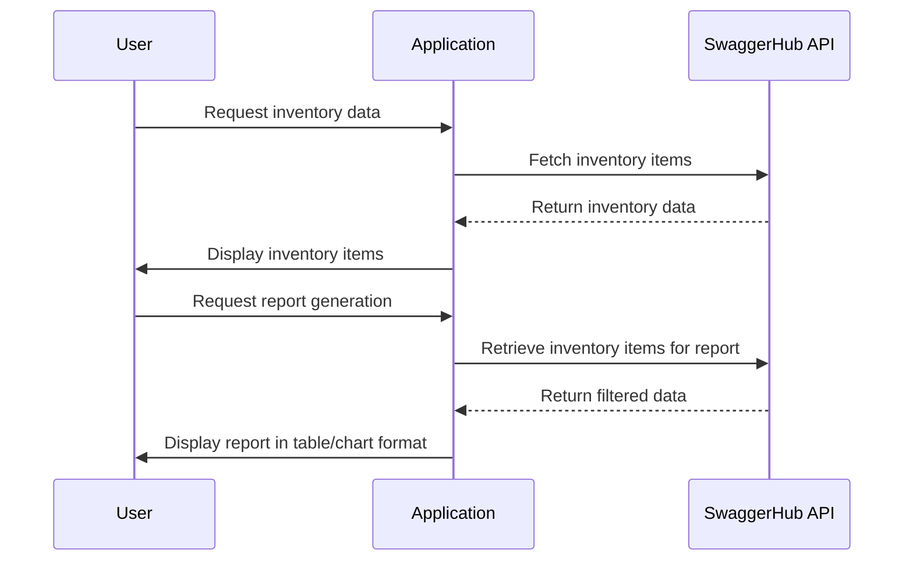

Got it! From your requirement, I understand that you're looking for a user requirement document that outlines user stories, a user journey diagram, and a sequence diagram, all focused on the application that generates reports from inventory data pulled from the SwaggerHub API.

Let’s break it down into components:

### User Requirement Document

#### User Stories
1. **As a user**, I want to retrieve all inventory items or filter them so that I can analyze specific subsets of data.
2. **As a user**, I want to generate a report summarizing key metrics (total number of items, average price, total value) so that I can understand the inventory better.
3. **As a user**, I want the report to be presented in a user-friendly format (like tables or charts) so that I can easily interpret the data.
4. **As a user**, I want error messages to be clear and helpful so that I can understand what went wrong and how to fix it.

#### User Journey Diagram
This diagram visually represents the steps a user takes when interacting with the application.

#### Sequence Diagram
This diagram outlines how the components of the application interact during the report generation process.

### Explanation of Choices
- **User Stories**: They help us capture what the users actually want, focusing on their needs and the functionalities that deliver value to them. 
- **User Journey Diagram**: It shows the overall flow from start to finish, making it clear how users will interact with the application.
- **Sequence Diagram**: This highlights the interaction between the user, the application, and the API, which is crucial for understanding the dynamics of report generation.

Let me know if you need any tweaks or additional details! 😊