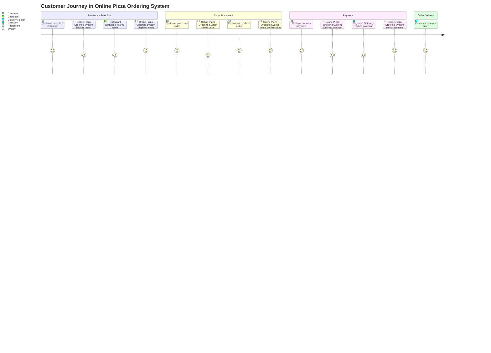
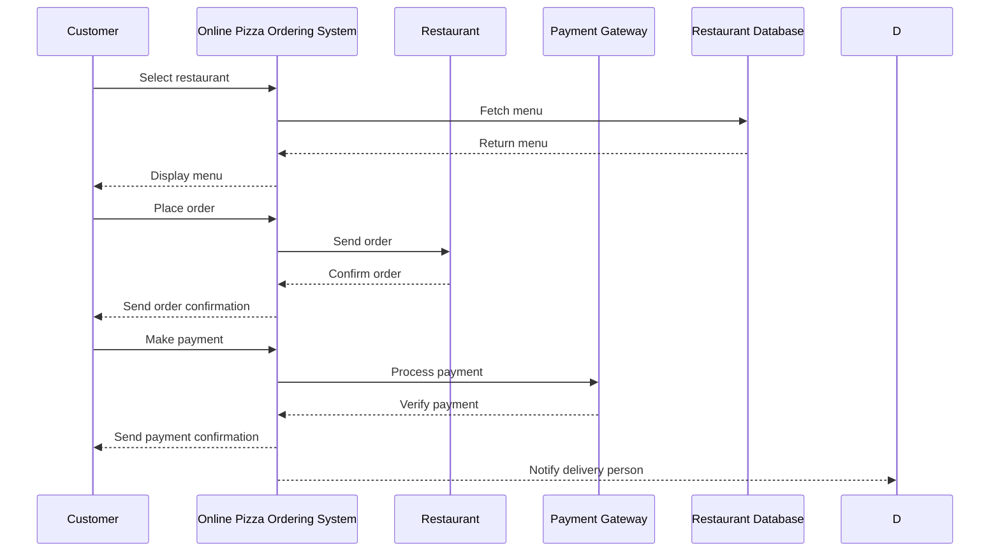

I understand that you want me to validate your requirement for the online pizza ordering system and create a user requirement document that includes user stories, a journey diagram, and a sequence diagram. This document will help clarify how users will interact with the system and outline the necessary processes.

Here's how I would structure the user requirement document:

### User Requirement Document for Online Pizza Ordering System

#### User Stories

1. **As a Customer**, I want to select a restaurant so that I can view its menu and place an order.
2. **As a Customer**, I want to view the menu items so that I can choose what I would like to order.
3. **As a Customer**, I want to place an order so that my selected items are sent to the restaurant for preparation.
4. **As a Customer**, I want to receive an order confirmation so that I know my order has been accepted.
5. **As a Customer**, I want to make a payment for my order so that it can be processed.
6. **As a Customer**, I want to receive a payment confirmation so that I know my payment was successful.
7. **As a Customer**, I want to receive my order through a delivery person so that I can enjoy my pizza.

#### Journey Diagram

#### Sequence Diagram

### Explanation of Choices

- **User Stories**: These capture the main interactions that users will have with the system. They’re simple and relatable, which helps ensure we understand user needs.
- **Journey Diagram**: This visualizes the user's path through the system, showing the key steps they’ll take — from restaurant selection to receiving the order.
- **Sequence Diagram**: This illustrates the communication between components in a step-by-step order, helping us understand how the system components interact during each process.

Let me know what you think! If you want to tweak anything or add more details, just let me know!