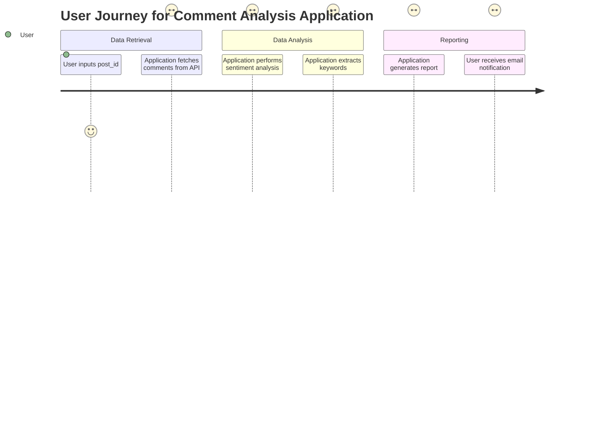
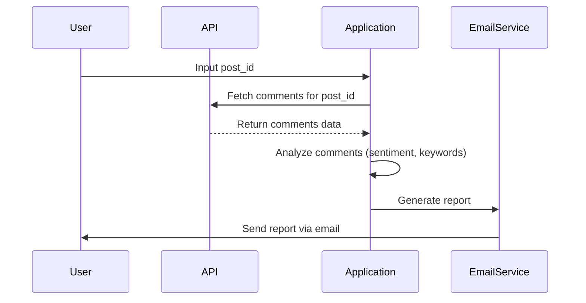

What I understood from your requirement is that you want me to validate your application's requirements and create a user requirement document that includes user stories, a journey diagram, and a sequence diagram. You'd like everything to be formatted in Markdown and use the Mermaid dialect for the diagrams.

Here's a breakdown of how I can assist:

### User Requirement Document

#### User Stories
User stories help articulate the needs of your users in a simple and understandable way. Here are a few examples based on your previous inputs:

1. **As a user**, I want to input a `post_id` so that I can retrieve comments related to that specific post from the API.
2. **As a user**, I want the application to analyze comments by performing sentiment analysis and keyword extraction so that I can understand the overall tone and key topics of the comments.
3. **As a user**, I want to receive an email report summarizing the analysis results so that I can easily share insights with others.

#### Journey Diagram
The journey diagram visualizes the steps a user takes while interacting with your application. Here's a simple representation using Mermaid:

#### Sequence Diagram
The sequence diagram shows how different components of your application interact over time. Here's a basic outline for the process:

### Explanation of Choices
- **User Stories**: These help us focus on what the user really needs, which is essential for developing a user-friendly application.
- **Journey Diagram**: It illustrates the user's path through the application, making it easier to spot any potential improvements in the user experience.
- **Sequence Diagram**: This shows the flow of data and actions between different components, helping visualize how the application will function.

Feel free to tweak or add anything you think might be missing! If you have any specific preferences or details to include, just let me know! 😊