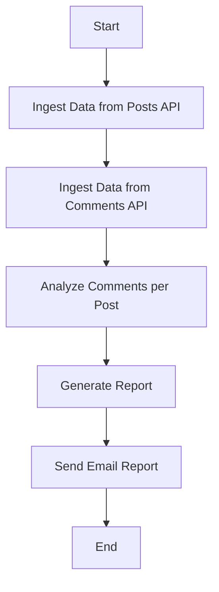
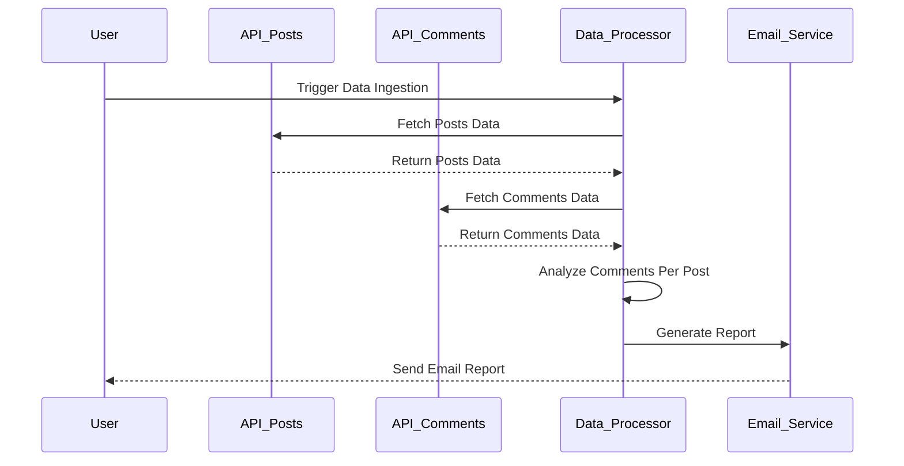

Got it! You want to validate your requirement and create a user requirement document that includes user stories, a journey diagram, and a sequence diagram. This will help clarify the project and illustrate how users will interact with the application.

Here’s what I’m thinking for your requirement:

### User Requirement Document

#### User Stories
1. **As a user**, I want to ingest data from the posts API so that I can analyze the comments for each post.
  
2. **As a user**, I want to ingest data from the comments API so that I can track how many comments are on each post.
  
3. **As a user**, I want to receive an email report immediately after the data ingestion so that I can see the latest comment statistics.

#### Journey Diagram
This diagram showcases the journey a user takes while interacting with the application.

#### Sequence Diagram
This diagram highlights how the different components of the application interact during the data ingestion and reporting process.

### Explanation of Choices
- **User Stories**: These clearly define what you want the application to do from the user's perspective. They help focus on feature requirements.
  
- **Journey Diagram**: This visualizes the steps the user goes through in the application, making it easy to understand the flow.

- **Sequence Diagram**: This shows how tasks are executed in a specific order and how different systems interact. It’s great for understanding the backend processes.

Let me know if you’d like to tweak anything or if you have more thoughts to add! 😊