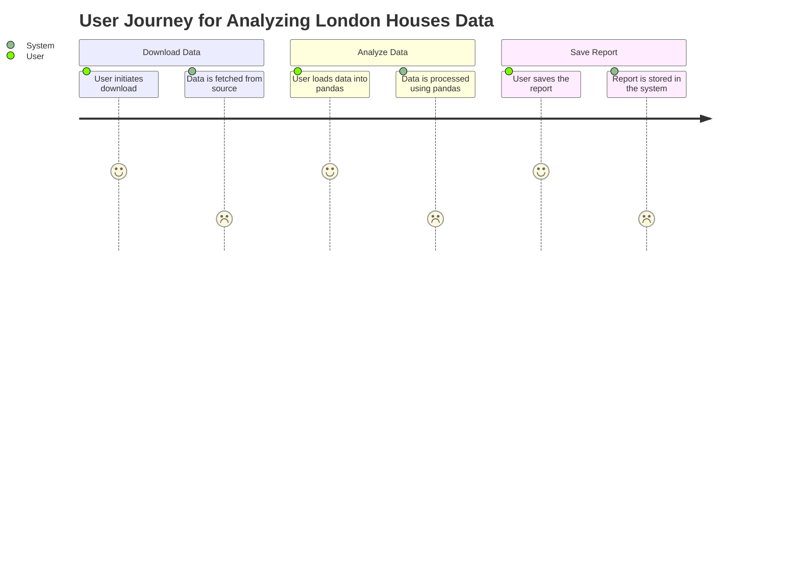
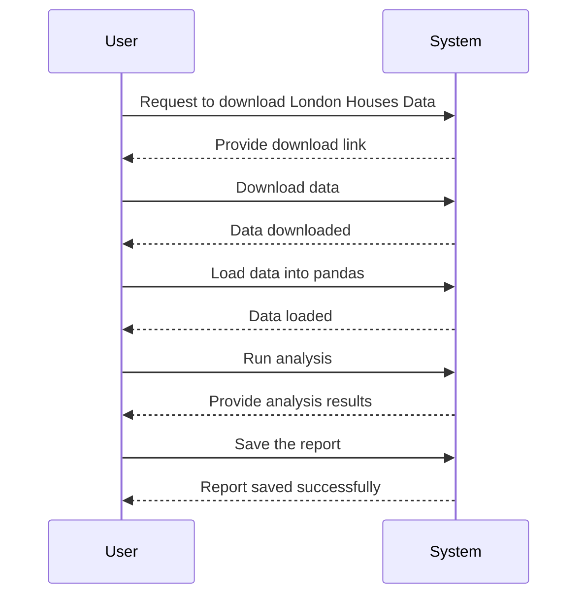

Got it! So, you want to validate your requirement for downloading London Houses Data, analyzing it with pandas, and saving a report. It’s all about making sure we know exactly what you need and how the process will flow.

To create a User Requirements Document, we can outline user stories, a journey diagram, and a sequence diagram. Here’s how I envision it:

### User Requirement Document

#### User Stories
1. **As a user**, I want to download London Houses Data so that I can analyze it for trends and insights.
2. **As a user**, I want to use pandas to process and analyze the data so I can extract useful information.
3. **As a user**, I want to save the report generated from my analysis so that I can refer back to it or share it with others.

#### Journey Diagram
The journey diagram illustrates the steps a user goes through in this process:

#### Sequence Diagram
The sequence diagram shows the interaction between the user and the system:

### Explanation
- **User Stories**: These help us focus on what you actually want to achieve from the application, putting you in the center of the process.
- **Journey Diagram**: This shows the steps you’ll take, making it easy to visualize how you’ll interact with the application.
- **Sequence Diagram**: This details the interaction between you and the system, outlining the flow of requests and responses.

Let me know if this aligns with what you had in mind or if you’d like to tweak anything! Feel free to add any more details or documents, and we’ll keep building from here.