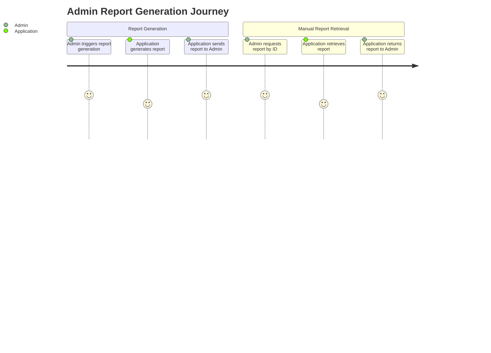
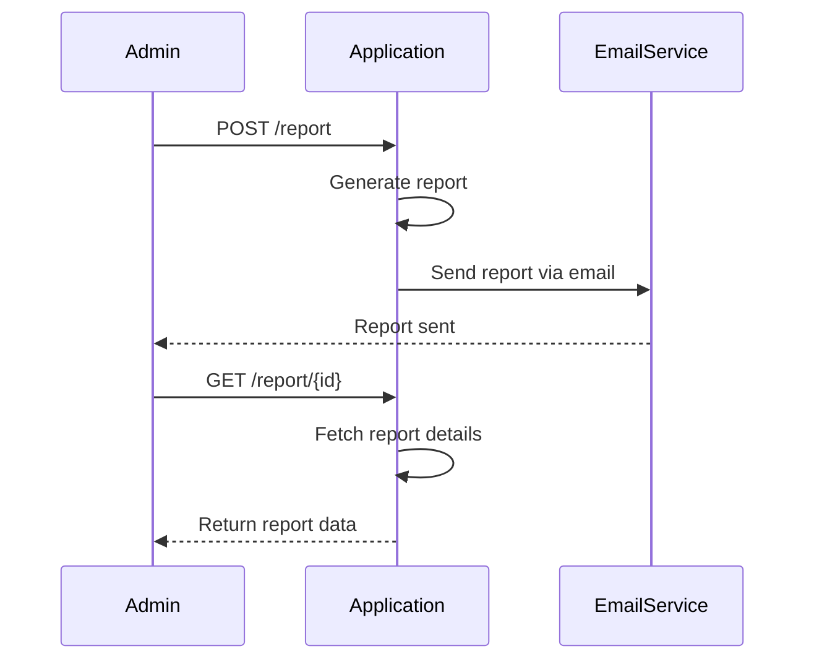

Got it! 📝 You want to validate your application requirement and create a user requirement document that includes user stories, a journey diagram, and a sequence diagram. You aim to detail how the application will work from the admin's perspective when generating and retrieving reports. 

Here's what we'll include in the user requirement document:

### User Requirement Document

#### User Stories

1. **Report Generation**
   - **As an admin**, I want to trigger the report generation process via a POST request, so that I can generate a report on-demand.

2. **Manual Report Retrieval**
   - **As an admin**, I want to be able to retrieve a report by its ID via a GET request, so that I can view the specific report I need.

#### Journey Diagram

#### Sequence Diagram

### Explanation

- **User Stories**: These detail what the admin wants to do. It’s straightforward and focuses on generation and retrieval.
  
- **Journey Diagram**: This visualizes the steps the admin takes to generate a report and later retrieve it. It shows interactions clearly, helping everyone understand the user flow.

- **Sequence Diagram**: This lays out the interactions step-by-step between the admin, application, and email service. It captures the technical flow, showing what happens when a report is generated and retrieved.

This setup gives you a solid foundation for your application requirements and clarifies how everything fits together. If you need any adjustments or have more ideas to add, just let me know! 😊